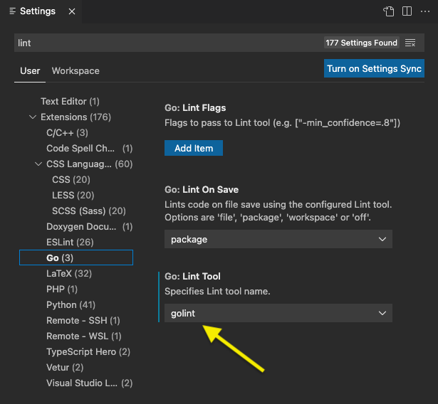
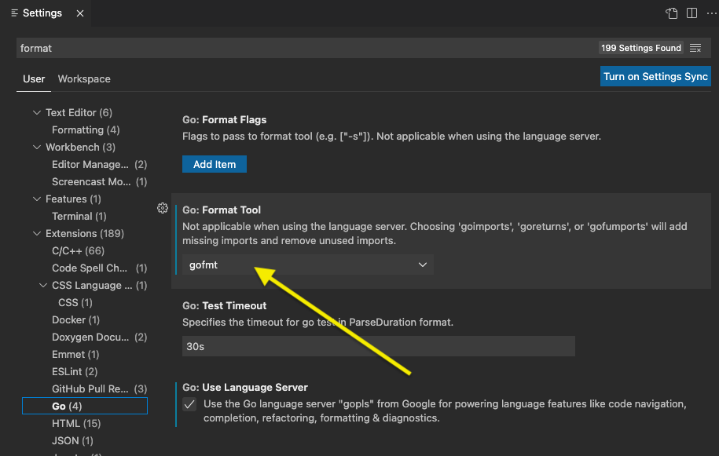

# Backend 1 - popstellar in Go

<div align="center">
  
</div>

> Welcome to the go-side of popstellar.

# Want to submit a PR ? Here are 3 points that will make sure things run smoothly

1. Make sure your code fits nicely with the code base and follows the SAME
   philosophy/ADN (format, pattern, organization, etc..). Notably: how errors
   are handled, how the code is spaced (use of newlines!), how the code is
   commented (80 chars!), structured, etc.. One shouldn't be able to
   differentiate between your code and the existing one. If you have any doubt
   about something just have a look around the existing code to find an example.

2. You just opened a PR ? Good. Make a review of your PR before requesting for a
   review. We all forget small details like a typo in comment, a commented line
   that should be removed, a debug print, etc.. If you missed them in your code
   editor there is a chance you can catch them from the Github review interface.
   It then spares time for everyone.

3. Got comments on your PR ? Great. To help the reviewer please do NOT resolve
   conversations, as it helps the reviewer check if his/her comments have been
   addressed (or not). You can use the 👍 reaction on the comment if you need to keep
   track of your progress, or comment them if discussion is needed.
   Additionally, when you address comments, make a single commit with a title
   "addresses X's comments".

# Configure your environment

## Linter

Please make sure that `golint` is configured properly on your IDE. `golint` will
tell you how to avoid the most common pitfall when writing go code. It should be
configured to automatically lint your code in your IDE. For example in VS code:



## Go format

Please make sure your code is automatically formatted with `gofmt`. Go is
opinionated about formatting and you must let him format your code. It should be
done automatically "on save" in your IDE. For example in VS code:



## Global format

Please make sure comments are formatted at 80 chars long. In VS code the
[rewrap](https://marketplace.visualstudio.com/items?itemName=stkb.rewrap) plugin can be of a great help. Also you can add ruler to your editor,
for example at 80 and 100 char in VS code with the following configuration:

```
"editor.rulers": [80,100],
```

(go to settings, search for `ruler` and click `edit in Settings.json`)

## New to Git ?

If you are new to git and don't want to go the hard way we recommend using
[Github desktop](https://desktop.github.com/). It allows you to easily perform
the most common git operations without the hassle of using the CLI.

## Overview

### Requirements

Please ensure you have Go >= 1.16 installed on your machine. Instructions for
doing so are available [here](https://golang.org/doc/install).

#### Build on Unix

To build the `pop` CLI on Unix devices, you need to execute the `make build` command. 

You should first install GNU Make. OSX users may install it using
homebrew. Linux users may do so using their package manager:

```bash
brew install make # OSX
sudo apt-get install build-essential # Ubuntu/Debian
```

#### Build on Windows

To build the `pop.exe` CLI on Windows devices, you need to execute the  `.\make.bat build` command.

You should first install GCC compiler 64 bits. After having looked on the internet for a while we recommend [TDM-GCC](https://jmeubank.github.io/tdm-gcc/), using the tdm64-gcc-%VERSION%.exe that contains MinGW-w64. (As of March 2022)

Then, you will be able to compile using `.\make.bat build` which will create `pop.exe` that you will be able to execute from the terminal. 

### Execution

You can see the CLI usage with the `-h` flag.

```bash
cd cli
go run . -h
```

You may start the organizer server at ports `9000` for clients and `9001` for
witnesses by executing

```
./pop organizer serve
```

if you want to enforce the rule that only the server owner can creates LAO, specify the option --pk (as written below)

```
./pop organizer --pk "<base64url encoded pk of server owner>" serve
```

Please use the `-cp` and `-wp` flags to specify an alternative port. The full
path to connect to the organizer as a client is
`ws://host:clientport/organizer/client/` and as a witness
`ws://host:witnessport/organizer/witness/`.

You may start the witness server at ports `9000` for clients and `9002` for
witness, connected to the organizer at `localhost:9000` by executing `./pop
witness --pk "<base64 encoded pk>" serve`. Please use the `-cp` and `-wp` flags
to specify an alternative port. Use the -org flag to specify an alternative
address and port for the organizer. Using the `-ow` flag as many times as
necessary, you can specify you can specify the `address:port` of each of the
other witnesses. The full path to connect to the organizer as a client is
`ws://host:clientport/organizer/client/` and as a witness
`ws://host:witnessport/organizer/witness/`.

## Unit-tests

Some unit-tests exist directly in their corresponding packages, as per Go
specification. They can be run with `make check` (recursive from the top-level
folder) or simply `go test` for the current package (except the `validation`).

## Documentation

Detailed information about the architecture and dataflow is available in the
[docs](docs/README.md) directory.

You may also make use of package level documentation by using `godoc`

```bash
$ godoc -http=:6060
```

The above command would make this module's documentation available at
[http://localhost:6060/pkg/popstellar](http://localhost:6060/pkg/popstellar).

## Potential improvements

### WebSockets

Maybe we should consider using websocket secure (websocket over TLS) instead of
"standards" websocket (over TCP). It would protect from MitM attacks, as we
currently don't offer data privacy.
