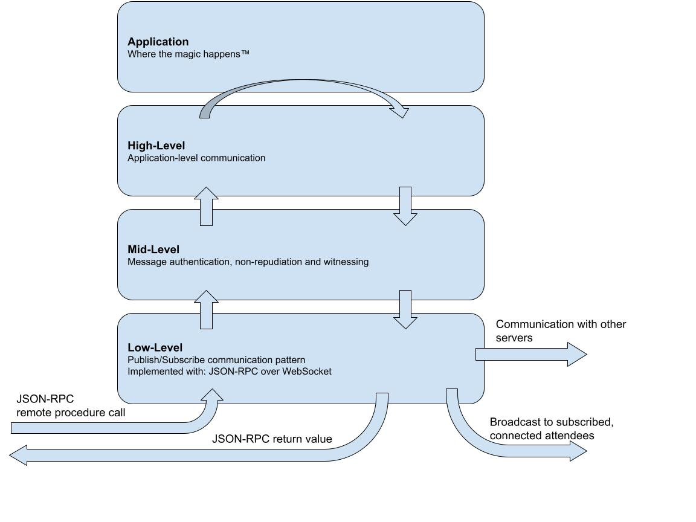
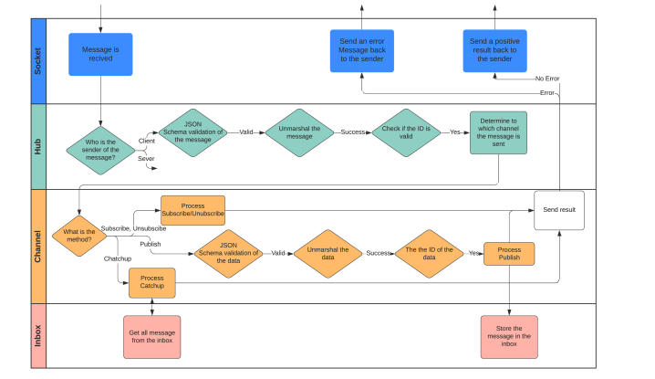

### PoP Go Backend

This repository contains the server side implementation of the PoP project.

#### Getting Started

We assume that you're familiar with the PoP project. Please read the
[Architecture Specifications](https://docs.google.com/document/d/19r3rP6o8TO-xeZBM0GQzkHYQFSJtWy7UhjLhzzZVry4)
to get an idea about all the actors and components in the system.

##### Resources

If this is your first time working with Go, please follow the following
tutorials:

* [Getting Started](https://golang.org/doc/tutorial/getting-started)
* [Creating Modules](https://golang.org/doc/tutorial/create-module)
* [A Tour of Go](https://tour.golang.org/welcome/1)

 
##### IDE/Editors

Go is supported well across multiple text editors and IDE. The team at DEDIS has
members using [GoLand (IntelliJ)](https://www.jetbrains.com/go/),
[VSCode](https://code.visualstudio.com/) and neovim/vim.

VSCode/Neovim/vim require some custom configuration for adding Go support. We'd
suggest using GoLand if you do not have a strict preference/experience with the
other text editors since it works out of the box and EPFL/ETHZ students may
avail a [free education license](https://www.jetbrains.com/community/education/#students)
for their use.

#### Project Structure

The project is organized into different modules as follows

```
.
├── channel             # contains the abstract definition of a channel
│   ├── chirp           # channel implementation for a chirp channel
│   ├── coin            # channel implementation for a coin channel
│   ├── consensus       # channel implementation for a consensus channel
│   ├── election        # channel implementation for an election channel
│   ├── generalChirping # channel implementation for a universal post channel
│   ├── lao             # channel implementation for a LAO channel
│   ├── reaction        # channel implementation for a reaction channel
│   └── registry        # helper for registry
├── cli                 # command line interface
├── crypto              # defines the cryptographic suite 
├── docs
├── hub                 # contains the abstract definition of a hub
│   ├── standard_hub    # hub implementation 
├── inbox               # helper to store messages used by channels
├── message             # message types and marshaling/unmarshaling logic
├── network             # module to set up Websocket connections
│   └── socket          # module to send/receive data over the wire
└── validation          # module to validate incoming/outgoing messages
```

The entry point is the cli with bulk of the implementation logic in the hub
module.

The following diagram represents the relations between the packages in the
application.

<div align="center">
  
</div>

#### Architecture

The PoP Go backend expects actors (depending on the context these may be
clients or server) to establish long lived websocket connections with it
and send messages back and forth over websockets using a publish/subscribe
pattern.

<div align="center">
  
</div>

On a higher level of abstraction, a client may publish messages or subscribe for
messages on a *channel*. You may think of a channel as a topic which stores
events that occur over time. For instance, every LAO is denoted by a unique
channel (also called the LAO channel) and contains messages about all events
that occur within it, for example, the creation of an election, a roll call. A
channel may have sub channels associated with it. For instance, a LAO may have a
sub-channel for the elections where all messages associated with that election
are published. Please refer to [Data pipeline
architecture](https://docs.google.com/document/d/19r3rP6o8TO-xeZBM0GQzkHYQFSJtWy7UhjLhzzZVry4/edit#heading=h.1h71fzpdznrh)
for more information.

All the messages are encoded using JSON and are validated using JSON-RPC
[schemas](https://github.com/dedis/popstellar/tree/master/protocol).
[Protocol Specifications](https://docs.google.com/document/d/1fyNWSPzLhM6W9V0VTFf2waMLiJGcscy7wa4bQlLkySM)
also gives an introduction to the different message formats. However, note that
the [schemas](https://github.com/dedis/popstellar/tree/master/protocol) in
this repository are **always** the source of truth and are more up to date than
the Google Doc.

##### Getting messages over the wire

The `Socket` interface (refer `network/socket/mod.go`) describes the methods
used for reading or sending data/error messages from/to the end user.

Depending on the type of end user, a `Socket` has two concrete
implementations:

* `ClientSocket`: Used to denote a connection to a user participating in a PoP
  Party
* `ServerSocket`: Used to represent a connection to a witness or organizer
  server.

The `ReadPump` and `WritePump` are low-level methods which allow reading/writing
data over the wire. Most users would instead use the `Send(msg []byte)`,
`SendError(id int, err error)` and `SendResult(id int, res message.Result)`
APIs.

Each incoming message read by `ReadPump` is passed to the Hub for processing.
Refer to the channel returned by `Receiver()` in the `Hub` interface.

We use [github.com/gorilla/websocket](github.com/gorilla/websocket) to manage
websocket connections.

##### Processing messages in the application layer

The incoming messages received by the `ReadPump` are propagated up the stack to
the `Hub` which is responsible for processing it and sending a `Result`, `Error`
or a `Broadcast`.

A hub, on receiving a message, processes it by invoking the
`handleIncomingMessage` method where its handled depending on which `Socket` the
message originates from.

The flowchart below describes the flow of data and how messages are processed.

<div align="center">
  
</div>

<p align="center"><i>
  Credits to the be1-go Spring 2021 team for the flowchart
</i></p>

The hubs themselves contain multiple `Channels` with the `Root` channel being
the default one, where messages for creation of new LAOs may be published for
instance. Another example of a channel would be one for an `Election` which
would be a sub-channel within the LAO channel.

The hubs use `Socket.SendError` to send an `Error` back to the client. We
suggest using `message.NewError` and `message.NewErrorf` to create these error
messages and wrap them using `xerrors.Errorf` with the `%w` format specifier if
required. The rule of thumb is the leaf/last method called from the hub should
create/return a `message.Error` and intermediate methods should propagate it up
by wrapping it until it reaches a point where `Socket.SendError` is invoked.

##### Message definitions

All messages are defined in the `message` package. Please note that the JSON-RPC
definitions in the root of the repository are to be considered a source of truth
since the validation library checks the messages against it.

##### Validation

All the incoming messages are validated using the `validation` package. The
`make build` and `make test` commands automatically copy over the JSON-RPC
specifications and bundle it up during compilation.

#### Debugging Tips

* Be generous with the use of log statements while developing a new feature.
It's useful to get feedback about which steps executed and how far the message
reached in the processing pipeline rather than getting an opaque error. Use the
new `zerolog.Logger` for that.

* Ensure your error messages are descriptive and ALWAYS wrap errors with a small
  description, for example `xerrors.Errorf("failed to parse message: %v", err)`
* If you're stuck, using a debugger can be of great help. GoLand has good
support for it.

#### Deployments

Please reach out to the DEDIS Engineering team members to deploy a build to an
internet accessible host.

Alternatively, if you wish to test things, **strongly** consider using
[ngrok](https://ngrok.com/) to get an internet accessible URL which proxies
requests to your local machine directly. This is a great option when testing
against mobile devices in a group and if you need a quick turnaround time.

#### Coding Style

Go is opinionated about coding style and guidelines. As a rule of thumb, please
please run `make check` before submitting any Pull Request and ensure there are
no errors. DEDIS has a complementary coding guideline that you can find
[here](https://dedis.github.io/dela/#/guideline).

The CI also executes static analysis using SonarCloud which is good for giving
early feedback against common problems. Please ensure all the code smells and
warnings raised by SonarCloud are resolved before requesting reviews.
