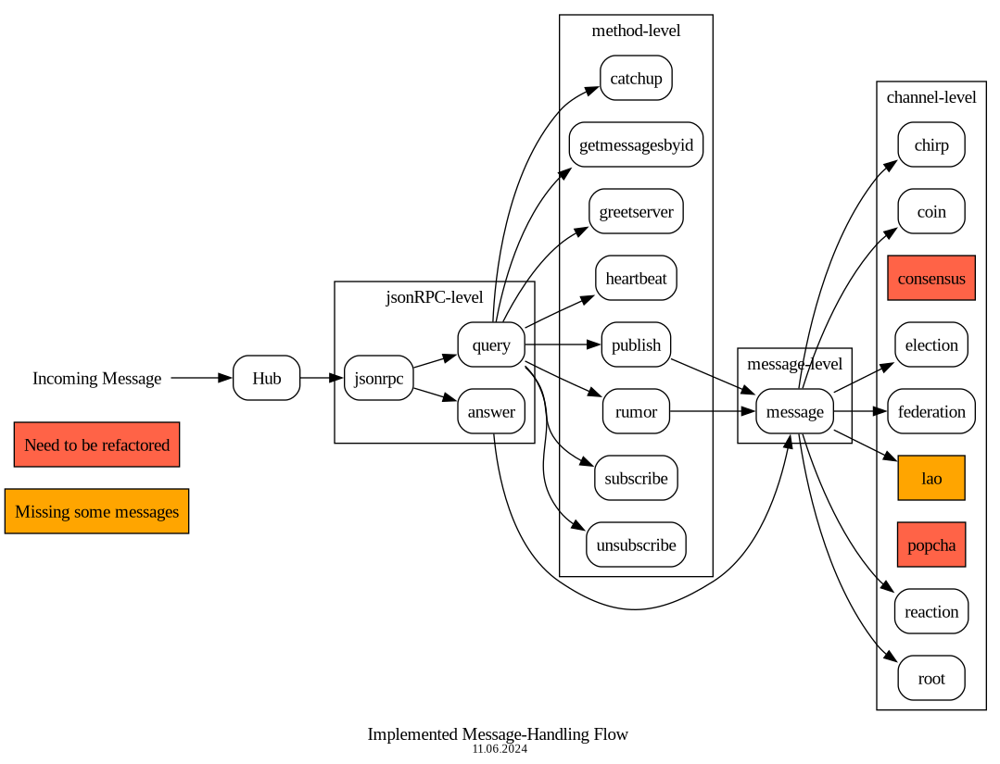

### PoP Go Backend

This repository contains the server side implementation of the PoP project.

#### Getting Started

We assume that you're familiar with the PoP project. Please read the
[Architecture Specifications](https://docs.google.com/document/d/19r3rP6o8TO-xeZBM0GQzkHYQFSJtWy7UhjLhzzZVry4)
to get an idea about all the actors and components in the system.

##### Resources

If this is your first time working with Go, please follow the following
tutorials:

* [Getting Started](https://golang.org/doc/tutorial/getting-started)
* [Creating Modules](https://golang.org/doc/tutorial/create-module)
* [A Tour of Go](https://tour.golang.org/welcome/1)

 
##### IDE/Editors

Go is supported well across multiple text editors and IDE. The team at DEDIS has
members using [GoLand (IntelliJ)](https://www.jetbrains.com/go/),
[VSCode](https://code.visualstudio.com/) and neovim/vim.

VSCode/Neovim/vim require some custom configuration for adding Go support. We'd
suggest using GoLand if you do not have a strict preference/experience with the
other text editors since it works out of the box and EPFL/ETHZ students may
avail a [free education license](https://www.jetbrains.com/community/education/#students)
for their use.

#### Architecture

The PoP Go backend expects actors (depending on the context these may be
clients or server) to establish long lived websocket connections with it
and send messages back and forth over websockets using a publish/subscribe
pattern.

<div align="center">
  
</div>

On a higher level of abstraction, a client may publish messages or subscribe for
messages on a *channel*. You may think of a channel as a topic which stores
events that occur over time. For instance, every LAO is denoted by a unique
channel (also called the LAO channel) and contains messages about all events
that occur within it, for example, the creation of an election, a roll call. A
channel may have sub channels associated with it. For instance, a LAO may have a
sub-channel for the elections where all messages associated with that election
are published. Please refer to [Data pipeline
architecture](https://docs.google.com/document/d/19r3rP6o8TO-xeZBM0GQzkHYQFSJtWy7UhjLhzzZVry4/edit#heading=h.1h71fzpdznrh)
for more information.

All the messages are encoded using JSON and are validated using JSON-RPC
[schemas](https://github.com/dedis/popstellar/tree/master/protocol).
[Protocol Specifications](https://docs.google.com/document/d/1fyNWSPzLhM6W9V0VTFf2waMLiJGcscy7wa4bQlLkySM)
also gives an introduction to the different message formats. However, note that
the [schemas](https://github.com/dedis/popstellar/tree/master/protocol) in
this repository are **always** the source of truth and are more up to date than
the Google Doc.

#### Project Structure

The project is organized into different packages/directories as follow:

```
├── cli                         # command line interface
├── docs
└── internal
    ├── crypto                  # defines the cryptographic suite
    ├── database                # directory with the database implementation packages
    ├── docsutils               # directory with the utils for the documentation
    ├── errors                  # error type used inside all the project
    ├── handler                 # directory with all the logic (handlers, message structures, types)
    ├── hub                     # builder of the logic flow + entry point of the messages received by the sockets
    ├── logger                  # global logger used inside all the project
    ├── network                 # Websocket connection + socket to receive/send over the Websocket
    ├── old                     # directory with the old backend implementation NEED TO BE DELETED AFTER TOTAL REFACTORING
    ├── popcha                  # HTTP server and back-end logic for PoPCHA NEED TO BE REFACTOR
    ├── state                   # in memory state implementations
    ├── test                    # test utils + future integration tests
    └── validation              # validate incoming/outgoing messages
```

##### Getting messages over the wire (*Need to be updated*)

The `Socket` interface (refer `network/socket/mod.go`) describes the methods
used for reading or sending data/error messages from/to the end user.

Depending on the type of end user, a `Socket` has two concrete
implementations:

* `ClientSocket`: Used to denote a connection to a user participating in a PoP
  Party
* `ServerSocket`: Used to represent a connection to a witness or organizer
  server.

The `ReadPump` and `WritePump` are low-level methods which allow reading/writing
data over the wire. Most users would instead use the `Send(msg []byte)`,
`SendError(id *int, err error)` and `SendResult(id int, res []message.Message, missingMessagesByChannel map[string][]message.Message)`
APIs.

Each incoming message read by `ReadPump` is passed to the Hub for processing.
Refer to the channel returned by `Receiver()` in the `Hub` interface.

We use [github.com/gorilla/websocket](github.com/gorilla/websocket) to manage
websocket connections.

##### Handler Structure

The directory `handler` contains all the modules of the backend logic for PoP as follow:

```
handler
├── answer                      # logic for the jsonrpc answer (getmessagesbyid and rumor answers)
│
├── channel                     # directory with all the channel modules
│   ├── authentication             # for popcha#authenticate
│   ├── chirp                      # for chirp#add|delete
│   ├── coin                       # for coin#post_transaction
│   ├── consensus                  # for consensus#elect|elect_accept|prepare|promise|propose|accept|learn|failure
│   ├── election                   # for election#key|open|cast_vote|end|result
│   ├── federation                 # for federation#challenge_request|challenge|expect|init|result
│   ├── lao                        # for lao#update_properties|state|greet
│   │                                    roll_call#create|open|close|reopen
│   │                                    message#witness
│   │                                    meeting#create|state
│   ├── reaction                   # for reaction#add|delete
│   └── root                       # for lao#create
│
├── jsonrpc                     # logic to validate the incoming message
│                                       to switch between the query and answer modules
│
├── message                     # logic to validate the signature of a message
│                                       to switch between the channel modules
│
├── method                      # directory with all the method modules
│   ├── broadcast
│   ├── catchup      
│   ├── getmessagesbyid
│   ├── greetserver
│   ├── heartbeat
│   ├── publish
│   ├── rumor
│   ├── subscribe
│   └── unsubscribe
│
└── query                       # logic to switch between the methods
                                        to respond an error to the sender in case of error deeper in the flow 
```

##### Module Structure

Each module can have up to 3 packages using the following convention:
1. A package starting with the letter __h for Handler__ with all the logic to handle the messages of the module
2. A package starting with the letter __m for Message__ with the definition of the structure of all the messages of the module
3. A package starting with the letter __t for Type__ with all the types used inside the module that could be also use outside (e.g with the database)

For example, the implementation of the `election` channel is divided as follow:

```
election                    
├── helection                   # all the logic for the messages: election#key|open|cast_vote|end|result
├── melection                   # all the structures for the messages: election#key|open|cast_vote|end|result
└── telection                   # the type Question used to simplify the interactions with the database
```

##### Type of Modules

As the PoP protocol has different level, the modules can have different type. At the moment, we have 3 different kind of module:

1. The __jsonRPC-level__ with the modules `jsonrpc`,`query`, and `answer`
   ```
   type Module interface {
	     Handle(Socket, message in byte) error
   }
   ```
2. The __method-level__ with all the module inside the directory __method__
   ```
   type Module interface {
	     Handle(Socket, message in byte) (jsonRPC ID, error)
   }
   ```

3. The __message-level__ with the module `message` (*need to be merge with channel-level by removing the last argument*)

   ```
   type Module interface {
	     Handle(channelPath, message in structure, is rumor?) error
   }
   ```

4. The __channel-level__ with all the modules inside the directory __channel__

   ```
   type Module interface {
	     Handle(channelPath, message in structure) error
   }
   ```
##### Building the Message-Handling flow

The __Message-Handling flow__ is created at the `Hub` creation. It builds it once with a __Top-Down__ construction by injecting the dependencies(`States`,`Database access`) in each __Module__ before assembling them together.

<div align="center">
  
</div>

##### Processing messages in the application layer

The incoming messages received by the `ReadPump` are propagated up the stack to the `Hub`. The `Hub`, on receiving a message,
processes it by invoking the `HandleIncomingMessage` method from the package `handler` and in case of `Error`, while processing the message, it will log it.
In parallel, the `Hub` will send a `Heartbeat` every 30 seconds to all the connected servers.

The flowchart below describes all the possible way for a message inside the handlers from package `handler`.

<div align="center">
  
</div>

<p align="center"><i>
  Flowchart last updated on 11.05.2024 and everything in red is still missing in the refactoring
</i></p>

We use `Socket.SendError` to send an `Error` back to the client. We use this function only in two places, inside `HandleIncomingMessage` 
in case the format of message is wrong or inside `handleQuery` because we should never answer an error to an answer to avoid loops.

We use `Socket.SendResult` to send a `Result` back to the client when there is no error after processing its query. We use it only inside `query.go` at the end of each method.

We check the Mid-level communication inside `channel.go`.

##### Database (*Need to be updated*)

<div align="center">
  
</div>

<p align="center"><i>
 SQL database schema last updated at 11.05.2024
</i></p>

The database is used to store the state of the server. It is implemented in the `database` package.
We use the Repository pattern to interact with the database. 
The current implementation uses a SQLite database.
For testing we use [github.com/vektra/mockery](https://github.com/vektra/mockery)  to mock the database.

##### Validation

All the incoming messages are validated using the `validation` package. The
`make build` and `make test` commands automatically copy over the JSON-RPC
specifications and bundle it up during compilation.

#### Debugging Tips

* Be generous with the use of log statements while developing a new feature.
It's useful to get feedback about which steps executed and how far the message
reached in the processing pipeline rather than getting an opaque error. Use the
new `zerolog.Logger` for that.

* Ensure your error messages are descriptive and ALWAYS wrap errors with a small
  description, for example `xerrors.Errorf("failed to parse message: %v", err)`
* If you're stuck, using a debugger can be of great help. GoLand has good
support for it.

#### Deployments

Please reach out to the DEDIS Engineering team members to deploy a build to an
internet accessible host.

Alternatively, if you wish to test things, **strongly** consider using
[ngrok](https://ngrok.com/) to get an internet accessible URL which proxies
requests to your local machine directly. This is a great option when testing
against mobile devices in a group and if you need a quick turnaround time.

#### Coding Style

Go is opinionated about coding style and guidelines. As a rule of thumb, please
please run `make check` before submitting any Pull Request and ensure there are
no errors. DEDIS has a complementary coding guideline that you can find
[here](https://dedis.github.io/dela/#/guideline).

The CI also executes static analysis using SonarCloud which is good for giving
early feedback against common problems. Please ensure all the code smells and
warnings raised by SonarCloud are resolved before requesting reviews.
