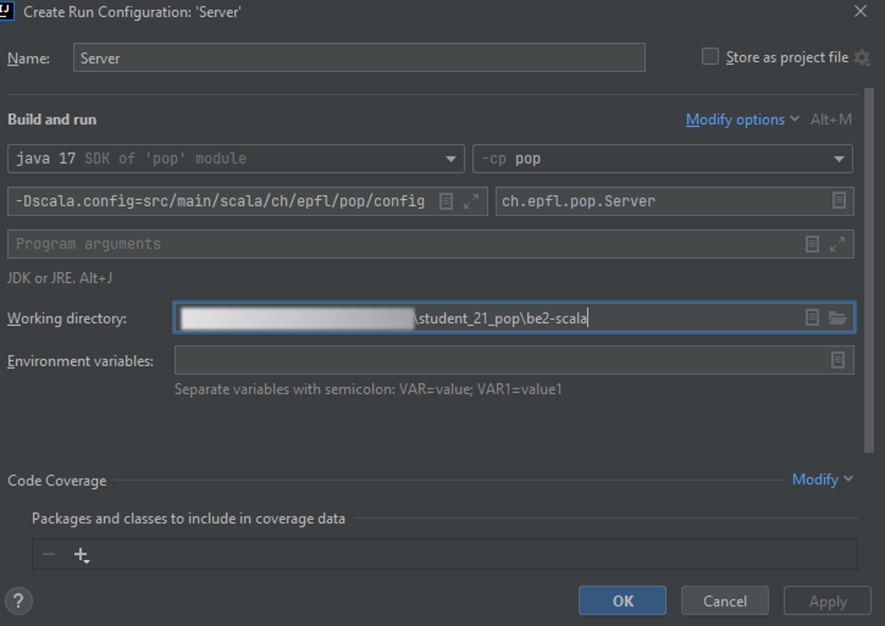

# popstellar: be2-scala branch

Proof-of-personhood, spring 2021: Scala language back-end

[TOC]

## Running the project

<span style="color:red;font-weight:bold">
Make sure to open be2-scala project folder as the root of your IDE workspace.
</span>

There are two main possible ways of running the project :

### Option 1: Intellij / VSCode

1. Import the project using your editor
2. Modify the default  Run configuration 'Server', to include the following __VM option__:

__```-Dscala.config=src/main/scala/ch/epfl/pop/config -Dscala.security=src/security```__ (click on **Modify options** and tick **Add VM options** if VM options box does not appear initially)



3. Due to [IntelliJ not executing sbt tasks on project compilation](https://intellij-support.jetbrains.com/hc/en-us/community/posts/205454630-SBT-What-actually-happens-when-I-click-on-Build-module-), our custom sbt tasks are not being run. Head to **IntelliJ IDEA** $\implies$ **Preferences** $\implies$ **Build, Execution, Deployment** $\implies$ **Build Tools** $\implies$ **sbt** and tick the option to use sbt shell for builds. Click on **Build** $\implies$ **Rebuild Project** to execute our sbt task.

#### Troubleshooting (IntelliJ)

Here are a few points that students often forget when setting up IntelliJ:

- make sure you have the [Scala plugin](https://plugins.jetbrains.com/plugin/1347-scala) installed on your IDE. You may install it directly from IntelliJ's settings (**IntelliJ IDEA** $\implies$ **Preferences** $\implies$ **Plugins**)
- make sure you actually have sbt on your machine
- if IntelliJ displays a banner stating "No Scala SDK in module", then make sure you actually have a version of the SDK on your machine (**File** $\implies$ **Project Structure...** $\implies$  **Global Libraries**). If not, simply install it using the `+` sign. We recommand SDK version `2.13.x`

### Option 2: SBT

Using `sbt -Dscala.config="path/to/config/file" -Dscala.security="src/security" run`.

There is a default configuration ready to use in
`src/main/scala/ch/epfl/pop/config` which contains an __application.config__
where the configuration lives. This can be updated if needed.

 ```apacheconf
# Snapshot of application.config

ch_epfl_pop_Server {
  http {
      interface = "127.0.0.1"
      port = "8000"
      client-path = "client"
      server-path = "server"
    }
}
 ```

Consequently, from **be2-scala/** folder run the following:

```bash
 sbt -Dscala.config="src/main/scala/ch/epfl/pop/config" -Dscala.security="src/security" run
```

---

## Security keys

The scala server needs security keys to run properly. Their location must be specified using the `-Dscala.security` flag.

By default, the folder is `src/security` and the script `src/security/generateKeys.sh` can be used to generate fresh keys.
> Go to the folder `src/security` and run `./generateKeys.sh`, or directly run `(cd ./src/security/ && ./generateKeys.sh)` from the current directory.

Security keys are also needed to run the tests. The process is the same except that tests expect to find the keys in a `test` folder (for example `src/security/test`), so run the script `generateKeys.sh` with the argument `-test` to take that into account. You don't need to generate new keys every time you run the tests.
> Go to the folder `src/security` and run `./generateKeys.sh -test`, or directly run `(cd ./src/security/ && ./generateKeys.sh -test)` from the current directory before running the tests.

Note that the script `generateKeys.sh` requires [**openssl**](https://www.openssl.org/) to be available on the system.

---

## Preprocessor flags

We introduced two custom [preprocessor flags](https://gcc.gnu.org/onlinedocs/gcc/Preprocessor-Options.html), one of which you already encountered:

- Config file location (**mandatory**): location of the config file on the system with respect to the be2-scala folder
- Security keys location (**mandatory**): location of the security keys on the system with respect to the be2-scala folder
- Database auto-cleanup (optional). By adding the `-Dclean` flag, the database will be recreated everytime the server starts running

---

## External libraries

The project relies on several sbt dependencies (external libraries) :

- websockets : [**akka-http**](https://doc.akka.io/docs/akka-http/current/introduction.html) for websocket server. It uses [akka-streams](https://doc.akka.io/docs/akka/current/stream/index.html) as dependency.
- database : [**leveldb**](https://github.com/codeborui/leveldb-scala) which relies on both [snappy](https://search.maven.org/artifact/org.xerial.snappy/snappy-java/1.1.7.3/jar) (for compression/decompression) and [akka-persistence](https://doc.akka.io/docs/akka/current/persistence.html)
- Json parser : [**spray-json**](https://github.com/spray/spray-json) for Json encoding/decoding
- encryption : [**tink**](https://github.com/google/tink/blob/master/docs/JAVA-HOWTO.md) to verify signatures
- encryption : [**kyber**](https://github.com/dedis/kyber) to encrypt and decrypt messages of an election
- testing : [**scalatest**](https://www.scalatest.org/) for unit tests
- Json schema validator : [**networknt**](https://github.com/networknt/json-schema-validator) for Json schema validation
- Json Web Tokens (jwt) : [java-jwt](https://github.com/auth0/java-jwt) to generate and sign jwt
- Qrcode : [**zxing**](https://github.com/zxing/zxing) to generate Qrcodes
- security keys : [**openssl**](https://www.openssl.org/) only used in `src/security/generateKeys.sh` to generate a pair of RSA keys

---

## Coding convention

Our coding guidelines can be found [here](https://docs.scala-lang.org/style/).

## Install java and sbt on linux and Mac

[skdman](https://sdkman.io/) does a pretty good job for installing the required
environment:

```sh
# install sdkman
curl -s "https://get.sdkman.io" | bash
# install java zulu 11
sdk install java 11.0.18-zulu
# install sbt
sdk install sbt
# check that everything went well
java -version
> openjdk version "11.0.18" 2023-01-17 LTS
```

## Package and run

Build the jar with:

```sh
sbt assembly
```

Run by specifying the configuration file:

```sh
java -Dscala.config="src/main/scala/ch/epfl/pop/config" -jar target/scala-2.13/pop-assembly-<version>-SNAPSHOT.jar
> ch.epfl.pop.Server online at ws://127.0.0.1:8000/client
```
