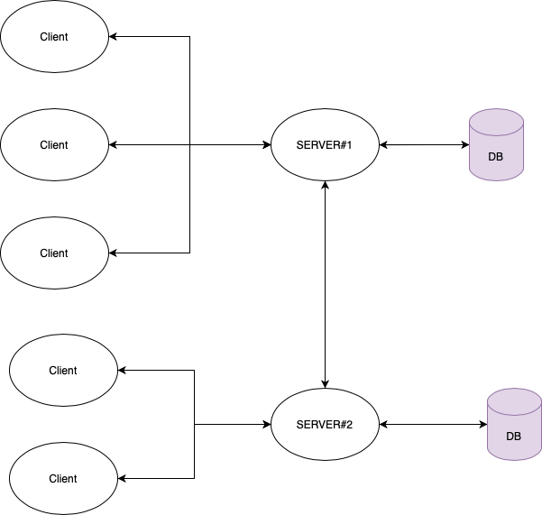

# PoP Scala backend

This repository contains the **scala server side implementation** of the PoP project.


## 1.	Getting Started

We assume that you're familiar with the PoP project. Please read the [Architecture Specifications](https://docs.google.com/document/d/19r3rP6o8TO-xeZBM0GQzkHYQFSJtWy7UhjLhzzZVry4) to get an idea about all the actors and components in the system.


### Resources

The code heavily relies on the principles of **actors** and **streams**. The first one is implemented using standard akka actors, whereas the latter uses akka DSL flow graphs. Finally, we use **spray-json** in order to properly encode/decode JSON messages.

- [Scala documentation](https://www.scala-lang.org/files/archive/api/2.13.1/)
- [Akka actors](https://doc.akka.io/docs/akka/current/typed/index.html)
- [Akka streams (DSL graphs)](https://doc.akka.io/docs/akka/current/stream/stream-graphs.html)
- [Spray-json](https://github.com/spray/spray-json): simple parsing library

Keep in mind that the [Pre-semester work project](https://docs.google.com/document/d/1gGRNVSKO4NGe2zzvVs28qJzkoMgIScq1iAQQct980pg) is a good tutorial to get familiar with both [WebSocket](https://en.wikipedia.org/wiki/WebSocket) and [Akka HTTP](https://doc.akka.io/docs/akka-http/current/index.html)


### IDE/Editors

The two most common Scala IDEs are VSCode and IntelliJ. Both are viable since we are using Scala version *2.13.x* (< 3.x).


## 2.	Project Structure

```
.
├── Server.scala 						# the entry point
│
├── json 								# module describing object & protocol json encoding/decoding
│
├── model 								# description of server's objects
│	├── network 						# JSON-rpc communication protocol model
│	└── objects 						# low-level server objects
│
└── pubsub 								# module handling the publish/subscribe model
	│
	├── ClientActor.scala 				# client model as an akka actor
	├── PubSubMediator.scala 			# handles pubsub channel operations
	├── PublishSubscribe.scala 			# DSL graph implementation
	│
	└── graph							# DSL graph description
		├── handlers 					# graph messages handlers
		└── validators 					# graph messages validators
```


## 3.	Architecture

The PoP Scala backend is used by LAO organizers and witnesses in order to store and validate LAO information/participation. A simplified version of the project is as follows: clients (either organizers, witnesses, or attendees) may connect to the server using WebSockets in order to "read" or "write" information on a database depending on their role in the LAO.

<div align="center">
  
</div>


In more details, the whole backend is a giant [DSL graph](https://doc.akka.io/docs/akka/current/stream/stream-graphs.html) (see image below). Whenever a new request is received (blue "Source" circle), a new `ClientActor` is automatically created for each new client. This actor *represents the fundamental link between a particular client and the server*; any message sent to the actor will arrive directly in the client's mailbox.

The `ClientActor` then transmits data destined for the server directly to a partitioner for further examination. This partitioner will decide which path a particular message will follow (e.g. a JSON-rpc query will not be treated the same way as a JSON-rpc response).

Once the message has been processed (e.g. LAO created if the message is valid or reject the request if it is not valid or does not follow our custom JSON-rpc protocol), the assigned handler (green and orange boxes) asks the `AnswerGenerator` to inform the client whether the operation was successful or not.

<div align="center">
  
</div>


If we look even closer, here is how the real be2 DSL graph is designed.

Between the `ClientActor` and the partitioner sits a module which goal is to validate conformity with our custom JSON-rcp protocol, decode the JSON payload, and then finally validate its fields.

The partitioner decides which path a message is supposed to take depending on its content; more precisely, depending on if it contains a "params" field or not. Further down the line, a handler is used for each type of message (e.g. the LAO handler is able to understand and process LAO messages such as `CreateLao`, `StateLao`, and `UpdateLao`)

The results are then collected by the main merger (blue "merger" circle) and sent to the `AnswerGenerator`. An answer (`JsonRpcResponse`) is created and sent back to the `ClientActor` (and thus the real client through WebSocket) by the `Answerer` module.

<div align="center">
  
</div>


### Sending and Receiving Messages

??? Explain ClientActor?

### Message Definition

All objects referred to in the protocol specification (and the logic for parsing them)
are defined in `model/network` package, closely mirroring the JSON-Schema folder structure.

Please note that the JSON-RPC definitions in the root of the repository are to be considered
a source of truth since the validation library checks the messages against it.

:information_source: When you need to create a new object, please refer to existing message types and in particular
their `buildFromJson` method to get an idea about how to implement a new type. In order to tell the encoder/decoder how to encode/decode the new message (e.g. `buildFromJson`), its "recipe" must be added directly in the `json/MessageDataProtocol.scala` file.


### Spray-json Conversion

Whenever a new JSON-rpc message is added in the protocol, its encoding/decoding recipe should be added in this package. If the new message is a case class, spray-json is able to handle message conversion using `jsonFormatX`, where `X` corresponds to the number of parameters the case class has. For example,

```scala
case class A(i: Int, s: String)

implicit val format: RootJsonFormat[A] = jsonFormat2(A)
```

or

```scala
case class B(price: Double)
case class A(name: String, b: B)

implicit val formatB: RootJsonFormat[B] = jsonFormat1(B) // (1)
implicit val formatA: RootJsonFormat[A] = jsonFormat2(A) // (2)
```

Note that order matters! In order to convert `A`, (2) gets called. It first handles the `name` parameter (`String`) and then converts `b` (`B`). Thus the conversion for `B` (here (1)) has to be defined *above*.

:warning: Spray-json is *not* able to automatically convert "complex" types such as `Option[T]`, `Either[A, B]`, ... Examples of such cases are provided in the codebase.


On the other hand, if the new message is anything but a case class, you will need to specify the entire conversion by hand with the help of two methods: `read` (from JSON to internal representation) and `write` (from internal representation to JSON). Note that, once again, order matters. For example,

```scala
class Point(var x: Int, var y: Int) {}

implicit object Format extends RootJsonFormat[Point] {
	override def read(json: JsValue): Point = {
		json.asJsObject.getFields("x", "y") match {
			case Seq(JsNumber(x), JsNumber(y)) => Point(x.toInt, y.toInt)
			case _ => throw ...
		}
	}

	override def write(obj: Point): JsValue = JsObject(
		"x" -> obj.x,
		"y" -> obj.y
	)
}

```

Once again, a lot of examples of such cases are present within the codebase

:information_source: *tips*: always try to prioritize case classes whenever possible :)


### Validation

All the incoming messages are validated in a two-steps process using the `pubsub/graph/validators` package:
1. Check conformity with the custom JSON-rpc protocol using `[...]validators/Validator.scala:schemaValidator`;
2. Check information validity (e.g. correct signature) using the rest of the `[...]validators` package.

Each additional message constraint (e.g. in this particular case, "start_time" should always equal "end_time") is checked in the corresponding validator (e.g. `LaoValidator`) before the case class instance representing the message is created.

### Storage

We are using [leveldb](https://github.com/codeborui/leveldb-scala) in order to store messages "inside" channels. A channel is represented with a standard directory. In the following example, we have 3 distinct channels (e.g. `root/u9nHxKYQkx7PXawcqs0DHUGEuc9Xv_P6blf7HxcDUTk=`).

```
.
├── database
│   └── root
│       └── u9nHxKYQkx7PXawcqs0DHUGEuc9Xv_P6blf7HxcDUTk=
│           ├── /* ... db stuff ... */
│       └── wfbY_ni1IbF7ziacoGlh7J9aAP1ukG2BPccRe4Z8EUc=
│           ├── /* ... db stuff ... */
│       └── zoaPYwfl9YRKEgdngCC6StufvhXWuvy-09g7l-KjG5g=
│           ├── /* ... db stuff ... */
```

Multiple messages may then be stored inside each channel. Since leveldb is a key-value database, we are using `message_id` as key and the corresponding `message` (in its json representation) as value

```scala
val messageId: Hash = message.message_id

Try(channelDb.put(messageId.getBytes, message.toJsonString.getBytes)) match {
	case Success(_) =>
		log.info(s"Actor $self (db) wrote message_id '$messageId' on channel '$channel'")
		sender ! DbActorWriteAck
	case Failure(exception) =>
		log.info(s"Actor $self (db) encountered a problem while writing message_id '$messageId' on channel '$channel'")
		sender ! DbActorNAck(ErrorCodes.SERVER_ERROR.id, exception.getMessage)
}
```


You may store/fetch data on/from the database using a special unique database actor (`DbActor`) using standard [akka ask pattern](https://doc.akka.io/docs/akka/current/typed/interaction-patterns.html#request-response). Akka messages `DbActor` understands are defined in `DbActor.scala:Event`, they include:

```scala
// DbActor Events correspond to messages the actor may receive
sealed trait Event

final case class Write(channel: Channel, message: Message) extends Event
final case class Read(channel: Channel, id: Hash) extends Event
```

`DbActor` will then answer using one of its predetermined answers defined within the same file:

```scala
// DbActor Events correspond to messages the actor may emit
sealed trait DbActorMessage

final case object DbActorWriteAck extends DbActorMessage
final case class DbActorReadAck(message: Option[Message]) extends DbActorMessage
final case class DbActorCatchupAck(messages: List[Message]) extends DbActorMessage
final case class DbActorNAck(code: Int, description: String) extends DbActorMessage
```

Here's an example (shamefully stolen from `MessageHandler.scala`) showing the power of `DbActor` coupled with Scala [Future](https://www.scala-lang.org/files/archive/api/2.13.1/scala/concurrent/Future.html)

```scala
val ask: Future[GraphMessage] = (dbActor ? DbActor.Write(channel, message)).map {
	case DbActorWriteAck => Left(rpcMessage)
	case DbActorNAck(code, description) => Right(PipelineError(code, description, rpcMessage.id))
	case _ => Right(PipelineError(
    ErrorCodes.SERVER_ERROR.id, "Database actor returned an unknown answer", rpcMessage.id)
	)
}

// Await.result waits for <duration> for the future <ask> to complete. It returns the value contained by the future (here `GraphMessage`) if the latter is successful, or throws if the Future terminates without being successful (i.e. either Failure or Timeout)
Await.result(ask, duration)
```


:information_source: the database may easily be reset/purged by either deleting a folder corresponding to a channel or by deleting the `database` folder entirely


### Import the project

`cd` where you want to have your project located and then clone the project using the following commands

```bash
git clone https://github.com/dedis/student_21_pop.git [folderProjectName]
```

We then want to navigate to the `be2-scala` subfolder

```bash
cd <folderProjectName>/be2-scala
```

You can then open the project using your favorite IDE (e.g. `idea .` for IntelliJ and `code .` for VSCode)

---

### Create a new branch

By default, the new branch you create will be a copy of `master`

```bash
git checkout -b <branchName>
```

If you rather want to make a copy of branch `x` (e.g. a branch that is currently being reviewed, i.e. not merged), use this instead

```bash
git checkout <x>
git checkout -b <branchName>
```

---

### Push changes on the remote server

When pushing changes, you first want to **commit** the changes you've applied using

```bash
git add <fileName>					# add file <fileName> to the commit
git commit -m"<message>"    # add a title to the commit (switch <message> for the actual message)

## Note: You may also add files separately using
git add <fileName>

## Note: You may also add all modified (!= new) files to the commit and set a title using
git commit -am"<message>"

## Note: You may also set a title and description for a specific commit using your favorite IDE (obviously doom emacs ^^). Then save and quit
git add <fileName>
git commit
```

<div align="center">
  
</div>

:information_source: Do not create a commit with 2.000 lines of codes! Short commit with meaningful titles/description are way better and way easier to review

:information_source: There are faster ways to add multiple files in the commit such as `git commit <-u|.>`. You can check the corresponding man page for more information

You then finally want to pull/push the changes

```bash
git pull			# safety check to see if no one applies changes to your branch in your absence
git push			# push the commited changes
```

Note that if you just created the branch, you'll need to tell git once where to push the changes using the following command instead of `git push`

```bash
git push -u origin <branchName>
```

:warning: You cannot directly push changes on `master`! For that, you need to go through the process of creating a pull request (see below)

---

### Merge a branch into another

Navigate (using `git checkout <branchName>`) to the branch you want the merge **to be applied to** (i.e. the branch that we merge another into!). Then perform the following command to merge the content of branch `x` into the current checked out branch

```bash
git merge <x>
```

---

### Create a pull request

Creating a pull request (PR) can only be done with on the [GitHub website](https://github.com/dedis/student_21_pop/pulls) by navigating on "Pull requests". Click on the big green button titled "New pull request" and choose the receiving branch (generally `master`) as well as the branch you want to merge into the latter (e.g. `work-be2-scala-raulinn-test`). Click on "Create pull request".

You can then set a title and description to your PR as well as set a label (e.g. `be2-scala`), an assignee (the person responsible for the code), a project (if any) and ask for a specific reviewer using the right side bar. Click on "Create pull request"

## 5.	Debugging Tips

The best way to "intercept" a `GraphMessage` being processed in the graph is to launch the server in debug mode, and then sending an isolated message to the server triggering the bug.

:information_source: [Hoppscotch](https://hoppscotch.io/realtime/) (Realtime => WebSocket => `ws://localhost:8000/`) is a useful tool to achieve this result


## 5.	Coding Styles

A simple way to have a coherent style across the codebase is to use the IDE features of "code cleanup". For example, in IntelliJ, click on the `src/main/scala` folder and then on `Code -> Reformat Code`. You can then check "include subdirectories", "optimize imports", and "cleanup code" checkbox options. Be careful to not apply these changes to `src/test` folder as it transforms the scalatest syntax into a mess difficult to understand.

Moreover, check that your favorite editor is detecting & using the `.editorconfig` file at the root of the project


## 7. Server `.jar` release

We have installed a simple but powerful plugin ([sbt-assembly](https://github.com/sbt/sbt-assembly)) to help build the "über-jar" version of the project. In the project folder, simply execute

```bash
sbt assembly
```

The all-in-one jar will automatically be created and located at `target/scala-x.xx/pop-assembly-0.x.jar`.

