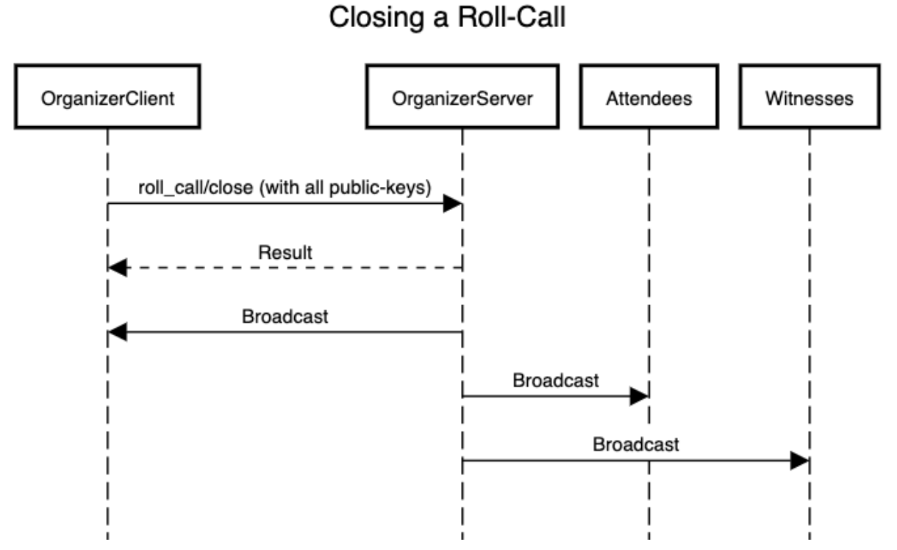
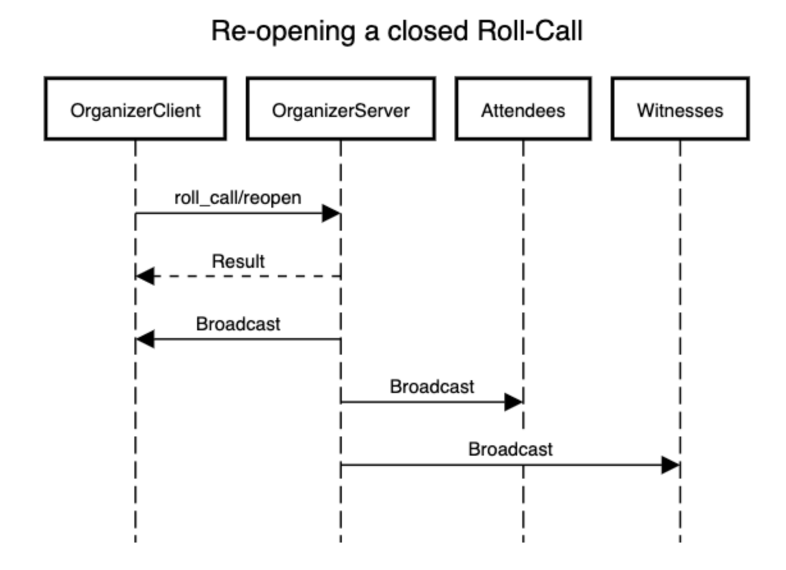

# High-level ("Message data") messages

<!-- START doctoc.sh generated TOC please keep comment here to allow auto update -->
<!-- DO NOT EDIT THIS SECTION, INSTEAD RE-RUN doctoc.sh TO UPDATE -->
**:book: Table of Contents**

- [High-level ("Message data") messages](#high-level-message-data-messages)
- [Introduction](#introduction)
  - [Creating a LAO (lao#create)](#creating-a-lao-laocreate)
  - [Update LAO properties (lao#update_properties)](#update-lao-properties-laoupdate_properties)
  - [LAO state broadcast (lao#state)](#lao-state-broadcast-laostate)
  - [Greeting new lao subscribers (lao#greet)](#greeting-new-lao-subscribers-laogreet)
  - [Witness a message (message#witness)](#witness-a-message-messagewitness)
  - [Creating a Meeting (meeting#create)](#creating-a-meeting-meetingcreate)
  - [Meeting state broadcast (meeting#state)](#meeting-state-broadcast-meetingstate)
  - [Roll Calls (introduction)](#roll-calls-introduction)
  - [Creating a Roll-Call (roll_call#create)](#creating-a-roll-call-roll_callcreate)
  - [Opening a Roll-Call (roll_call#open)](#opening-a-roll-call-roll_callopen)
  - [Closing a Roll-Call (roll_call#close)](#closing-a-roll-call-roll_callclose)
  - [Reopening a Roll-Call (roll_call#reopen)](#reopening-a-roll-call-roll_callreopen)
  - [Elections (introduction)](#elections-introduction)
  - [Setting up an Election (election#setup)](#setting-up-an-election-electionsetup)
  - [Receiving a key for an encrypted election (election#key)](#receiving-a-key-for-an-encrypted-election-electionkey)
  - [Opening an Election (election#open)](#opening-an-election-electionopen)
  - [Casting a vote (election#cast_vote)](#casting-a-vote-electioncast_vote)
  - [Ending an Election (election#end)](#ending-an-election-electionend)
  - [Sending the results of an Election (election#result)](#sending-the-results-of-an-election-electionresult)
  - [Publishing a Chirp (chirp#add)](#publishing-a-chirp-chirpadd)
  - [Removing a Chirp (chirp#delete)](#removing-a-chirp-chirpdelete)
  - [Publishing a reaction (reaction#add)](#publishing-a-reaction-reactionadd)
  - [Removing a reaction (reaction#delete)](#removing-a-reaction-reactiondelete)
  - [Consensus (introduction)](#consensus-introduction)
  - [Starting a Consensus (consensus#elect)](#starting-a-consensus-consensuselect)
  - [Accepting the start of a Consensus (consensus#elect_accept)](#accepting-the-start-of-a-consensus-consensuselect_accept)
  - [Preparing nodes for a Consensus (consensus#prepare)](#preparing-nodes-for-a-consensus-consensusprepare)
  - [Promising a value in the Consensus (consensus#promise)](#promising-a-value-in-the-consensus-consensuspromise)
  - [Proposing a value during a Consensus (consensus#propose)](#proposing-a-value-during-a-consensus-consensuspropose)
  - [Accepting a value during a Consensus (consensus#accept)](#accepting-a-value-during-a-consensus-consensusaccept)
  - [Sending the result of a Consensus (consensus#learn)](#sending-the-result-of-a-consensus-consensuslearn)
  - [Sending the failure of a Consensus (consensus#failure)](#sending-the-failure-of-a-consensus-consensusfailure)

<!-- END doctoc.sh generated TOC please keep comment here to allow auto update -->

**Note**: do not edit JSON messages directly. Those are automatically embedded
from `../protocol`. Use 
[embedme](https://github.com/dedis/popstellar/blob/master/docs/embedme.sh) to 
make an update.

# Introduction

**RPC Message** > **Query** > **Publish** > **Message** > **Message data**

A `Message` (see [protocol.md](protocol.md)) contains a special `data` field.
This field contains a serialized `Message data` message. A `Message data`
targets an `Object` and an `Action`. The `Object` can be seen as a class, and
the `Action` as a method. We represent this tuple (Object, Action) as a string
`<Object>#<Action>`.

Here are the existing `Message data`, identified by their unique
`<Object>#<Action>` attributes:

* lao#create
* lao#update_properties
* lao#state
* message#witness
* meeting#create
* meeting#state
* roll_call#create
* roll_call#open
* roll_call#close
* roll_call#reopen
* election#setup
* election#cast_vote
* election#end
* election#result

## Creating a LAO (lao#create)

By sending the lao/create message to the organizer’s server’s default channel
(“/root”), the main channel of the LAO will be created with the identifier id.
At that point, any of the clients, including the organizer, can subscribe to the
channel id and send messages over it. The server is expected to verify the data,
such that the last modified timestamp is equal to the creation timestamp, that
the timestamp is reasonably recent with respect to the server’s clock, that the
attestation is valid, etc. Upon successful creation, the organizer is expected
to broadcast the LAO state to all witnesses and clients (see “LAO state
broadcast”).

<details>
<summary>
💡 See an example
</summary>

```json5
// ../protocol/examples/messageData/lao_create/lao_create.json

{
    "object": "lao",
    "action": "create",
    "id": "fzJSZjKf-2cbXH7kds9H8NORuuFIRLkevJlN7qQemjo=",
    "name": "LAO",
    "creation": 1633098234,
    "organizer": "J9fBzJV70Jk5c-i3277Uq4CmeL4t53WDfUghaK0HpeM=",
    "witnesses": []
}

```

</details>


```json5
// ../protocol/query/method/message/data/dataCreateLao.json

{
    "$schema": "http://json-schema.org/draft-07/schema#",
    "$id": "https://raw.githubusercontent.com/dedis/popstellar/master/protocol/query/method/message/data/dataCreateLao.json",
    "description": "Match a create LAO query",
    "type": "object",
    "properties": {
        "object": {
            "const": "lao"
        },
        "action": {
            "const": "create"
        },
        "id": {
            "type": "string",
            "contentEncoding": "base64",
            "$comment": "Hash : HashLen(organizer, creation, name)"
        },
        "name": {
            "type": "string"
        },
        "creation": {
            "description": "[Timestamp] creation time",
            "type": "integer",
            "minimum": 0
        },
        "organizer": {
            "description": "[Base64String] public key of the organizer",
            "type": "string",
            "contentEncoding": "base64"
        },
        "witnesses": {
            "description": "[Array[Base64String]] list of public keys of witnesses",
            "type": "array",
            "uniqueItems": true,
            "items": {
                "type": "string",
                "contentEncoding": "base64"
            }
        }
    },
    "additionalProperties": false,
    "required": [
        "object",
        "action",
        "id",
        "name",
        "creation",
        "organizer",
        "witnesses"
    ],
    "note": [
        "By sending the lao/create message to the organizer’s server’s default channel (\"/root\"), the main channel of ",
        "the LAO will be created with the identifier id. At that point, any of the clients, including the organizer, can ",
        "subscribe to the channel id and send messages over it. The server is expected to verify the data, such that the ",
        "last modified timestamp is equal to the creation timestamp, that the timestamp is reasonably recent with respect ",
        "to the server’s clock, that the attestation is valid, etc. Upon successful creation, the organizer is ",
        "expected to broadcast the LAO state to all witnesses and clients (see \"LAO state broadcast\")"
    ]
}

```

## Update LAO properties (lao#update_properties)

By sending the lao/update_properties message to the LAO’s main channel (LAO's
“id”), the LAO name, list of witnesses and last modified timestamp are updated.
The server is expected to forward the message to the witnesses and clients. The
server is expected to verify the data, including timestamp freshness. Upon
successful modification, the organizer is expected to broadcast the LAO state to
all witnesses and clients (see “LAO state broadcast”).

<details>
<summary>
💡 See an example
</summary>

```json5
// ../protocol/examples/messageData/lao_update/lao_update.json

{
    "object": "lao",
    "action": "update_properties",
    "id": "fzJSZjKf-2cbXH7kds9H8NORuuFIRLkevJlN7qQemjo=",
    "name": "LAO",
    "last_modified": 1633099140,
    "witnesses": ["M5ZychEi5rwm22FjwjNuljL1qMJWD2sE7oX9fcHNMDU="]
}

```

</details>

```json5
// ../protocol/query/method/message/data/dataUpdateLao.json

{
    "$schema": "http://json-schema.org/draft-07/schema#",
    "$id": "https://raw.githubusercontent.com/dedis/popstellar/master/protocol/query/method/message/data/dataUpdateLao.json",
    "description": "Match an update LAO query",
    "type": "object",
    "properties": {
        "object": {
            "const": "lao"
        },
        "action": {
            "const": "update_properties"
        },
        "id": {
            "type": "string",
            "contentEncoding": "base64",
            "$comment": "Hash : HashLen(organizer, creation, name)"
        },
        "name": {
            "type": "string"
        },
        "last_modified": {
            "description": "[Timestamp] last modification's time",
            "type": "integer",
            "minimum": 0
        },
        "witnesses": {
            "description": "[Array[Base64String]] list of public keys of witnesses",
            "type": "array",
            "uniqueItems": true,
            "items": {
                "type": "string",
                "contentEncoding": "base64"
            }
        }
    },
    "additionalProperties": false,
    "required": [
        "object",
        "action",
        "id",
        "name",
        "last_modified",
        "witnesses"
    ],
    "note": [
        "By sending the lao/update_properties message to the LAO’s main channel (LAO's id), the LAO name, list of ",
        "witnesses and last modified timestamp are updated. The server is expected to forward the message to the ",
        "witnesses and clients. The server is expected to verify the data, including timestamp freshness. Upon successful ",
        "modification, the organizer is expected to broadcast the LAO state to all witnesses and clients (see ",
        "\"LAO state broadcast\")"
    ]
}

```

## LAO state broadcast (lao#state)

When a LAO is created or modified, the organizer is expected to publish the
lao/state message to the LAO’s main channel (LAO's “id”), once it has received
the required number of witness signatures.

<details>
<summary>
💡 See an example
</summary>

```json5
// ../protocol/examples/messageData/lao_state/lao_state.json

{
    "object": "lao",
    "action": "state",
    "id": "fzJSZjKf-2cbXH7kds9H8NORuuFIRLkevJlN7qQemjo=",
    "name": "LAO",
    "creation": 1633098234,
    "last_modified": 1633099140,
    "organizer": "J9fBzJV70Jk5c-i3277Uq4CmeL4t53WDfUghaK0HpeM=",
    "witnesses": ["M5ZychEi5rwm22FjwjNuljL1qMJWD2sE7oX9fcHNMDU="],
    "modification_id": "fzJSZjKf-2cbXH7kds9H8NORuuFIRLkevJlN7qQemjo=",
    "modification_signatures": [
        {
            "witness": "M5ZychEi5rwm22FjwjNuljL1qMJWD2sE7oX9fcHNMDU=",
            "signature": "XXX"
        }
    ]
}

```

</details>

```json5
// ../protocol/query/method/message/data/dataStateLao.json

{
    "$schema": "http://json-schema.org/draft-07/schema#",
    "$id": "https://raw.githubusercontent.com/dedis/popstellar/master/protocol/query/method/message/data/dataStateLao.json",
    "description": "Match a state broadcast LAO query",
    "type": "object",
    "properties": {
        "object": {
            "const": "lao"
        },
        "action": {
            "const": "state"
        },
        "id": {
            "type": "string",
            "contentEncoding": "base64",
            "$comment": "Hash : HashLen(organizer, creation, name)"
        },
        "name": {
            "type": "string"
        },
        "creation": {
            "description": "[Timestamp] creation time",
            "type": "integer",
            "minimum": 0
        },
        "last_modified": {
            "description": "[Timestamp] last modification's time",
            "type": "integer",
            "minimum": 0
        },
        "organizer": {
            "description": "[Base64String] public key of the organizer",
            "type": "string",
            "contentEncoding": "base64"
        },
        "witnesses": {
            "description": "[Array[Base64String]] list of public keys of witnesses",
            "type": "array",
            "uniqueItems": true,
            "items": {
                "type": "string",
                "contentEncoding": "base64"
            }
        },
        "modification_id": {
            "description": "[Base64String] id of the modification (either creation/update)",
            "type": "string",
            "contentEncoding": "base64"
        },
        "modification_signatures": {
            "description": "[Array[Base64String]] signatures of the witnesses on the modification message (either creation/update)",
            "type": "array",
            "items": {
                "type": "object",
                "properties": {
                    "witness": {
                        "description": "[Base64String] public key of the witness",
                        "type": "string",
                        "contentEncoding": "base64",
                        "$comment": "Note: the string is encoded in Base64"
                    },
                    "signature": {
                        "description": "[Base64String] witness' signature : Sign(message_id)",
                        "type": "string",
                        "contentEncoding": "base64",
                        "$comment": "Note: the strings are encoded in Base64"
                    }
                },
                "additionalProperties": false,
                "required": ["witness", "signature"]
            }
        }
    },
    "additionalProperties": false,
    "required": [
        "object",
        "action",
        "id",
        "name",
        "creation",
        "last_modified",
        "organizer",
        "witnesses",
        "modification_id",
        "modification_signatures"
    ],
    "note": [
        "When a LAO is created or modified, the organizer is expected to publish the lao/state message to the ",
        "LAO’s main channel (LAO's id), once it got the required number of witness signatures"
    ]
}

```

## Greeting new lao subscribers (lao#greet)
🧭 **RPC Message** > **RPC payload** (*Query*) > **Query payload** (*Publish*) >
**Mid Level** > **High level** (*lao#greet*)

This is a message that is broadcasted by the server on the lao channel after it is created. Clients can then receive this message by sending a [catchup message](./protocol.md#catching-up-on-past-messages-on-a-channel).


The message contains the server's (canonical) address, its public key (not in the message content but it is part of the Mid Level) and a list of peers. The canonical address is the address the client is supposed to use in order to connect to the server. This allows clients to more easily tell apart synonyms such as `128.179.33.44` and `dedis.ch`. More importantly it tells the client the name that should be linked to the public key (`sender`) that is also part of the greeting message and enables client to implement public key pinning. There is one greeting message per LAO since the list of peers can differ between LAOs run on the same server.

Most messages are sent by frontends but there are also some messages that originate from the backend. These messages are signed using the private key corresponding to the public key received by this message.

In order to bind the server owner's (either an organizer or a witness) frontend to the server, the lao#greet message contains the public key of the frontend of server's owner. At this point the claim is only one-directional and this a lao#greet message should only be treated as being valid if it has been signed by the corresponding frontend key using a witness signature. This then makes the binding bidirectional. (For now this check is omitted since the witnessing functionality has not been implemented in all subsystems)

Last but not least, the greeting message contains a list of peers that tells client which other servers it can or should connect to. These severs run by other organizers or witnesses allow the client to send messages to multiple servers which increases the likelihood of sending it to a honest one.

<details>
<summary>
💡 See an example
</summary>

```json5
// ../protocol/examples/messageData/lao_greet/greeting.json

{
    "object": "lao",
    "action": "greet",
    "lao": "p_EYbHyMv6sopI5QhEXBf40MO_eNoq7V_LygBd4c9RA=",
    "frontend": "J9fBzJV70Jk5c-i3277Uq4CmeL4t53WDfUghaK0HpeM=",
    "address": "wss://popdemo.dedis.ch:8000/demo",
    "peers": [
        {
            "address": "wss://popdemo.dedis.ch:8000/second-organizer-demo"
        },
        {
            "address": "wss://popdemo.dedis.ch:8000/witness-demo"
        }
    ]
}

```

<details>

```json5
// ../protocol/query/method/message/data/dataGreetLao.json

{
    "$schema": "http://json-schema.org/draft-07/schema#",
    "$id": "https://raw.githubusercontent.com/dedis/popstellar/master/protocol/query/method/message/data/dataGreetLao.json",
    "description": "Match a lao greeting query",
    "$comment": "A message the back-end sends to clients when they subscribe to a LAO. It informs clients about the servers public key and its peers for this lao",
    "type": "object",
    "properties": {
        "object": {
            "const": "lao"
        },
        "action": {
            "const": "greet"
        },
        "lao": {
            "type": "string",
            "contentEncoding": "base64",
            "$comment": "ID of the LAO"
        },
        "frontend": {
            "description": "[Base64String] public key of the frontend of the server owner",
            "type": "string",
            "contentEncoding": "base64",
            "$comment": "Note: the string is encoded in Base64"
        },
        "address": {
            "description": "Canonical address of the server with a protocol prefix and (optionally) the port number",
            "type": "string",
            "pattern": "^(ws|wss):\/\/.*(:\d{0,5})?\/.*$"
        },
        "peers": {
            "description": "A list of peers the server is connected to (excluding itself). These can be other organizers or witnesses",
            "type": "array",
            "items": {
                "type": "object",
                "additionalProperties": false,
                "properties": {
                    "address": {
                        "description": "Canonical address of the peer with a protocol prefix and (optionally) the port number",
                        "type": "string",
                        "pattern": "^(ws|wss):\/\/.*(:\d{0,5})?\/.*$"
                    }
                },
                "required": ["address"]
            }
        }
    },
    "additionalProperties": false,
    "required": ["object", "action", "lao", "frontend", "address", "peers"]
}

```

</details>

## Witness a message (message#witness)

By sending the message/witness message to the LAO’s main channel (LAO's “id”), a
witness can attest to the message. Upon reception, the server and the witnesses
add this signature to the existing message’s `witness_signatures` field. When a
new client retrieves this message, the `witness_signatures` field will be
populated with all the witness signatures received by the server.

<details>
<summary>
💡 See an example
</summary>

```json5
// ../protocol/examples/messageData/message_witness.json

{
    "object": "message",
    "action": "witness",
    "message_id": "kAG_m4nEQXkguuO_LVphXFE_c_dPoQrHNsb0MvwhXTA=",
    "signature": "Lgax5s25xVVF-6j5KNPE85oP3RyUtRZR0OSD5nNH34YT1DzlOFixmYyIcB5wZKjuKJ_nB3YkNwVGW5z96LC7Bw=="
}

```

</details>

```json5
// ../protocol/query/method/message/data/dataWitnessMessage.json

{
    "$schema": "http://json-schema.org/draft-07/schema#",
    "$id": "https://raw.githubusercontent.com/dedis/popstellar/master/protocol/query/method/message/data/dataWitnessMessage.json",
    "description": "Match a witness a message query",
    "type": "object",
    "properties": {
        "object": {
            "const": "message"
        },
        "action": {
            "const": "witness"
        },
        "message_id": {
            "type": "string",
            "contentEncoding": "base64",
            "note": "message_id of the message to witness"
        },
        "signature": {
            "description": "[Base64String] signature by the witness over the \"message_id\" field of the message",
            "type": "string",
            "contentEncoding": "base64"
        }
    },
    "additionalProperties": false,
    "required": ["object", "action", "message_id", "signature"],
    "note": [
        "By sending the message/witness message to the LAO’s main channel (LAO's id), a witness can attest to the ",
        "message. Upon reception, the server and the witnesses add this signature to the existing message’s ",
        "witness_signatures field. When a new client retrieves this message, the witness_signatures field will be ",
        "populated with all the witness signatures received by the server"
    ]
}

```

## Creating a Meeting (meeting#create)

🧭 **RPC Message** > **RPC payload** (*Query*) > **Query payload** (*Publish*) >
**Mid Level** > **High level** (*meeting#create*)

By sending the meeting/create message to the LAO’s main channel (LAO's “id”),
the meeting will be created with the identifier `id`. The server is expected to
verify the data, such that the last modified timestamp is equal to the creation
timestamp, that the timestamp is reasonably recent with respect to the server’s
clock, that the attestation is valid, etc. Upon successful creation, the server
is expected to broadcast the Meeting state to all witnesses and clients (see
“Meeting state broadcast”).

<details>
<summary>
💡 See an example
</summary>

```json5
// ../protocol/examples/messageData/meeting_create.json

{
    "object": "meeting",
    "action": "create",
    "id": "wY29dWimwUQa0EWerQ7bNsRddlYtHBgJiEL8ZHnzjv8=",
    "name": "Meeting",
    "creation": 1633098331,
    "location": "EPFL",
    "start": 1633098900,
    "end": 1633102500
}

```

</details>

```json5
// ../protocol/query/method/message/data/dataCreateMeeting.json

{
    "$schema": "http://json-schema.org/draft-07/schema#",
    "$id": "https://raw.githubusercontent.com/dedis/popstellar/master/protocol/query/method/message/data/dataCreateMeeting.json",
    "description": "Match a create Meeting query",
    "type": "object",
    "properties": {
        "object": {
            "const": "meeting"
        },
        "action": {
            "const": "create"
        },
        "id": {
            "type": "string",
            "contentEncoding": "base64",
            "$comment": "Hash : HashLen('M', lao_id, creation, name)"
        },
        "name": {
            "type": "string"
        },
        "creation": {
            "description": "[Timestamp] creation time",
            "type": "integer",
            "minimum": 0
        },
        "location": {
            "description": "[String] location of the meeting",
            "type": "string",
            "$comment": "Note: optional"
        },
        "start": {
            "description": "[Timestamp] start time",
            "type": "integer",
            "minimum": 0
        },
        "end": {
            "description": "[Timestamp] end time",
            "type": "integer",
            "minimum": 0,
            "$comment": "Note: optional"
        },
        "extra": {
            "description": "[JsObject] arbitrary object for extra information",
            "type": "object",
            "$comment": "Note: optional"
        }
    },
    "additionalProperties": false,
    "required": ["object", "action", "id", "name", "creation", "start"],
    "note": [
        "By sending the meeting/create message to the LAO’s main channel (LAO's id), the meeting will be created with ",
        "the identifier id. The server is expected to verify the data, such that the last modified timestamp is equal ",
        "to the creation timestamp, that the timestamp is reasonably recent with respect to the server’s clock, that ",
        "the attestation is valid, etc. Upon successful creation, the organizer is expected to broadcast the Meeting state ",
        "to all witnesses and clients (see \"Meeting state broadcast\")"
    ]
}

```

## Meeting state broadcast (meeting#state)

When a meeting is created, modified or attested to by a witness, the server is
expected to publish the meeting/state message to the LAO’s main channel (LAO's
“id”). 

<details>
<summary>
💡 See an example
</summary>

```json5
// ../protocol/examples/messageData/meeting_state.json

{
    "object": "meeting",
    "action": "state",
    "id": "wY29dWimwUQa0EWerQ7bNsRddlYtHBgJiEL8ZHnzjv8=",
    "name": "Meeting",
    "creation": 1633098331,
    "last_modified": 1633098340,
    "location": "EPFL",
    "start": 1633098900,
    "end": 1633102500,
    "modification_id": "wY29dWimwUQa0EWerQ7bNsRddlYtHBgJiEL8ZHnzjv8=",
    "modification_signatures": [
        {
            "witness": "M5ZychEi5rwm22FjwjNuljL1qMJWD2sE7oX9fcHNMDU=",
            "signature": "XXX"
        }
    ]
}

```

</details>

```json5
// ../protocol/query/method/message/data/dataStateMeeting.json

{
    "$schema": "http://json-schema.org/draft-07/schema#",
    "$id": "https://raw.githubusercontent.com/dedis/popstellar/master/protocol/query/method/message/data/dataStateMeeting.json",
    "description": "Match a state broadcast Meeting query",
    "type": "object",
    "properties": {
        "object": {
            "const": "meeting"
        },
        "action": {
            "const": "state"
        },
        "id": {
            "type": "string",
            "contentEncoding": "base64",
            "$comment": "Hash : HashLen('M', lao_id, creation, name)"
        },
        "name": {
            "type": "string"
        },
        "creation": {
            "description": "[Timestamp] creation time",
            "type": "integer",
            "minimum": 0
        },
        "last_modified": {
            "description": "[Timestamp] last modification's time",
            "type": "integer",
            "minimum": 0
        },
        "location": {
            "description": "[String] location of the meeting",
            "type": "string",
            "$comment": "Note: optional"
        },
        "start": {
            "description": "[Timestamp] start time",
            "type": "integer",
            "minimum": 0
        },
        "end": {
            "description": "[Timestamp] end time",
            "type": "integer",
            "minimum": 0,
            "$comment": "Note: optional"
        },
        "extra": {
            "description": "[JsObject] arbitrary object for extra information",
            "type": "object",
            "$comment": "Note: optional"
        },
        "modification_id": {
            "description": "[Base64String] id of the modification (either creation/update)",
            "type": "string",
            "contentEncoding": "base64"
        },
        "modification_signatures": {
            "description": "[Array[Base64String]] signatures of the witnesses on the modification message (either creation/update)",
            "type": "array",
            "items": {
                "type": "object",
                "properties": {
                    "witness": {
                        "description": "[Base64String] public key of the witness",
                        "type": "string",
                        "contentEncoding": "base64",
                        "$comment": "Note: the string is encoded in Base64"
                    },
                    "signature": {
                        "description": "[Base64String] witness' signature : Sign(message_id)",
                        "type": "string",
                        "contentEncoding": "base64",
                        "$comment": "Note: the strings are encoded in Base64"
                    }
                },
                "additionalProperties": false,
                "required": ["witness", "signature"]
            }
        }
    },
    "additionalProperties": false,
    "required": [
        "object",
        "action",
        "id",
        "name",
        "creation",
        "last_modified",
        "start",
        "modification_id",
        "modification_signatures"
    ],
    "note": [
        "When a meeting is created or modified, the organizer is expected to publish the ",
        "meeting/state message to the LAO’s main channel (LAO's id)"
    ]
}

```

## Roll Calls (introduction)

A roll call has the following state transitions:

Created → Opened → Closed → Reopened → Closed

**Created**: This states denotes the organizers intention of organizing a new
roll call.  
**Opened**: This state denotes that the roll call is open and the organizer and
**witnesses** are ready to scan the QR code(s) of the attendees.  
**Closed**: This state denotes the closing of a roll call and contains all the
**attendee** public keys scanned during the roll call process.  

## Creating a Roll-Call (roll_call#create)

🧭 **RPC Message** > **RPC payload** (*Query*) > **Query payload** (*Publish*) >
**Mid Level** > **High level** (*roll_call#create*)

An organizer creates a roll-call by publishing a roll_call/create message to the
LAO’s channel. The proposed_start and proposed_end fields denote the start and
end time for the roll call. Note that these fields are only used to position the
event correctly in the list of LAO events. Witnesses witness the roll call event
ensuring that each attendee is scanned exactly once.

<details>
<summary>
💡 See an example
</summary>

```json5
// ../protocol/examples/messageData/roll_call_create.json

{
    "object": "roll_call",
    "action": "create",
    "id": "fEvAfdtNrykd9NPYl9ReHLX-6IP6SFLKTZJLeGUHZ_U=",
    "name": "Roll Call ",
    "creation": 1633098853,
    "proposed_start": 1633099125,
    "proposed_end": 1633099140,
    "location": "EPFL",
    "description": "Food is welcome!"
}

```

</details>

```json5
// ../protocol/query/method/message/data/dataCreateRollCall.json

{
    "$schema": "http://json-schema.org/draft-07/schema#",
    "$id": "https://raw.githubusercontent.com/dedis/popstellar/master/protocol/query/method/message/data/dataCreateRollCall.json",
    "description": "Match a create roll-call query",
    "type": "object",
    "properties": {
        "object": {
            "const": "roll_call"
        },
        "action": {
            "const": "create"
        },
        "id": {
            "type": "string",
            "contentEncoding": "base64",
            "$comment": "Hash : HashLen('R', lao_id, creation, name)"
        },
        "name": {
            "type": "string"
        },
        "creation": {
            "description": "[Timestamp] creation time",
            "type": "integer",
            "minimum": 0
        },
        "proposed_start": {
            "description": "[Timestamp] proposed start time",
            "type": "integer",
            "minimum": 0
        },
        "proposed_end": {
            "description": "[Timestamp] proposed end time",
            "type": "integer",
            "minimum": 0
        },
        "location": {
            "description": "[String] location of the roll-call",
            "type": "string"
        },
        "description": {
            "description": "An optional description of the meeting",
            "type": "string",
            "$comment": "Optional"
        }
    },
    "additionalProperties": false,
    "required": [
        "object",
        "action",
        "id",
        "name",
        "creation",
        "location",
        "proposed_start",
        "proposed_end"
    ],
    "note": [
        "The roll_call/create message denotes the organizer's intention to create a new roll call",
        "The proposed_start and proposed_end fields denote the start and end time for the roll call for displaying the event in the UI.",
        "The roll call may however be only considered started/closed based on its latest state and the attestation of witnesses for the message leading to that state transition."
    ]
}

```

## Opening a Roll-Call (roll_call#open)

A roll-call may be opened by the organizer by publishing a roll_call/open
message on the LAO channel.

<details>
<summary>
💡 See an example
</summary>

```json5
// ../protocol/examples/messageData/roll_call_open.json

{
    "object": "roll_call",
    "action": "open",
    "update_id": "krCHh6OFWIjSHQiUSrWyx1FV0Jp8deC3zUyelhPG-Yk=",
    "opens": "fEvAfdtNrykd9NPYl9ReHLX-6IP6SFLKTZJLeGUHZ_U=",
    "opened_at": 1633099127
}

```

</details>

```json5
// ../protocol/query/method/message/data/dataOpenRollCall.json

{
    "$schema": "http://json-schema.org/draft-07/schema#",
    "$id": "https://raw.githubusercontent.com/dedis/popstellar/master/protocol/query/method/message/data/dataOpenRollCall.json",
    "description": "Match a open roll-call query",
    "type": "object",
    "properties": {
        "object": {
            "const": "roll_call"
        },
        "action": {
            "enum": ["open", "reopen"]
        },
        "update_id": {
            "type": "string",
            "contentEncoding": "base64",
            "$comment": "Hash : HashLen('R', lao_id, opens, opened_at)"
        },
        "opens": {
            "type": "string",
            "contentEncoding": "base64",
            "$comment": "The 'update_id' of the latest roll call close, or in its absence, the 'id' field of the roll call creation"
        },
        "opened_at": {
            "description": "[Timestamp] start time",
            "type": "integer",
            "minimum": 0,
            "$comment": "The time at which the roll call is opened/reopened"
        }
    },
    "additionalProperties": false,
    "required": ["object", "action", "update_id", "opens", "opened_at"],
    "note": [
        "The roll_call/open message opens a roll call. This message would lead to a transition from the",
        "created -> opened state after witnesses attest the message. Witnesses should attest this when they",
        "can ensure the roll call has actually started. roll_call/reopen may be used to re-open a",
        "closed roll call in case of a human error (forgot to scan a QR Code). A roll_call/reopen attested by",
        "witnesses would cause a transition from closed -> opened state"
    ]
}

```

## Closing a Roll-Call (roll_call#close)

A roll-call may be closed by the organizer by publishing a roll_call/close
message on the LAO channel. This is effectively the message that will be sent by
the organizer after scanning all attendees’ public key. 



<details>
<summary>
💡 See an example
</summary>

```json5
// ../protocol/examples/messageData/roll_call_close.json

{
    "object": "roll_call",
    "action": "close",
    "update_id": "WxoPg4wLpmog0Q5eQewQ5AAD19RW-8-6aSZ2mGIJRO8=",
    "closes": "krCHh6OFWIjSHQiUSrWyx1FV0Jp8deC3zUyelhPG-Yk=",
    "closed_at": 1633099135,
    "attendees": ["M5ZychEi5rwm22FjwjNuljL1qMJWD2sE7oX9fcHNMDU="]
}

```

</details>

```json5
// ../protocol/query/method/message/data/dataCloseRollCall.json

{
    "$schema": "http://json-schema.org/draft-07/schema#",
    "$id": "https://raw.githubusercontent.com/dedis/popstellar/master/protocol/query/method/message/data/dataCloseRollCall.json",
    "description": "Match a close roll-call query",
    "type": "object",
    "properties": {
        "object": {
            "const": "roll_call"
        },
        "action": {
            "const": "close"
        },
        "update_id": {
            "type": "string",
            "contentEncoding": "base64",
            "$comment": "Hash : HashLen('R', lao_id, closes, closed_at)"
        },
        "closes": {
            "type": "string",
            "contentEncoding": "base64",
            "$comment": "The 'update_id' of the latest roll call open/reopen"
        },
        "closed_at": {
            "description": "[Timestamp] end time",
            "type": "integer",
            "minimum": 0
        },
        "attendees": {
            "description": "[Array[Base64String]] list of public keys of attendees",
            "type": "array",
            "uniqueItems": true,
            "items": {
                "type": "string",
                "contentEncoding": "base64"
            }
        }
    },
    "additionalProperties": false,
    "required": [
        "object",
        "action",
        "update_id",
        "closes",
        "closed_at",
        "attendees"
    ],
    "note": [
        "When the organizer scanned all the public keys of the attendees, it closes the event",
        "and broadcast attendees public keys. A roll_call/close message attested by witnesses",
        "leads to a transition from opened -> closed state. Usually, the event can only be closed once.",
        "In some special case, the event may be reopened (e.g. the organizer forgot to scan the key",
        "of an attendee, so we reopen 2 minutes later). In this case, we can close the event a",
        "second (or more) time. Please see `dataOpenRollCall.json` for more information."
    ]
}

```

## Reopening a Roll-Call (roll_call#reopen)

A closed roll-call may be re-opened by the organizer by publishing a
roll_call/reopen message on the LAO channel. This is useful in scenarios where
the organizer forgets to scan an attendee’s public key.



<details>
<summary>
💡 See an example
</summary>

```json5
// ../protocol/examples/messageData/roll_call_reopen.json

{
    "object": "roll_call",
    "action": "reopen",
    "update_id": "sgMsQ4EPPwKbHw3TsiCwkyH1JvilxPn0Y9iTEcbNMl4=",
    "opens": "WxoPg4wLpmog0Q5eQewQ5AAD19RW-8-6aSZ2mGIJRO8=",
    "opened_at": 1633099137
}

```

</details>

```json5
// ../protocol/query/method/message/data/dataOpenRollCall.json

{
    "$schema": "http://json-schema.org/draft-07/schema#",
    "$id": "https://raw.githubusercontent.com/dedis/popstellar/master/protocol/query/method/message/data/dataOpenRollCall.json",
    "description": "Match a open roll-call query",
    "type": "object",
    "properties": {
        "object": {
            "const": "roll_call"
        },
        "action": {
            "enum": ["open", "reopen"]
        },
        "update_id": {
            "type": "string",
            "contentEncoding": "base64",
            "$comment": "Hash : HashLen('R', lao_id, opens, opened_at)"
        },
        "opens": {
            "type": "string",
            "contentEncoding": "base64",
            "$comment": "The 'update_id' of the latest roll call close, or in its absence, the 'id' field of the roll call creation"
        },
        "opened_at": {
            "description": "[Timestamp] start time",
            "type": "integer",
            "minimum": 0,
            "$comment": "The time at which the roll call is opened/reopened"
        }
    },
    "additionalProperties": false,
    "required": ["object", "action", "update_id", "opens", "opened_at"],
    "note": [
        "The roll_call/open message opens a roll call. This message would lead to a transition from the",
        "created -> opened state after witnesses attest the message. Witnesses should attest this when they",
        "can ensure the roll call has actually started. roll_call/reopen may be used to re-open a",
        "closed roll call in case of a human error (forgot to scan a QR Code). A roll_call/reopen attested by",
        "witnesses would cause a transition from closed -> opened state"
    ]
}

```

## Elections (introduction)

An election has the following phases:

Setup (→ Receive key) → Open → Cast vote(s) → End → Result

**Setup**: This phase consists of the organizer creating a new election.
**(Receive key)**: If the election was setup with the secret ballot option. The backend will send this message after generating the key.
**Open**: This state consists of the organizer opening the election.
**Cast vote(s)**: This phase consists of the members of the LAO casting a vote.  
**End**: This phase consists of the organizer ending the election. No new votes are accepted from now on.
**Result**: This phase consists of the organizer determining the outcome of the election and retrieving the **witness* signatures on it.

## Setting up an Election (election#setup)

🧭 **RPC Message** > **RPC payload** (*Query*) > **Query payload** (*Publish*) >
**Mid Level** > **High level** (*election#setup*)

By sending the election/setup message to the organizer’s server’s channel
(“/root/lao-channel”), the main channel of the election will be created with the identifier id, i.e. `/root/<lao_id>/<election_id>`.
The election will be created with the start_time and end_time fields denote the start and end time for the election.

An election can either be open or secret ballot and the `version` property has to be set to `OPEN_BALLOT` or `SECRET_BALLOT`, respectively.

In the future elections may allow write-in or support different voting methods but at the moment, write-in elections are not supported (`write_in` property is always set to false) and only plurality voting is supported.

<details>
<summary>
💡 See an example of an open ballot election setup
</summary>

```json5
// ../protocol/examples/messageData/election_setup/election_setup.json

{
    "object": "election",
    "action": "setup",
    "version": "OPEN_BALLOT",
    "id": "zG1olgFZwA0m3mLyUqeOqrG0MbjtfqShkyZ6hlyx1tg=",
    "lao": "fzJSZjKf-2cbXH7kds9H8NORuuFIRLkevJlN7qQemjo=",
    "name": "Election",
    "created_at": 1633098941,
    "start_time": 1633098941,
    "end_time": 1633099812,
    "questions": [
        {
            "id": "2PLwVvqxMqW5hQJXkFpNCvBI9MZwuN8rf66V1hS-iZU=",
            "question": "Is this project fun?",
            "voting_method": "Plurality",
            "ballot_options": ["Yes", "No"],
            "write_in": false
        }
    ]
}

```

</details>

<details>
<summary>
💡 See an example of a secret ballot election setup
</summary>

```json5
// ../protocol/examples/messageData/election_setup/election_setup_secret_ballot.json

{
    "object": "election",
    "action": "setup",
    "version": "SECRET_BALLOT",
    "id": "zG1olgFZwA0m3mLyUqeOqrG0MbjtfqShkyZ6hlyx1tg=",
    "lao": "fzJSZjKf-2cbXH7kds9H8NORuuFIRLkevJlN7qQemjo=",
    "name": "Election",
    "created_at": 1633098941,
    "start_time": 1633098941,
    "end_time": 1633099812,
    "questions": [
        {
            "id": "2PLwVvqxMqW5hQJXkFpNCvBI9MZwuN8rf66V1hS-iZU=",
            "question": "Is this project fun?",
            "voting_method": "Plurality",
            "ballot_options": ["Yes", "No"],
            "write_in": false
        }
    ]
}

```

</details>

```json5
// ../protocol/query/method/message/data/dataSetupElection.json

{
    "$schema": "http://json-schema.org/draft-07/schema#",
    "$id": "https://raw.githubusercontent.com/dedis/popstellar/master/protocol/query/method/message/data/dataSetupElection.json",
    "description": "Match an ElectionSetup query",
    "type": "object",
    "properties": {
        "object": {
            "const": "election"
        },
        "action": {
            "const": "setup"
        },
        "version": {
            "type": "string",
            "enum": ["OPEN_BALLOT", "SECRET_BALLOT"],
            "$comment": "features/implementation identifier"
        },
        "id": {
            "type": "string",
            "contentEncoding": "base64",
            "$comment": "Hash : HashLen('Election', lao_id, created_at, name)"
        },
        "lao": {
            "type": "string",
            "contentEncoding": "base64",
            "$comment": "ID of the LAO"
        },
        "name": {
            "type": "string",
            "$comment": "name of the election",
            "minLength": 1
        },
        "created_at": {
            "description": "[Timestamp] time created in UTC",
            "type": "integer",
            "minimum": 0
        },
        "start_time": {
            "description": "[Timestamp] start time of the election in UTC",
            "type": "integer",
            "minimum": 0
        },
        "end_time": {
            "description": "[Timestamp] end time of the election in UTC",
            "type": "integer",
            "minimum": 0
        },
        "questions": {
            "description": "Array of questions",
            "type": "array",
            "items": {
                "type": "object",
                "properties": {
                    "id": {
                        "type": "string",
                        "contentEncoding": "base64",
                        "$comment": "Question ID: Hash : HashLen('Question', election_id, question)"
                    },
                    "question": {
                        "type": "string",
                        "$comment": "Voting topic. Has to be be unique."
                    },
                    "voting_method": {
                        "type": "string",
                        "enum": ["Plurality"],
                        "$comment": "supported voting methods"
                    },
                    "ballot_options": {
                        "description": "[Array[String]] ballot options",
                        "type": "array",
                        "items": {
                            "type": "string",
                            "$comment": "ballot option"
                        },
                        "minItems": 2,
                        "uniqueItems": true
                    },
                    "write_in": {
                        "const": false,
                        "$comment": "whether write-in is allowed. not supported yet"
                    }
                },
                "additionalProperties": false,
                "required": [
                    "id",
                    "question",
                    "voting_method",
                    "ballot_options",
                    "write_in"
                ]
            },
            "minItems": 1,
            "uniqueItems": true
        }
    },
    "additionalProperties": false,
    "required": [
        "object",
        "action",
        "version",
        "id",
        "lao",
        "name",
        "created_at",
        "start_time",
        "end_time",
        "questions"
    ]
}

```

## Receiving a key for an encrypted election (election#key)

🧭 **RPC Message** > **RPC payload** (*Query*) > **Query payload** (*Publish*) >
**Mid Level** > **High level** (*election#key*)

After receiving an [election#setup](#setting-up-an-election-electionsetup) message with a secret ballot voting method, the backend will generate a key pair and broadcast an election#key message to all the channel subscribers to encrypt the votes.

**Security Considerations**

The receiver has to authenticate the message by checking whether it was sent by the backend of the lao's organizer.

<details>
<summary>
💡 See an example
</summary>

```json5
// ../protocol/examples/messageData/election_key/election_key.json

{
    "object": "election",
    "action": "key",
    "election": "zG1olgFZwA0m3mLyUqeOqrG0MbjtfqShkyZ6hlyx1tg=",
    "election_key": "JsS0bXJU8yMT9jvIeTfoS6RJPZ8YopuAUPkxssHaoTQ"
}

```

</details>

```json5
// ../protocol/query/method/message/data/dataKeyElection.json

{
    "$schema": "http://json-schema.org/draft-07/schema#",
    "$id": "https://raw.githubusercontent.com/dedis/popstellar/master/protocol/query/method/message/data/dataKeyElection.json",
    "description": "Match an ElectionKey query. This message is sent by the server",
    "type": "object",
    "properties": {
        "object": {
            "const": "election"
        },
        "action": {
            "const": "key"
        },
        "election": {
            "type": "string",
            "contentEncoding": "base64",
            "description": "The election id the new election key is associated with",
            "$comment": "Hash : HashLen('Election', lao_id, created_at, name)"
        },
        "election_key": {
            "description": "[Base64String] public key of the election",
            "type": "string",
            "contentEncoding": "base64",
            "$comment": "Note: the string is encoded in Base64"
        }
    },
    "additionalProperties": false,
    "required": ["object", "action", "election", "election_key"]
}

```

## Opening an Election (election#open)
🧭 **RPC Message** > **RPC payload** (*Query*) > **Query payload** (*Publish*) >
**Mid Level** > **High level** (*election#open*)

The election can be opened by publishing an election/open message on the election channel. This message indicates when votes begin to be valid. Until consensus or other changes are implemented, this message is manually sent by the organizer or witnesses, at their discretion, though normally before or soon after the start_time.

<details>
<summary>
💡 See an example
</summary>

```json5
// ../protocol/examples/messageData/election_open.json
{
    "object": "election",
    "action": "open",
    "lao": "fzJSZjKf-2cbXH7kds9H8NORuuFIRLkevJlN7qQemjo=",
    "election": "zG1olgFZwA0m3mLyUqeOqrG0MbjtfqShkyZ6hlyx1tg=",
    "opened_at": 1633099883
}
```
</details>

```json5
// ../protocol/query/method/message/data/dataOpenElection.json
{
    "$schema": "http://json-schema.org/draft-07/schema#",
    "$id": "https://raw.githubusercontent.com/dedis/popstellar/master/protocol/query/method/message/data/dataOpenElection.json",
    "description": "Match an OpenElection query",
    "type": "object",
    "properties": {
        "object": {
            "const": "election"
        },
        "action": {
            "const": "open"
        },
        "lao": {
            "type": "string",
            "contentEncoding": "base64",
            "$comment": "ID of the LAO"
        },
        "election": {
            "type": "string",
            "contentEncoding": "base64",
            "$comment": "ID of the election"
        },
        "opened_at": {
            "description": "[Timestamp] start time",
            "type": "integer",
            "minimum": 0
        }
    },
    "additionalProperties": false,
    "required": [
        "object",
        "action",
        "lao",
        "election",
        "opened_at"
    ]
}
```
</details>

## Casting a vote (election#cast_vote)

🧭 **RPC Message** > **RPC payload** (*Query*) > **Query payload** (*Publish*) >
**Mid Level** > **High level** (*election#cast_vote*)

A member of the LAO can cast a vote by publishing an election/cast_vote message to the
election’s channel. Each member may cast multiple votes, only the last one will be counted.

For the generated vote ids, it has to be made sure that the hash is unique and
consistent across all subsystems. The hash is computed based on the list of
ballot option indices. To disambiguated between `[1, 0]` and `[10]`, the usage
of the comma delimiter `,` in between the indices is mandatory and to make the
hash unique, the list of indicies should be sorted in ascending order (from
small numbers/indicies to bigger ones, from left to right). Last but not least,
it must be made sure that this list does not contain any duplicates, i.e.
represents a set of indices. (Each ballot option can only be selected once).

For example if the user select the ballot options with indices 5 and 2, then the hash function should be applied only to the string `2,5`, not to `2,2,5`, `5,2`, `25`, `[2,5]` or `2, 5` (note the additional space).

<details>
<summary>
💡 See some examples
</summary>

A vote in an open ballot election

```json5
// ../protocol/examples/messageData/vote_cast_vote/vote_cast_vote.json

{
    "object": "election",
    "action": "cast_vote",
    "lao": "fzJSZjKf-2cbXH7kds9H8NORuuFIRLkevJlN7qQemjo=",
    "election": "zG1olgFZwA0m3mLyUqeOqrG0MbjtfqShkyZ6hlyx1tg=",
    "created_at": 1633098941,
    "votes": [
        {
            "id": "8L2MWJJYNGG57ZOKdbmhHD9AopvBaBN26y1w5jL07ms=",
            "question": "2PLwVvqxMqW5hQJXkFpNCvBI9MZwuN8rf66V1hS-iZU=",
            "vote": 0
        }
    ]
}

```

A vote in a secret ballot election

```json5
// ../protocol/examples/messageData/vote_cast_vote/vote_cast_vote_encrypted.json

{
    "object": "election",
    "action": "cast_vote",
    "lao": "fzJSZjKf-2cbXH7kds9H8NORuuFIRLkevJlN7qQemjo=",
    "election": "zG1olgFZwA0m3mLyUqeOqrG0MbjtfqShkyZ6hlyx1tg=",
    "created_at": 1633098941,
    "votes": [
        {
            "id": "8L2MWJJYNGG57ZOKdbmhHD9AopvBaBN26y1w5jL07ms=",
            "question": "2PLwVvqxMqW5hQJXkFpNCvBI9MZwuN8rf66V1hS-iZU=",
            "vote": "bm90IHJlYWxseSBlbmNyeXB0ZWQgYnV0IGVoaA=="
        }
    ]
}

```

</details>

```json5
// ../protocol/query/method/message/data/dataCastVote.json

{
    "$schema": "http://json-schema.org/draft-07/schema#",
    "$id": "https://raw.githubusercontent.com/dedis/popstellar/master/protocol/query/method/message/data/dataCastVote.json",
    "description": "Match a cast vote query",
    "type": "object",
    "properties": {
        "object": {
            "const": "election"
        },
        "action": {
            "const": "cast_vote"
        },
        "lao": {
            "type": "string",
            "contentEncoding": "base64",
            "$comment": "ID of the LAO"
        },
        "election": {
            "type": "string",
            "contentEncoding": "base64",
            "$comment": "ID of the election"
        },
        "created_at": {
            "description": "[Timestamp] time created in UTC",
            "type": "integer",
            "minimum": 0
        },
        "votes": {
            "description": "Array of votes",
            "type": "array",
            "items": {
                "type": "object",
                "oneOf": [
                    {
                        "properties": {
                            "id": {
                                "type": "string",
                                "contentEncoding": "base64",
                                "$comment": "Hash : HashLen('Vote', election_id, question_id, (vote_index | write_in))"
                            },
                            "question": {
                                "type": "string",
                                "contentEncoding": "base64",
                                "$comment": "ID of the question : Hash : SHA256('Question'||election_id||question)"
                            },
                            "vote": {
                                "description": "index corresponding to the ballot_option",
                                "type": "integer",
                                "$comment": "index of the option to vote for"
                            }
                        }
                    },
                    {
                        "properties": {
                            "id": {
                                "type": "string",
                                "contentEncoding": "base64",
                                "$comment": "Hash : HashLen('Vote', election_id, question_id, (encrypted_vote_index | encrypted_write_in)))"
                            },
                            "question": {
                                "type": "string",
                                "contentEncoding": "base64",
                                "$comment": "ID of the question : Hash : SHA256('Question'||election_id||question)"
                            },
                            "vote": {
                                "description": "encrypted index corresponding to the ballot_option",
                                "type": "string",
                                "contentEncoding": "base64",
                                "$comment": "encrypted index of the option to vote for"
                            }
                        }
                    }
                ],
                "required": ["id", "question", "vote"]
            },
            "minItems": 1,
            "uniqueItems": true
        }
    },
    "additionalProperties": false,
    "required": ["object", "action", "lao", "election", "created_at", "votes"]
}

```

## Ending an Election (election#end)

An election may be ended by the organizer by publishing an election/end
message on the election channel. This message indicates that the organizer will no longer process new votes.

<details>
<summary>
💡 See an example
</summary>

```json5
// ../protocol/examples/messageData/election_end/election_end.json

{
    "object": "election",
    "action": "end",
    "lao": "fzJSZjKf-2cbXH7kds9H8NORuuFIRLkevJlN7qQemjo=",
    "election": "zG1olgFZwA0m3mLyUqeOqrG0MbjtfqShkyZ6hlyx1tg=",
    "created_at": 1633099883,
    "registered_votes": "tAUYpZDc7lOfrxyviK6V9UsezeubGUZR-TpwF52pzWU="
}

```

</details>

```json5
// ../protocol/query/method/message/data/dataEndElection.json

{
    "$schema": "http://json-schema.org/draft-07/schema#",
    "$id": "https://raw.githubusercontent.com/dedis/popstellar/master/protocol/query/method/message/data/dataEndElection.json",
    "description": "Match an ElectionEnd query",
    "type": "object",
    "properties": {
        "object": {
            "const": "election"
        },
        "action": {
            "const": "end"
        },
        "lao": {
            "type": "string",
            "contentEncoding": "base64",
            "$comment": "ID of the LAO"
        },
        "election": {
            "type": "string",
            "contentEncoding": "base64",
            "$comment": "ID of the election"
        },
        "created_at": {
            "description": "[Timestamp] time created in UTC",
            "type": "integer",
            "minimum": 0
        },
        "registered_votes": {
            "type": "string",
            "contentEncoding": "base64",
            "$comment": "Hash : HashLen(<vote_id>, <vote_id>, ...) - the different vote_ids from different election#cast_vote messages need to be ordered in ascii order by vote_id"
        }
    },
    "additionalProperties": false,
    "required": [
        "object",
        "action",
        "lao",
        "election",
        "created_at",
        "registered_votes"
    ]
}

```

## Sending the results of an Election (election#result)

The results of an election may be informed by the organizer by publishing an election/result
message on the election channel. This message indicates that the organizer has determined the outcome
and has received the witness signatures on the result.


<details>
<summary>
💡 See an example
</summary>

```json5
// ../protocol/examples/messageData/election_result.json

{
    "object": "election",
    "action": "result",
    "questions": [
        {
            "id": "2PLwVvqxMqW5hQJXkFpNCvBI9MZwuN8rf66V1hS-iZU=",
            "result": [
                {
                    "ballot_option": "Yes",
                    "count": 1
                },
                {
                    "ballot_option": "No",
                    "count": 0
                }
            ]
        }
    ],
    "witness_signatures": []
}

```

</details>

```json5
// ../protocol/query/method/message/data/dataResultElection.json

{
    "$schema": "http://json-schema.org/draft-07/schema#",
    "$id": "https://raw.githubusercontent.com/dedis/popstellar/master/protocol/query/method/message/data/dataResultElection.json",
    "description": "Match an ElectionResult query",
    "type": "object",
    "properties": {
        "object": {
            "const": "election"
        },
        "action": {
            "const": "result"
        },
        "questions": {
            "description": "Array of questions with their result",
            "type": "array",
            "items": {
                "type": "object",
                "properties": {
                    "id": {
                        "type": "string",
                        "$comment": "ID of the question"
                    },
                    "result": {
                        "description": "[Array[object{'ballot_options':string, 'count':integer}]] results",
                        "type": "array",
                        "items": {
                            "type": "object",
                            "$comment": "result of Plurality Voting",
                            "properties": {
                                "ballot_option": {
                                    "type": "string",
                                    "$comment": "string containing ballot option of the question"
                                },
                                "count": {
                                    "type": "integer",
                                    "$comment": "vote-count of the corresponding option",
                                    "minimum": 0
                                }
                            },
                            "required": ["ballot_option", "count"],
                            "additionalProperties": false
                        },
                        "minItems": 1,
                        "uniqueItems": true
                    }
                },
                "additionalProperties": false,
                "required": ["id", "result"]
            },
            "minItems": 1,
            "uniqueItems": true
        },
        "witness_signatures": {
            "description": "[Array[Base64String]] list of witnesses' signatures",
            "type": "array"
        }
    },
    "additionalProperties": false,
    "required": ["object", "action", "questions"]
}

```

## Publishing a Chirp (chirp#add)

A user that owns a PoP token can publish a chirp by sending a chirp/add message 
to his/her chirp channel ("/root/lao_id/social/sender_id").

Each Chirp data object consists of the following:
- Text: Max 300 characters (i.e., Unicode code points). The UI needs to enforce 
this rule. The organizer + witness servers also need to enforce this restriction, 
rejecting the publication of a chirp.
- Parent ID: The parent chirp’s message id if it is not the top level chirp.
- Timestamp: UNIX timestamp in UTC of the time that the chirp is published; 
2 chirps cannot be posted on the same second; The organizer + witness servers 
enforce that the timestamp field is valid (by verifying the timestamp against 
the server’s time +/- a threshold).

<details>
<summary>
💡 See an example
</summary>

```json5
// ../protocol/examples/messageData/chirp_add_publish/chirp_add_publish.json

{
    "object": "chirp",
    "action": "add",
    "text": "I love PoP",
    "timestamp": 1634760180
}
```

</details>

```json5
// ../protocol/query/method/message/data/dataAddChirp.json

{
    "$schema": "http://json-schema.org/draft-07/schema#",
    "$id": "https://raw.githubusercontent.com/dedis/popstellar/master/protocol/query/method/message/data/dataAddChirp.json",
    "description": "Match an add chirp query",
    "type": "object",
    "properties": {
        "object": {
            "const": "chirp"
        },
        "action": {
            "const": "add"
        },
        "text": {
            "type": "string",
            "$comment": "text in the chirp"
        },
        "parent_id": {
            "description": "message_id of parent chirp",
            "type": "string",
            "contentEncoding": "base64",
            "$comment": "optional (only in case the chirp is a reply)"
        },
        "timestamp": {
            "description": "UNIX Timestamp in UTC of this deletion request",
            "type": "integer",
            "minimum": 0
        }
    },
    "additionalProperties": false,
    "required": ["object", "action", "text", "timestamp"]
}

```

After validating the chirp, the organizer’s server propagates the above message 
on the channel it is meant for (like usual) but it also creates the following 
message and sends it to a universal chirp channel ("/root/lao_id/social/chirps"):

<details>
<summary>
💡 See an example
</summary>

```json5
// ../protocol/examples/messageData/chirp_notify_add/chirp_notify_add.json

{
    "object": "chirp",
    "action": "notify_add",
    "chirp_id": "ONYYu9Q2kGdAVpfbGwdmgBPf4QBznjt-JQO2gGCL3iI=",
    "channel": "/root/<lao_id>/social/<sender>",
    "timestamp": 1634760180
}
```
</details>

```json5
// ../protocol/query/method/message/data/dataNotifyAddChirp.json

{
  "$schema": "http://json-schema.org/draft-07/schema#",
  "$id": "https://raw.githubusercontent.com/dedis/popstellar/master/protocol/query/method/message/data/dataNotifyAddChirp.json",
  "description": "Match a add chirp broadcast query",
  "type": "object",
  "properties": {
    "object": {
      "const": "chirp"
    },
    "action": {
      "const": "notify_add"
    },
    "chirp_id": {
      "description": "message_id of the chirp message above",
      "type": "string",
      "contentEncoding": "base64"
    },
    "channel": {
      "description": "[String] name of the channel",
      "pattern": "^/root/([^/]+)/social/([^/]+)",
      "type": "string"
    },
    "timestamp": {
      "description": "UNIX Timestamp in UTC of this deletion request",
      "type": "integer",
      "minimum": 0
    }
  },
  "additionalProperties": false,
  "required": ["object", "action", "chirp_id", "channel", "timestamp"]
}

```

## Removing a Chirp (chirp#delete)

A user that has published a chirp in the past can remove the chirp by sending a 
chirp/delete message to his/her chirp channel ("/root/lao_id/social/sender_id"). 
Although a chirp can be removed from the UI, by design of the pub-sub communication 
protocol, the chirp will always exist in historical records of the users’ channel.

<details>
<summary>
💡 See an example
</summary>

```json5
// ../protocol/examples/messageData/chirp_delete_publish/chirp_delete_publish.json

{
    "object": "chirp",
    "action": "delete",
    "chirp_id": "ONYYu9Q2kGdAVpfbGwdmgBPf4QBznjt-JQO2gGCL3iI=",
    "timestamp": 1634760180
}
```

</details>

```json5
// ../protocol/query/method/message/data/dataDeleteChirp.json

{
  "$schema": "http://json-schema.org/draft-07/schema#",
  "$id": "https://raw.githubusercontent.com/dedis/popstellar/master/protocol/query/method/message/data/dataDeleteChirp.json",
  "description": "Match a delete chirp query",
  "type": "object",
  "properties": {
    "object": {
      "const": "chirp"
    },
    "action": {
      "const": "delete"
    },
    "chirp_id": {
      "description": "Message id of the chirp published",
      "type": "string",
      "contentEncoding": "base64"
    },
    "timestamp": {
      "description": "UNIX Timestamp in UTC of this deletion request",
      "type": "integer",
      "minimum": 0
    }
  },
  "additionalProperties": false,
  "required": ["object", "action", "chirp_id", "timestamp"]
}
```

After validating the removal of the chirp, the organizer’s server propagates the above message 
on the channel it is meant for (like usual) but it also creates the following message and sends 
it to a universal chirp channel ("/root/lao_id/social/chirps"):

<details>
<summary>
💡 See an example
</summary>

```json5
// ../protocol/examples/messageData/chirp_notify_delete/chirp_notify_delete.json

{
    "object": "chirp",
    "action": "notify_delete",
    "chirp_id": "ONYYu9Q2kGdAVpfbGwdmgBPf4QBznjt-JQO2gGCL3iI=",
    "channel": "/root/<lao_id>/social/<sender>",
    "timestamp": 1634760180
}
```

</details>

```json5
// ../protocol/query/method/message/data/dataNotifyDeleteChirp.json

{
  "$schema": "http://json-schema.org/draft-07/schema#",
  "$id": "https://raw.githubusercontent.com/dedis/popstellar/master/protocol/query/method/message/data/dataNotifyDeleteChirp.json",
  "description": "Match a delete chirp broadcast query",
  "type": "object",
  "properties": {
    "object": {
      "const": "chirp"
    },
    "action": {
      "const": "notify_delete"
    },
    "chirp_id": {
      "description": "message_id of the chirp message above",
      "type": "string",
      "contentEncoding": "base64"
    },
    "channel": {
      "description": "The channel where the chirp is located (starting from social/ inclusive)",
      "type": "string",
      "pattern": "^/root/([^/]+)/social/([^/]+)",
      "$comment": "Note: the regex matches a \"social\" or a \"social/<channel>\""
    },
    "timestamp": {
      "description": "UNIX Timestamp in UTC given by the message above (deletion request)",
      "type": "integer",
      "minimum": 0
    }
  },
  "additionalProperties": false,
  "required": ["object", "action", "chirp_id", "channel", "timestamp"]
}
```

## Publishing a reaction (reaction#add)

Anyone with an active PoP token for that LAO may react (like/dislike/heart/etc...) to a chirp. 
All reactions are posted in a single channel: "root/lao_id/social/reactions" to enable users 
to see what is being popular.

Each reaction contains the following:
- Reaction Codepoint: Emoji indicating a reaction: https://unicode.org/emoji/charts/full-emoji-list.html
- Chirp ID: The chirp that the sender is reacting to.
- Timestamp: UNIX timestamp in UTC of the time that the user reacted.

<details>
<summary>
💡 See an example
</summary>

```json5
// ../protocol/examples/messageData/reaction_add/reaction_add.json

{
  "object": "reaction",
  "action": "add",
  "reaction_codepoint": "👍",
  "chirp_id": "ONYYu9Q2kGdAVpfbGwdmgBPf4QBznjt-JQO2gGCL3iI=",
  "timestamp": 1634760180
}
```

</details>

```json5
// ../protocol/query/method/message/data/dataAddReaction.json

{
  "$schema": "http://json-schema.org/draft-07/schema#",
  "$id": "https://raw.githubusercontent.com/dedis/popstellar/master/protocol/query/method/message/data/dataAddReaction.json",
  "description": "Match a add reaction query",
  "type": "object",
  "properties": {
    "object": {
      "const": "reaction"
    },
    "action": {
      "const": "add"
    },
    "reaction_codepoint": {
      "description": "Emoji indicating a reaction",
      "type": "string",
      "examples": ["👍", "👎"],
      "$comment": "We represent the emojis with the character itself"
    },
    "chirp_id": {
      "description": "message_id of the chirp message",
      "type": "string",
      "contentEncoding": "base64"
    },
    "timestamp": {
      "description": "UNIX Timestamp in UTC of this reaction request",
      "type": "integer",
      "minimum": 0
    }
  },
  "additionalProperties": false,
  "required": ["object", "action", "reaction_codepoint", "chirp_id", "timestamp"]
}
```

## Removing a reaction (reaction#delete)

A user that has published a reaction in the past can remove the reaction by sending 
a reaction/delete message to the reaction channel ("/root/lao_id/social/reactions"). 
Although a reaction can be removed from the UI, by design of the pub-sub communication 
protocol, the reaction will always exist in historical records of the reactions’ channel.

<details>
<summary>
💡 See an example
</summary>

```json5
// ../protocol/examples/messageData/reaction_delete/reaction_delete.json

{
  "object": "reaction",
  "action": "delete",
  "reaction_id": "ONYYu9Q2kGdAVpfbGwdmgBPf4QBznjt-JQO2gGCL3iI=",
  "timestamp": 1634760180
}
```

</details>

```json5
// ../protocol/query/method/message/data/dataDeleteReaction.json

{
  "$schema": "http://json-schema.org/draft-07/schema#",
  "$id": "https://raw.githubusercontent.com/dedis/popstellar/master/protocol/query/method/message/data/dataDeleteReaction.json",
  "description": "Match a delete reaction query",
  "type": "object",
  "properties": {
    "object": {
      "const": "reaction"
    },
    "action": {
      "const": "delete"
    },
    "reaction_id": {
      "description": "message_id of the add reaction message",
      "type": "string",
      "contentEncoding": "base64"
    },
    "timestamp": {
      "description": "UNIX Timestamp in UTC of this deletion of reaction request",
      "type": "integer",
      "minimum": 0
    }
  },
  "additionalProperties": false,
  "required": ["object", "action", "reaction_id", "timestamp"]
}
```

## Consensus (introduction)

A consensus has the following phases:

Elect → Elect-Accept → Prepare → Promise → Propose → Accept → Learn

**Elect**: This phase consists of an organizer or witness taking the role of a
proposer and starting a consensus.
**Elect-Accept**: This phase consists of the accpetors accepting the start of
the consensus.
**Prepare**: This phase consists of the proposer asking if it holds the last
proposed value and that there is no already accepted value.
**Promise**: This phase consists of the acceptors telling their last promised
value and if they already accepted a value or not.
**Propose**: This phase consists of the proposer proposing the latest promised
value, or the accepted value, in the system.
**Accept**: This phase consists of the acceptors accepting a value.
**Learn**: This phase consists of the proposer sending a result after a successfull
consensus.

## Starting a Consensus (consensus#elect)

An organizer or a witness can start a consensus to start an election by sending
a consensus/elect message on a consensus channel ("/root/lao_id/consensus").
When receiving this message, the channel will create the state of this consensus
instance, with some values linked with the object on which the consensus happens
and some values linked with the consensus/elect message starting the consensus.

<details>
<summary>
💡 See an example
</summary>

```json5
// ../protocol/examples/messageData/consensus_elect/elect.json

{
    "object": "consensus",
    "action": "elect",
    "instance_id": "6wCJZmUn0UwsdZGyJVy7iiAIiPEHwsBRmIsL_TxM4Cs=",
    "created_at": 1634553005,
    "key": {
        "type": "election",
        "id": "GXVFZVHlVNpOJsdRsJkUmJW2hnrd9n_vKtEc7P6FMF4=",
        "property": "state"
    },
    "value": "started"
}
```

</details>

```json5
// ../protocol/query/method/message/data/dataElect.json

{
    "$schema": "http://json-schema.org/draft-07/schema#",
    "$id": "https://raw.githubusercontent.com/dedis/popstellar/master/protocol/query/method/message/data/dataElect.json",
    "description": "Match an elect query",
    "type": "object",
    "properties": {
        "object": {
            "const": "consensus"
        },
        "action": {
            "const": "elect"
        },
        "instance_id": {
            "type": "string",
            "contentEncoding": "base64",
            "$comment": "Hash : HashLen('consensus', key:type, key:id, key:property)"
        },
        "created_at": {
            "description": "[Timestamp] creation time",
            "type": "integer",
            "minimum": 0
        },
        "key": {
            "type": "object",
            "properties": {
                "type": {
                    "description": "The object type that the consensus refers to",
                    "type": "string"
                },
                "id": {
                    "description": "The object id that the consensus refers to",
                    "contentEncoding": "base64",
                    "type": "string"
                },
                "property": {
                    "description": "The property of the object that the value refers to",
                    "type": "string"
                }
            },
            "additionalProperties": false,
            "required": [
                "type",
                "id",
                "property"
            ]
        },
        "value": {
            "description": "The proposed value",
            "type": "string"
        }
    },
    "additionalProperties": false,
    "required": [
        "object",
        "action",
        "instance_id",
        "created_at",
        "key",
        "value"
    ]
}
```

## Accepting the start of a Consensus (consensus#elect_accept)

An acceptor in a consensus instance can accept the start of the consensus
by sending a consensus/elect_accept message. Once the majority of acceptors
have accepted the start of the consensus, it can start.

<details>
<summary>
💡 See an example
</summary>

```json5
// ../protocol/examples/messageData/consensus_elect_accept/elect_accept.json

{
    "object": "consensus",
    "action": "elect_accept",
    "instance_id": "6wCJZmUn0UwsdZGyJVy7iiAIiPEHwsBRmIsL_TxM4Cs=",
    "message_id": "7J0d6d8Bw28AJwB4ttOUiMgm_DUTHSYFXM30_8kmd1Q=",
    "accept": true
}
```

</details>

```json5
// ../protocol/query/method/message/data/dataElectAccept.json

{
    "$schema": "http://json-schema.org/draft-07/schema#",
    "$id": "https://raw.githubusercontent.com/dedis/popstellar/master/protocol/query/method/message/data/dataElectAccept.json",
    "description": "Match an elect_accept query",
    "type": "object",
    "properties": {
        "object": {
            "const": "consensus"
        },
        "action": {
            "const": "elect_accept"
        },
        "instance_id": {
            "description": "Unique id of the consensus instance taken from the elect message",
            "type": "string"
        },
        "message_id": {
            "description": "message_id of the elect message",
            "type": "string"
        },
        "accept": {
            "description": "Indicating whether the proposal is accepted (true) or rejected (false)",
            "type": "boolean"
        }
    },
    "additionalProperties": false,
    "required": [
        "object",
        "action",
        "instance_id",
        "message_id",
        "accept"
    ]
}
```

## Preparing nodes for a Consensus (consensus#prepare)

Once enough consensus/elect_accept messages have been received, the
server of the proposer will send a consensus/prepare message to all
acceptors, containing an integer identifying the proposition made by
this proposer in the proposed_try field.

<details>
<summary>
💡 See an example
</summary>

```json5
// ../protocol/examples/messageData/consensus_prepare/prepare.json

{
    "object": "consensus",
    "action": "prepare",
    "instance_id": "6wCJZmUn0UwsdZGyJVy7iiAIiPEHwsBRmIsL_TxM4Cs=",
    "message_id": "7J0d6d8Bw28AJwB4ttOUiMgm_DUTHSYFXM30_8kmd1Q=",
    "created_at": 1634760000,
    "value": {
        "proposed_try": 4
    }
}
```

</details>

```json5
// ../protocol/query/method/message/data/dataPrepare.json

{
    "$schema": "http://json-schema.org/draft-07/schema#",
    "$id": "https://raw.githubusercontent.com/dedis/popstellar/master/protocol/query/method/message/data/dataPrepare.json",
    "description": "Match a prepare query",
    "type": "object",
    "properties": {
        "object": {
            "const": "consensus"
        },
        "action": {
            "const": "prepare"
        },
        "instance_id": {
            "description": "Unique id of the consensus instance",
            "type": "string"
        },
        "message_id": {
            "type": "string",
            "description": "message_id of the elect message"
        },
        "created_at": {
            "description": "[Timestamp] creation time",
            "type": "integer",
            "minimum": 0
        },
        "value": {
            "type": "object",
            "properties": {
                "proposed_try": {
                    "type": "integer",
                    "minimum": 1
                }
            },
            "additionalProperties": false,
            "required": [
                "proposed_try"
            ]
        }
    },
    "additionalProperties": false,
    "required": [
        "object",
        "action",
        "instance_id",
        "message_id",
        "created_at",
        "value"
    ]
}
```

## Promising a value in the Consensus (consensus#promise)

After receiving a consensus/prepare message an acceptor answer with a
consensus/promise message if the proposed_try field of the received message
is bigger than the promised_try stored in the consensus instance stored
by the acceptor, the promised_try is also changed to the received proposed_try.
The new message contains the promised_try of the stored consensus instance and
both its accepted_try and accepted value.

<details>
<summary>
💡 See an example
</summary>

```json5
// ../protocol/examples/messageData/consensus_promise/promise.json

{
    "object": "consensus",
    "action": "promise",
    "instance_id": "6wCJZmUn0UwsdZGyJVy7iiAIiPEHwsBRmIsL_TxM4Cs=",
    "message_id": "7J0d6d8Bw28AJwB4ttOUiMgm_DUTHSYFXM30_8kmd1Q=",
    "created_at": 1634760060,
    "value": {
        "accepted_try": 4,
        "accepted_value": true,
        "promised_try": 4
    }
}
```

</details>

```json5
// ../protocol/query/method/message/data/dataPromise.json

{
    "$schema": "http://json-schema.org/draft-07/schema#",
    "$id": "https://raw.githubusercontent.com/dedis/popstellar/master/protocol/query/method/message/data/dataPromise.json",
    "description": "Match a promise query",
    "type": "object",
    "properties": {
        "object": {
            "const": "consensus"
        },
        "action": {
            "const": "promise"
        },
        "instance_id": {
            "description": "Unique id of the consensus instance",
            "type": "string"
        },
        "message_id": {
            "type": "string",
            "description": "message_id of the elect message"
        },
        "created_at": {
            "description": "[Timestamp] creation time",
            "type": "integer",
            "minimum": 0
        },
        "value": {
            "type": "object",
            "properties": {
                "accepted_try": {
                    "type": "integer",
                    "minimum": -1
                },
                "accepted_value": {
                    "type": "boolean"
                },
                "promised_try": {
                    "type": "integer",
                    "minimum": 1
                }
            },
            "additionalProperties": false,
            "required": [
                "accepted_try",
                "accepted_value",
                "promised_try"
            ]
        }
    },
    "additionalProperties": false,
    "required": [
        "object",
        "action",
        "instance_id",
        "message_id",
        "created_at",
        "value"
    ]
}
```

## Proposing a value during a Consensus (consensus#propose)

After receiving consensus/promise messages from a majority of the acceptors,
the proposer will first check if there is any accepted_try greater than -1 in the
set of received message. If there is, it means that a value was already accepted.
The proposer will then send a consensus/propose message containing either its stored
proposed_try and proposed_value if there is no already accepted value, or containing
the greater received accepted_try and its corresponding accepted_value.

<details>
<summary>
💡 See an example
</summary>

```json5
// ../protocol/examples/messageData/consensus_propose/propose.json

{
    "object": "consensus",
    "action": "propose",
    "instance_id": "6wCJZmUn0UwsdZGyJVy7iiAIiPEHwsBRmIsL_TxM4Cs=",
    "message_id": "7J0d6d8Bw28AJwB4ttOUiMgm_DUTHSYFXM30_8kmd1Q=",
    "created_at": 1634760120,
    "value": {
        "proposed_try": 4,
        "proposed_value": true
    },
    "acceptor-signatures": [
        "WTptZUxeSDE0I0N9ODshRio4OzBRRTM_bzxBWjV5Xi1=",
        "Z1ghQm4iVihAPSZRVXteZWJTekNdbWAhXDtOKyJwag4=",
        "LkNLWW1_RXV5Y11XO2xHLypFSlRodzMmJVN0NXlQZCs="
    ]
}
```

</details>

```json5
// ../protocol/query/method/message/data/dataPropose.json

{
    "$schema": "http://json-schema.org/draft-07/schema#",
    "$id": "https://raw.githubusercontent.com/dedis/popstellar/master/protocol/query/method/message/data/dataPropose.json",
    "description": "Match a propose query",
    "type": "object",
    "properties": {
        "object": {
            "const": "consensus"
        },
        "action": {
            "const": "propose"
        },
        "instance_id": {
            "description": "Unique id of the consensus instance",
            "type": "string"
        },
        "message_id": {
            "description": "message_id of the elect message",
            "type": "string"
        },
        "created_at": {
            "description": "[Timestamp] creation time",
            "type": "integer",
            "minimum": 0
        },
        "value": {
            "type": "object",
            "properties": {
                "proposed_try": {
                    "type": "integer",
                    "minimum": 0
                },
                "proposed_value": {
                    "type": "boolean"
                }
            },
            "additionalProperties": false,
            "required": [
                "proposed_try",
                "proposed_value"
            ]
        },
        "acceptor-signatures": {
            "description": "Signatures of all received Promise messages",
            "type": "array",
            "items": {
                "type": "string"
            }
        }
    },
    "additionalProperties": false,
    "required": [
        "object",
        "action",
        "instance_id",
        "message_id",
        "created_at",
        "value",
        "acceptor-signatures"
    ]
}
```

## Accepting a value during a Consensus (consensus#accept)

After receiving a consensus/propose message, an acceptor will check wether the proposed_try
field of the message is greater or equal than its own proposed_try field. If it is the case,
it will change its accepted_try and accepted_value by those contained in the message and send
a consensus/accept message containing these values.

<details>
<summary>
💡 See an example
</summary>

```json5
// ../protocol/examples/messageData/consensus_accept/accept.json

{
    "object": "consensus",
    "action": "accept",
    "instance_id": "6wCJZmUn0UwsdZGyJVy7iiAIiPEHwsBRmIsL_TxM4Cs=",
    "message_id": "7J0d6d8Bw28AJwB4ttOUiMgm_DUTHSYFXM30_8kmd1Q=",
    "created_at": 1634760180,
    "value": {
        "accepted_try": 4,
        "accepted_value": true
    }
}
```

</details>

```json5
// ../protocol/query/method/message/data/dataAccept.json

{
    "$schema": "http://json-schema.org/draft-07/schema#",
    "$id": "https://raw.githubusercontent.com/dedis/popstellar/master/protocol/query/method/message/data/dataAccept.json",
    "description": "Match an accept query",
    "type": "object",
    "properties": {
        "object": {
            "const": "consensus"
        },
        "action": {
            "const": "accept"
        },
        "instance_id": {
            "description": "Unique id of the consensus instance",
            "type": "string"
        },
        "message_id": {
            "description": "message_id of the elect message",
            "type": "string"
        },
        "created_at": {
            "description": "[Timestamp] creation time",
            "type": "integer",
            "minimum": 0
        },
        "value": {
            "type": "object",
            "properties": {
                "accepted_try": {
                    "type": "integer",
                    "minimum": 0
                },
                "accepted_value": {
                    "type": "boolean"
                }
            },
            "additionalProperties": false,
            "required": [
                "accepted_try",
                "accepted_value"
            ]
        }
    },
    "additionalProperties": false,
    "required": [
        "object",
        "action",
        "instance_id",
        "message_id",
        "created_at",
        "value"
    ]
}
```

## Sending the result of a Consensus (consensus#learn)

After having consensus/accept messages from the majority of acceptors, the
proposer will send a consensus/learn message confirming the accepted value
to all proposers, acceptors, and their clients.

<details>
<summary>
💡 See an example
</summary>

```json5
// ../protocol/examples/messageData/consensus_learn/learn.json

{
    "object": "consensus",
    "action": "learn",
    "instance_id": "6wCJZmUn0UwsdZGyJVy7iiAIiPEHwsBRmIsL_TxM4Cs=",
    "message_id": "7J0d6d8Bw28AJwB4ttOUiMgm_DUTHSYFXM30_8kmd1Q=",
    "created_at": 1635624000,
    "value": {
        "decision": true
    },
    "acceptor-signatures": [
        "pFFLRiOVyFX2UwFw8kd8PnVg6rshT-ofWYVAc_QuRz4=",
        "cSaSHaZzvVR_sfcD5xngSxafK1eCDxmrd0d1C7-VHXJ=",
        "OtP_nVgrshTofWYVAcQ-uRz44UD_2tFJUOLLvTbFmzO="
    ]
}
```

</details>

```json5
// ../protocol/query/method/message/data/dataLearn.json

{
    "$schema": "http://json-schema.org/draft-07/schema#",
    "$id": "https://raw.githubusercontent.com/dedis/popstellar/master/protocol/query/method/message/data/dataLearn.json",
    "description": "Match a learn query",
    "type": "object",
    "properties": {
        "object": {
            "const": "consensus"
        },
        "action": {
            "const": "learn"
        },
        "instance_id": {
            "description": "Unique id of the consensus instance taken from the elect accept",
            "type": "string"
        },
        "message_id": {
            "description": "message_id of the elect message",
            "type": "string"
        },
        "created_at": {
            "description": "[Timestamp] creation time",
            "type": "integer",
            "minimum": 0
        },
        "value": {
            "type": "object",
            "properties": {
                "decision": {
                    "type": "boolean"
                }
            },
            "additionalProperties": false,
            "required": [
                "decision"
            ]
        },
        "acceptor-signatures": {
            "description": "Signatures of all received Accept messages",
            "type": "array",
            "items": {
                "type": "string"
            }
        }
    },
    "additionalProperties": false,
    "required": [
        "object",
        "action",
        "instance_id",
        "message_id",
        "created_at",
        "value",
        "acceptor-signatures"
    ]
}
```

## Sending the failure of a Consensus (consensus#failure)

If a majority of acceptors send a negative consensus/elect_accept message to the
proposer, or if the consensus times out in any node at any point of the consensus,
a consensus/failure message is sent informing the system of the failure.

<details>
<summary>
💡 See an example
</summary>

```json5
// ../protocol/examples/messageData/consensus_failure/failure.json

{
    "object": "consensus",
    "action": "failure",
    "instance_id": "6wCJZmUn0UwsdZGyJVy7iiAIiPEHwsBRmIsL_TxM4Cs=",
    "message_id": "7J0d6d8Bw28AJwB4ttOUiMgm_DUTHSYFXM30_8kmd1Q=",
    "created_at": 1634760120
}
```

</details>

```json5
// ../protocol/query/method/message/data/dataFailure.json

{
    "$schema": "http://json-schema.org/draft-07/schema#",
    "$id": "https://raw.githubusercontent.com/dedis/popstellar/master/protocol/query/method/message/data/dataFailure.json",
    "description": "Match a Failure query",
    "type": "object",
    "properties": {
        "object": {
            "const": "consensus"
        },
        "action": {
            "const": "failure"
        },
        "instance_id": {
            "description": "Unique id of the consensus instance",
            "type": "string"
        },
        "message_id": {
            "description": "message_id of the elect message",
            "type": "string"
        },
        "created_at": {
            "description": "[Timestamp] creation time",
            "type": "integer",
            "minimum": 0
        }
    },
    "additionalProperties": false,
    "required": [
        "object",
        "instance_id",
        "message_id",
        "created_at"
    ]
}
```
