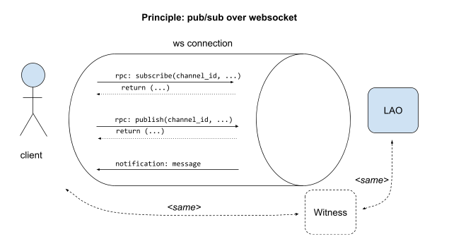

# Protocol specification

<!-- START doctoc.sh generated TOC please keep comment here to allow auto update -->
<!-- DO NOT EDIT THIS SECTION, INSTEAD RE-RUN doctoc.sh TO UPDATE -->
**:book: Table of Contents**

- [Protocol specification](#protocol-specification)
- [Introduction](#introduction)
  - [Validation and Disambiguation](#validation-and-disambiguation)
  - [Representation of complex data types in the protocol](#representation-of-complex-data-types-in-the-protocol)
  - [Concatenation for hashing](#concatenation-for-hashing)
- [JSON RPC (low-level)](#json-rpc-low-level)
  - [Query](#query)
    - [Subscribing to a channel](#subscribing-to-a-channel)
    - [Unsubscribing from a channel](#unsubscribing-from-a-channel)
    - [Publishing a message on a channel](#publishing-a-message-on-a-channel)
    - [Propagating a message on a channel](#propagating-a-message-on-a-channel)
    - [Catching up on past messages on a channel](#catching-up-on-past-messages-on-a-channel)
    - [Sending a heartbeat message to servers](#sending-a-heartbeat-message-to-servers)
    - [Retrieving messages from server using ids](#retrieving-messages-from-server-using-ids)

  - [Answer](#answer)
    - [RPC answer error](#rpc-answer-error)
- [Mid-level (message) communication](#mid-level-message-communication)

<!-- END doctoc.sh generated TOC please keep comment here to allow auto update -->

- [High-level (message data) communication](messageData.md)

**Note**: do not edit JSON messages directly. Those are automatically embedded
from `../protocol`. Use 
[embedme](https://github.com/dedis/popstellar/blob/master/docs/embedme.sh) to 
make an update. 

# Introduction

The Personhood.Online system will communicate over WebSockets and rely on a
Publish/Subscribe communication pattern, to support the Personhood.Online notion
of “Communication channels” described in Data Pipeline architecture
specification. As WebSockets do not naturally support Publish/Subscribe, a
low-level protocol is described to provide the Publish/Subscribe communication
layer. Building on top of this low-level protocol, a high-level protocol will
provide the Personhood.Online application-level communication. This protocol is
also described here. The following figure illustrates the principle of a pub/sub
over websocket:



## Validation and Disambiguation
To make sure that the protocol is understood by everyone equally and to ensure
that it is implemented correctly, all messages will be described using the
JSON Schema (proposed IETF standard, version: draft-07). 
This will enable the teams to validate their inputs and outputs with the schema
files as part of their testing strategy. 

## Representation of complex data types in the protocol

- base64: string containing base64url-encoded data
- Public Key: base64
- Signature: base64
- Hash: base64
- Timestamp: uint64 representation of the Unix timestamp (seconds since January
  1st, 1970)  

## Concatenation for hashing

When concatenating strings for hashing, the following <code>HashLen()</code> function is applied:

<code>HashLen(a<sub>1</sub>,a<sub>2</sub>,...,a<sub>n</sub>) = SHA256(
string(length(a<sub>1</sub>)) || a<sub>1</sub> || string(length(a<sub>2</sub>))
|| a<sub>2</sub> || ... || string(length(a<sub>n</sub>)) ||
a<sub>n</sub>)</code>

where <code>a<sub>1</sub>, ..., a<sub>n</sub></code> are UTF-8 strings,
`length()` computes the length in bytes of the UTF-8 string, `string()` is the
textual representation of a number and `||` represents the concatenation.

# JSON RPC (low-level)

🧭 **JSON RPC**

JSON RPC is the basic and lowest definition of an RPC message.

```json5
// ../protocol/jsonRPC.json

{
    "$schema": "http://json-schema.org/draft-07/schema#",
    "$id": "https://raw.githubusercontent.com/dedis/popstellar/master/protocol/jsonRPC.json",
    "title": "Match a custom JsonRpc 2.0 message",
    "description": "Match a client query or a positive or negative server answer.",
    "type": "object",
    "properties": {
        "jsonrpc": {
            "type": "string",
            "const": "2.0",
            "description": "JSON RPC version"
        }
    },
    "oneOf": [
        {
            "$ref": "answer/answer.json"
        },
        {
            "$ref": "query/query.json"
        }
    ],
    "required": ["jsonrpc"]
}

```

There are two kinds of low-level RPC messages:

- query
- answer

The low-level communication takes care of establishing a channel-based
publish/subscribe mechanism on the WebSocket connection. The implementation of
the low-level communication layer is based on the JSON-RPC 2.0 protocol.

While WebSocket connections function as a bi-directional communication link,
this protocol allows WebSocket clients to subscribe to existing pub/sub channels
(and unsubscribe from them) as well as to publish a message on the pub/sub
channel. It is the responsibility of the organizer & witness servers to
propagate any message received on pub/sub channel C across all open WebSocket
connections listening to the pub/sub channel C.

All low-level, RPC-based communications carry an id field based on the JSON-RPC
2.0 specification. This field is a short-lived, unique id that is used to match
the response with the corresponding request. It is assigned by whoever creates
the request. How this field is generated is up to you, provided that there are
never 2 concurrent requests with the same id in progress on the same WebSocket
connection.

## Query

🧭 **RPC Message** > **Query**

A query denotes an RPC, with corresponds to a function invocation.
Therefore, it defines the name of the function to call (the `method`)
and its arguments (`params`).

```json5
// ../protocol/query/query.json

{
    "$schema": "http://json-schema.org/draft-07/schema#",
    "$id": "https://raw.githubusercontent.com/dedis/popstellar/master/protocol/query/query.json",
    "title": "Match a custom JsonRpc 2.0 query message",
    "description": "Match a client query",
    "type": "object",
    "properties": {
        "jsonrpc": {
            "$comment": "Defined by the parent, but needed here for the validation"
        },

        "method": {
            "type": "string"
        },

        "params": {
            "type": "object"
        }
    },
    "oneOf": [
        {
            "$ref": "method/subscribe.json"
        },
        {
            "$ref": "method/broadcast.json"
        },
        {
            "$ref": "method/unsubscribe.json"
        },
        {
            "$ref": "method/publish.json"
        },
        {
            "$ref": "method/catchup.json"
        },
        {
          "$ref": "method/heartbeat.json"
        },
        {
          "$ref": "method/get_messages_by_id.json"
        }
    ],

    "required": ["method", "params", "jsonrpc"],

    "$comment": "can have an additional property `id` if not a broadcast"
}

```

Here are the different methods that can be called:

* Subscribe
* Unsubscribe
* Catchup
* Broadcast
* Publish
* Heartbeat
* GetMessagesById

### Subscribing to a channel

🧭 **RPC Message** > **Query** > **Subscribe**

By executing a subscribe action, a client can start receiving messages from that
channel.

To simplify the initialization of the system and keep the low-level
communication simple, it is assumed that channel “/root” always exists, and only
the server is allowed to subscribe to it. Clients can then publish on channel
"/root" to create and bootstrap their Local Autonomous Organizer (LAO) (cf
High-level communication).

RPC 

```json5
// ../protocol/examples/query/subscribe/subscribe.json

{
    "jsonrpc": "2.0",
    "id": 2,
    "method": "subscribe",
    "params": {
        "channel": "/root/p_EYbHyMv6sopI5QhEXBf40MO_eNoq7V_LygBd4c9RA="
    }
}

```

Response (in case of success)

```json5
// ../protocol/examples/answer/general_empty.json

{
    "jsonrpc": "2.0",
    "id": 999,
    "result": 0
}

```


<details>
<summary>
💡 See the full specification
</summary>

```json5
// ../protocol/query/method/subscribe.json

{
    "$schema": "http://json-schema.org/draft-07/schema#",
    "$id": "https://raw.githubusercontent.com/dedis/popstellar/master/protocol/query/method/subscribe.json",
    "description": "Match subscribe to a channel client query",
    "type": "object",
    "additionalProperties": false,
    "properties": {
        "method": {
            "description": "[String] operation to be performed by the query",
            "const": "subscribe"
        },

        "params": {
            "type": "object",
            "additionalProperties": false,
            "properties": {
                "channel": {
                    "description": "[String] name of the channel",
                    "type": "string",
                    "pattern": "^/root(/[^/]+)+$"
                }
            },

            "required": ["channel"]
        },

        "jsonrpc": {
            "$comment": "Defined by the parent, but needed here for the validation"
        },

        "id": {
            "type": "integer"
        }
    },

    "required": ["method", "params", "id", "jsonrpc"]
}

```

</details>

### Unsubscribing from a channel

🧭 **RPC Message** > **Query** > **Unsubscribe**

By executing an unsubscribe action, a client stops receiving messages from that
channel.

RPC 

```json5
// ../protocol/examples/query/unsubscribe/unsubscribe.json

{
    "jsonrpc": "2.0",
    "id": 7,
    "method": "unsubscribe",
    "params": {
        "channel": "/root/p_EYbHyMv6sopI5QhEXBf40MO_eNoq7V_LygBd4c9RA="
    }
}

```

Response (in case of success)

```json5
// ../protocol/examples/answer/general_empty.json

{
    "jsonrpc": "2.0",
    "id": 999,
    "result": 0
}

```


<details>
<summary>
💡 See the full specification
</summary>
  
```json5
// ../protocol/query/method/unsubscribe.json

{
    "$schema": "http://json-schema.org/draft-07/schema#",
    "$id": "https://raw.githubusercontent.com/dedis/popstellar/master/protocol/query/method/unsubscribe.json",
    "description": "Match unsubscribe from a channel client query",
    "type": "object",
    "properties": {
        "method": {
            "description": "[String] operation to be performed by the query",
            "const": "unsubscribe"
        },

        "params": {
            "type": "object",
            "additionalProperties": false,
            "properties": {
                "channel": {
                    "description": "[String] name of the channel",
                    "type": "string",
                    "pattern": "^/root(/[^/]+)+$"
                }
            },

            "required": ["channel"]
        },

        "jsonrpc": {
            "$comment": "Defined by the parent, but needed here for the validation"
        },

        "id": {
            "type": "integer"
        }
    },

    "required": ["method", "params", "id", "jsonrpc"]
}

```
  
</details>
  
### Publishing a message on a channel

🧭 **RPC Message** > **Query** > **Publish**

By executing a publish action, an attendee communicates its intention to publish
a specific message on a channel.

The format and content of the `message` parameter is further detailed as part of
the [Mid-level (message) communication](#mid-level-message-communication) section.

RPC 

```json5
// ../protocol/examples/query/publish/publish.json

{
    "jsonrpc": "2.0",
    "id": 4,
    "method": "publish",
    "params": {
        "channel": "/root/p_EYbHyMv6sopI5QhEXBf40MO_eNoq7V_LygBd4c9RA=",
        "message": {
            "data": "eyJvYmplY3QiOiJyb2xsX2NhbGwiLCJhY3Rpb24iOiJjcmVhdGUiLCJuYW1lIjoiUm9sbCBDYWxsIiwiY3JlYXRpb24iOjE2MzMwMzYxMjAsInByb3Bvc2VkX3N0YXJ0IjoxNjMzMDM2Mzg4LCJwcm9wb3NlZF9lbmQiOjE2MzMwMzk2ODgsImxvY2F0aW9uIjoiRVBGTCIsImlkIjoial9kSmhZYnpubXZNYnVMc0ZNQ2dzYlB5YjJ6Nm1vZ2VtSmFON1NWaHVVTT0ifQ==",
            "sender": "J9fBzJV70Jk5c-i3277Uq4CmeL4t53WDfUghaK0HpeM=",
            "signature": "FFqBXhZSaKvBnTvrDNIeEYMpFKI5oIa5SAewquxIBHTTEyTIDnUgmvkwgccV9NrujPwDnRt1f4CIEqzXqhbjCw==",
            "message_id": "sD_PdryBuOr14_65h8L-e1lzdQpDWxUAngtu1uwqgEI=",
            "witness_signatures": []
        }
    }
}

```

Response (in case of success)

```json5
// ../protocol/examples/answer/general_empty.json

{
    "jsonrpc": "2.0",
    "id": 999,
    "result": 0
}

```

<details>
<summary>
💡 See the full specification
</summary>

```json5
// ../protocol/query/method/publish.json

{
    "$schema": "http://json-schema.org/draft-07/schema#",
    "$id": "https://raw.githubusercontent.com/dedis/popstellar/master/protocol/query/method/publish.json",
    "description": "Match publish query",
    "type": "object",
    "additionalProperties": false,
    "properties": {
        "method": {
            "description": "[String] operation to be performed by the query",
            "const": "publish"
        },

        "params": {
            "type": "object",
            "additionalProperties": false,
            "properties": {
                "channel": {
                    "description": "[String] name of the channel",
                    "type": "string",
                    "pattern": "^/root(/[^/]+)*$",
                    "$comment": "Note: the regex matches a \"/root\" or a \"/root/<channel>\""
                },
                "message": {
                    "description": "[Message] message to be published",
                    "$ref": "message/message.json"
                }
            },

            "required": ["channel", "message"]
        },

        "jsonrpc": {
            "$comment": "Defined by the parent, but needed here for the validation"
        },

        "id": {
            "type": "integer"
        }
    },

    "required": ["method", "params", "id", "jsonrpc"]
}

```

</details>

### Propagating a message on a channel

🧭 **RPC Message** > **Query** > **Broadcast**

To broadcast a message that was published on a given channel, the server sends
out a JSON-RPC 2.0 *notification* as defined below. Do notice the absence of an id
field and of a response, in compliance with the JSON-RPC 2.0 specification.

To broadcast a message between different servers, the same JSON-RPC 2.0 *notification*
is used. This is the only case when a message should be broadcast on the “/root”
channel.

The format and content of the `message` parameter is further detailed as part of
the [Mid-level (message) communication](#mid-level-message-communication) section.

Notification 

```json5
// ../protocol/examples/query/broadcast/broadcast.json

{
    "jsonrpc": "2.0",
    "method": "broadcast",
    "params": {
        "channel": "/root/p_EYbHyMv6sopI5QhEXBf40MO_eNoq7V_LygBd4c9RA=",
        "message": {
            "data": "eyJvYmplY3QiOiJyb2xsX2NhbGwiLCJhY3Rpb24iOiJjcmVhdGUiLCJuYW1lIjoiUm9sbCBDYWxsIiwiY3JlYXRpb24iOjE2MzMwMzYxMjAsInByb3Bvc2VkX3N0YXJ0IjoxNjMzMDM2Mzg4LCJwcm9wb3NlZF9lbmQiOjE2MzMwMzk2ODgsImxvY2F0aW9uIjoiRVBGTCIsImlkIjoial9kSmhZYnpubXZNYnVMc0ZNQ2dzYlB5YjJ6Nm1vZ2VtSmFON1NWaHVVTT0ifQ==",
            "sender": "J9fBzJV70Jk5c-i3277Uq4CmeL4t53WDfUghaK0HpeM=",
            "signature": "FFqBXhZSaKvBnTvrDNIeEYMpFKI5oIa5SAewquxIBHTTEyTIDnUgmvkwgccV9NrujPwDnRt1f4CIEqzXqhbjCw==",
            "message_id": "sD_PdryBuOr14_65h8L-e1lzdQpDWxUAngtu1uwqgEI=",
            "witness_signatures": []
        }
    }
}

```

<details>
<summary>
💡 See the full specification
</summary>
  
```json5
// ../protocol/query/method/broadcast.json

{
    "$schema": "http://json-schema.org/draft-07/schema#",
    "$id": "https://raw.githubusercontent.com/dedis/popstellar/master/protocol/query/method/broadcast.json",
    "description": "Match propagation/broadcast of a message on a channel query",
    "type": "object",
    "additionalProperties": false,
    "properties": {
        "method": {
            "description": "[String] operation to be performed by the query",
            "const": "broadcast"
        },

        "params": {
            "type": "object",
            "additionalProperties": false,
            "properties": {
                "channel": {
                    "description": "[String] name of the channel",
                    "type": "string",
                    "pattern": "^/root(/[^/]+)*$"
                },

                "message": {
                    "description": "[Message] message to be published",
                    "$ref": "message/message.json"
                }
            },

            "required": ["channel", "message"]
        },

        "jsonrpc": {
            "$comment": "Defined by the parent, but needed here for the validation"
        }
    },

    "required": ["method", "params", "jsonrpc"]
}

```

</details>

### Catching up on past messages on a channel

🧭 **RPC Message** > **Query** > **Catchup**

By executing a catchup action, a client can ask the server to receive *all*
past messages on a specific channel.
This could be optimized to include some form of pagination, but the system
hasn't yet been scaled to the extent of needing such features.

A server can also execute a catchup action, and ask another server to receive
*all* past messages on the root or on a specific channel.
For now it happens when two servers are connected to each other on the root, and
when a server cause the creation of a channel on another server.

RPC 

```json5
// ../protocol/examples/query/catchup/catchup.json

{
    "jsonrpc": "2.0",
    "id": 3,
    "method": "catchup",
    "params": {
        "channel": "/root/p_EYbHyMv6sopI5QhEXBf40MO_eNoq7V_LygBd4c9RA="
    }
}

```

Response (in case of success)


```json5
// ../protocol/examples/answer/general_message.json

{
    "jsonrpc": "2.0",
    "id": 3,
    "result": [
        {
            "data": "eyJvYmplY3QiOiJsYW8iLCJhY3Rpb24iOiJjcmVhdGUiLCJuYW1lIjoiTEFPIiwiY3JlYXRpb24iOjE2MzMwMzU3MjEsIm9yZ2FuaXplciI6Iko5ZkJ6SlY3MEprNWMtaTMyNzdVcTRDbWVMNHQ1M1dEZlVnaGFLMEhwZU09Iiwid2l0bmVzc2VzIjpbXSwiaWQiOiJwX0VZYkh5TXY2c29wSTVRaEVYQmY0ME1PX2VOb3E3Vl9MeWdCZDRjOVJBPSJ9",
            "sender": "J9fBzJV70Jk5c-i3277Uq4CmeL4t53WDfUghaK0HpeM=",
            "signature": "ONylxgHA9cbsB_lwdfbn3iyzRd4aTpJhBMnvEKhmJF_niE_pUHdmjxDXjEwFyvo5WiH1NZXWyXG27SYEpkasCA==",
            "message_id": "2mAAevx61TZJi4groVGqqkeLEQq0e-qM6PGmTWuShyY=",
            "witness_signatures": []
        }
    ]
}

```
  
<details>
<summary>
💡 See the full specification
</summary>
  
```json5
// ../protocol/query/method/catchup.json

{
    "$schema": "http://json-schema.org/draft-07/schema#",
    "$id": "https://raw.githubusercontent.com/dedis/popstellar/master/protocol/query/method/catchup.json",
    "description": "Match catchup on past message on a channel query",
    "type": "object",
    "additionalProperties": false,
    "properties": {
        "method": {
            "description": "[String] operation to be performed by the query",
            "const": "catchup"
        },

        "params": {
            "type": "object",
            "additionalProperties": false,
            "properties": {
                "channel": {
                    "description": "[String] name of the channel",
                    "type": "string",
                    "pattern": "^/root(/[^/]+)*$"
                }
            },

            "required": ["channel"]
        },

        "jsonrpc": {
            "$comment": "Defined by the parent, but needed here for the validation"
        },

        "id": {
            "type": "integer"
        }
    },

    "required": ["method", "params", "id", "jsonrpc"]
}

```

</details>

## Sending a heartbeat message to servers

🧭 **RPC Message** > **Query** > **Heartbeat**

A server sends a heartbeat to its peers in order to attest that: 

- it is alive
- it received a certain set of messages

Heartbeat are to be sent based on channel activity and time intervals.  

RPC 

```json5
// ../protocol/examples/query/heartbeat/heartbeat.json

{
    "jsonrpc": "2.0",
    "id": 5,
    "method": "heartbeat",
    "params": {
        "message_ids_by_channel_id": [
            {
                "channel": "/root/nLghr9_P406lfkMjaNWqyohLxOiGlQee8zad4qAfj18=/social/8qlv4aUT5-tBodKp4RszY284CFYVaoDZK6XKiw9isSw=",
                "message_ids": ["DCBX48EuNO6q-Sr42ONqsj7opKiNeXyRzrjqTbZ_aMI="]
            },
            {
                "channel": "/root/nLghr9_P406lfkMjaNWqyohLxOiGlQee8zad4qAfj18=/HnXDyvSSron676Icmvcjk5zXvGLkPJ1fVOaWOxItzBE=",
                "message_ids": [
                    "z6SbjJ0Hw36k8L09-GVRq4PNmi06yQX4e8aZRSbUDwc=",
                    "txbTmVMwCDkZdoaAiEYfAKozVizZzkeMkeOlzq5qMlg="
                ]
            }
        ]
    }
}

```

The heartbeat can then trigger the internal logic of a server: when it receives message ids that it has not already delivered it will execute a `get_messages_by_id` RPC. However, this is just a consequence of that specific condition, normally the heartbeat is just a way to communicate to others that the sender is alive, thus it doesn't expect any answer back.

<details>
<summary>
💡 See the full specification
</summary>
  
```json5
// ../protocol/query/method/heartbeat.json

{
    "$schema": "http://json-schema.org/draft-07/schema#",
    "$id": "https://raw.githubusercontent.com/dedis/popstellar/master/protocol/query/method/heartbeat.json",
    "description": "Heartbeat message",
    "type": "object",
    "additionalProperties": false,
    "properties": {
        "method": {
            "description": "[String] operation to be performed by the query",
            "const": "heartbeat"
        },
        "params": {
            "description": "[Array] of objects containing each a channel and the list of ids from that channel",
            "type": "object",
            "additionalProperties": false,
            "properties": {
                "message_ids_by_channel_id": {
                    "type": "array",
                    "items": {
                        "type": "object",
                        "additionalProperties": false,
                        "properties": {
                            "channel": {
                                "description": "[String] name of the channel",
                                "type": "string",
                                "pattern": "^/root(/[^/]+)*$"
                            },
                            "message_ids": {
                                "description": "[Array] of message_ids corresponding to that channel",
                                "type": "array",
                                "items": {
                                    "type": "string"
                                }
                            }
                        },
                        "required": ["channel", "message_ids"]
                    }
                }
            },
            "required": ["message_ids_by_channel_id"]
        },
        "jsonrpc": {
            "$comment": "Defined by the parent, but needed here for the validation"
        },

        "id": {
            "type": "integer"
        }
    },
    "required": ["method", "params", "id", "jsonrpc"]
}

```
</details>

## Retrieving messages from server using ids 

🧭 **RPC Message** > **Query** > **Get messages by their ids**
  
The purpose of this RPC is to request missed messages so far.

This call is generally triggered upon the reception of a hearbeat message, in case the server hasn't already received some of the messages contained in such heartbeat but it could also used in other contexts. 

RPC 

```json5
// ../protocol/examples/query/get_messages_by_id/get_messages_by_id.json

{
    "jsonrpc": "2.0",
    "id": 6,
    "method": "get_messages_by_id",
    "params": {
        "message_ids_by_channel_id": [
            {
                "channel": "/root/nLghr9_P406lfkMjaNWqyohLxOiGlQee8zad4qAfj18=/social/8qlv4aUT5-tBodKp4RszY284CFYVaoDZK6XKiw9isSw=",
                "message_ids": ["DCBX48EuNO6q-Sr42ONqsj7opKiNeXyRzrjqTbZ_aMI="]
            },
            {
                "channel": "/root/nLghr9_P406lfkMjaNWqyohLxOiGlQee8zad4qAfj18=/HnXDyvSSron676Icmvcjk5zXvGLkPJ1fVOaWOxItzBE=",
                "message_ids": [
                    "z6SbjJ0Hw36k8L09-GVRq4PNmi06yQX4e8aZRSbUDwc=",
                    "txbTmVMwCDkZdoaAiEYfAKozVizZzkeMkeOlzq5qMlg="
                ]
            }
        ]
    }
}

```

Response (in case of success)

```json5
// ../protocol/examples/answer/get_messages_by_id_ans.json

{
    "jsonrpc": "2.0",
    "id": 6,
    "result": {
        "messages_by_channel_id": [
            {
                "channel": "/root/nLghr9_P406lfkMjaNWqyohLxOiGlQee8zad4qAfj18=/social/8qlv4aUT5-tBodKp4RszY284CFYVaoDZK6XKiw9isSw=",
                "messages": []
            },
            {
                "channel": "/root/nLghr9_P406lfkMjaNWqyohLxOiGlQee8zad4qAfj18=/HnXDyvSSron676Icmvcjk5zXvGLkPJ1fVOaWOxItzBE=",
                "messages": []
            }
        ]
    }
}

```

<details>
<summary>
💡 See the full specification
</summary>
  
```json5
// ../protocol/query/method/get_messages_by_id.json

{
    "$schema": "http://json-schema.org/draft-07/schema#",
    "$id": "https://raw.githubusercontent.com/dedis/popstellar/master/protocol/query/method/get_messages_by_id.json",
    "description": "Request messages by their ids",
    "type": "object",
    "additionalProperties": false,
    "properties": {
        "method": {
            "description": "[String] operation to be performed by the query",
            "const": "get_messages_by_id"
        },
        "params": {
            "description": "[Array] of objects containing each a channel and the list of ids from that channel",
            "type": "object",
            "additionalProperties": false,
            "properties": {
                "message_ids_by_channel_id": {
                    "type": "array",
                    "items": {
                        "type": "object",
                        "additionalProperties": false,
                        "properties": {
                            "channel": {
                                "description": "[String] name of the channel",
                                "type": "string",
                                "pattern": "^/root(/[^/]+)*$"
                            },
                            "message_ids": {
                                "description": "[Array] of message_ids corresponding to that channel",
                                "type": "array",
                                "items": {
                                    "type": "string"
                                }
                            }
                        },
                        "required": ["channel", "message_ids"]
                    }
                }
            },
            "required": ["message_ids_by_channel_id"]
        },

        "jsonrpc": {
            "$comment": "Defined by the parent, but needed here for the validation"
        },

        "id": {
            "type": "integer"
        }
    },
    "required": ["method", "params", "id", "jsonrpc"]
}

```
</details>

## Answer

🧭 **RPC Message** > **Answer**

The JSON-RPC 2.0 answer is best documented in the JSON-RPC specification.
In the Proof-of-Personhood system, there are however only three types of
valid messages: 

* `0`-valued answers (i.e., no error, no return value)
* catchup answers, which contain a list of messages
* get_messages_by_id answers which contain the mapping: channel_id -> list of messages
* error-valued answers, further detailed in the next section.
  
<details>
<summary>
💡 See an example of `0`-valued answer
</summary>

```json5
// ../protocol/examples/answer/general_empty.json

{
    "jsonrpc": "2.0",
    "id": 999,
    "result": 0
}

```

</details>

<details>
<summary>
💡 See an example of catchup answer
</summary>

```json5
// ../protocol/examples/answer/general_message.json

{
    "jsonrpc": "2.0",
    "id": 3,
    "result": [
        {
            "data": "eyJvYmplY3QiOiJsYW8iLCJhY3Rpb24iOiJjcmVhdGUiLCJuYW1lIjoiTEFPIiwiY3JlYXRpb24iOjE2MzMwMzU3MjEsIm9yZ2FuaXplciI6Iko5ZkJ6SlY3MEprNWMtaTMyNzdVcTRDbWVMNHQ1M1dEZlVnaGFLMEhwZU09Iiwid2l0bmVzc2VzIjpbXSwiaWQiOiJwX0VZYkh5TXY2c29wSTVRaEVYQmY0ME1PX2VOb3E3Vl9MeWdCZDRjOVJBPSJ9",
            "sender": "J9fBzJV70Jk5c-i3277Uq4CmeL4t53WDfUghaK0HpeM=",
            "signature": "ONylxgHA9cbsB_lwdfbn3iyzRd4aTpJhBMnvEKhmJF_niE_pUHdmjxDXjEwFyvo5WiH1NZXWyXG27SYEpkasCA==",
            "message_id": "2mAAevx61TZJi4groVGqqkeLEQq0e-qM6PGmTWuShyY=",
            "witness_signatures": []
        }
    ]
}

```

</details>

<details>
<summary>
See the full specification
</summary>
  
```json5
// ../protocol/answer/answer.json

{
    "$schema": "http://json-schema.org/draft-07/schema#",
    "$id": "https://raw.githubusercontent.com/dedis/popstellar/master/protocol/answer/answer.json",
    "title": "Match a custom JsonRpc 2.0 message answer",
    "description": "Match a positive or negative server answer",
    "type": "object",
    "additionalProperties": false,
    "properties": {
        "result": {
            "description": "In case of positive answer, result of the client query",
            "oneOf": [
                {
                    "type": "integer",
                    "const": 0,
                    "$comment": "Default return value indicating a success"
                },
                {
                    "type": "array",
                    "items": {
                        "$ref": "../query/method/message/message.json"
                    },
                    "minItems": 0,
                    "$comment": "Return value for a `catchup` request"
                }
            ],
            "$comment": "Note: this field is absent if there is an error"
        },

        "error": {
            "description": "In case of negative answer, error generated by the client query",
            "$ref": "error.json"
        },

        "id": {
            "oneOf": [
                {
                    "type": "integer",
                    "$comment": "The id matching the request id."
                },
                {
                    "type": "null",
                    "$comment": "If there was an error in detecting the request id, it must be null."
                }
            ],
            "$comment": "The id matches the request id. If there was an error in detecting the id, it must be null"
        },

        "jsonrpc": {
            "$comment": "Defined by the parent, but needed here for the validation"
        }
    },

    "oneOf": [
        {
            "required": ["result", "id", "jsonrpc"]
        },
        {
            "required": ["error", "id", "jsonrpc"]
        }
    ],
    "$comment": "Can contain either a `result` or an `error`. The result can be either a list of messages or `0`."
}

```
  
</details>

### RPC answer error

🧭 **RPC Message** > **Answer** > **Error**

If an error occurred, the `result` field must be absent and the `error` field must adhere to the following format:


```json5
// ../protocol/examples/answer/error.json

{
    "jsonrpc": "2.0",
    "id": 999,
    "error": {
        "code": -1,
        "description": "This is an error"
    }
}

```

Please take notice of the error codes that have been defined as part of the specification:

```json5
// ../protocol/answer/error.json

{
    "$schema": "http://json-schema.org/draft-07/schema#",
    "$id": "https://raw.githubusercontent.com/dedis/popstellar/master/protocol/answer/error.json",
    "title": "If an error occurred, the returned error object must adhere to the following format",
    "description": "In case of negative answer, error generated by the client query",
    "type": "object",
    "properties": {
        "code": {
            "description": "[Int] error code",
            "type": "integer",
            "minimum": -5,
            "maximum": -1,
            "$comment": "Note: should be in { -5, -4, ..., -1 }",
            "note": [
                "0  operation was successful (should never be used)",
                "-1 invalid action",
                "-2 invalid resource (e.g. channel does not exist, channel was not subscribed to, etc.)",
                "-3 resource already exists (e.g. lao already exists, channel already exists, etc.)",
                "-4 request data is invalid (e.g. message is invalid), use the data field object to provide extra information",
                "-5 access denied (e.g. subscribing to a “restricted” channel)",
                "-6 internal server error (e.g. the server crashed while processing, its database is unavailable, its memory is exhausted, etc.)"
            ]
        },
        "description": {
            "description": "[String] error description",
            "type": "string"
        }
    },
    "additionalProperties": false,
    "required": ["code", "description"],
    "$comment": "Note: this error object is absent if the answer is positive"
}

```


# Mid-level (message) communication

🧭 **RPC Message** > **Query** > **Publish** or **Broadcast** > **Message**

Building upon the low-level communication protocol, any communication is
expressed as a message object being sent or received on a channel (cf.
“Publishing a message on a channel”). This includes the creation of a LAO,
changes to LAO properties, creation of meetings, roll-calls, polls, etc. 


As this layer builds on the low-level communication protocol, we already have
operation confirmation / error management logic and don’t need to duplicate it.

**Message object** - The message data specific to the operation is encapsulated
in the data field, whereas the other fields attest to its :

- Origin: `sender` field
- Authenticity: `signature` and `witness_signatures` fields
- Uniqueness: `message_id` field

The `witness_signatures` field will be empty when the message is first sent by
the sender. It will subsequently be filled by the server, as it receives
signatures by witnesses (asynchronously). When a client receives past messages,
the witness signatures will be included. 

As you can see, the `data` field is base64 encoded. This derives from the
necessity to hash and sign the field. An object cannot be signed, but one could
imagine signing its JSON representation. However, a study of the JSON format
will reveal that there's no "canonicalized", unique binary representation of
JSON. That is, different systems may represent the same JSON object in different
ways. The two following structures are identical JSON objects but have very
different binary representations (field order, whitespace, newlines, unicode,
etc.):

```
{ "text": "message", "temp": "15\u00f8C" }
```

VS

```
{"temp":"15°C","text":"message"}
```

As a consequence, we decide to encode the sender's preferred representation (any
valid representation) in base64, and then use that representation as input to
our hash or sign function. A nice side effect of this design is that the message
object signature verification is entirely independent from the structure of the
data field itself: no matter what message you send, the verification will always
work in the same way (compare this to signing the data field-by-field!). Once
the `data` field is unencoded and parsed, the receiving peer can simply validate
it and process it at the application level.

```json5
// ../protocol/query/method/message/message.json

{
    "$schema": "http://json-schema.org/draft-07/schema#",
    "$id": "https://raw.githubusercontent.com/dedis/popstellar/master/protocol/query/method/message/message.json",
    "title": "This represents a message someone would want to publish on a specific channel",
    "description": "Match general message content (Create LAO, Update LAO, Broadcast LAO, Create Meeting, Broadcast Meeting)",
    "type": "object",
    "additionalProperties": false,
    "properties": {
        "data": {
            "description": "[Base64String] data contained in the message",
            "type": "string",
            "contentEncoding": "base64",
            "$comment": "Note: the string is encoded in Base64"
        },
        "sender": {
            "description": "[Base64String] public key of the sender/organizer/server",
            "type": "string",
            "contentEncoding": "base64",
            "$comment": "Note: the string is encoded in Base64"
        },
        "signature": {
            "description": "[Base64String] organizer's signature on data : Sign(data)",
            "type": "string",
            "contentEncoding": "base64",
            "$comment": "Note: the string is encoded in Base64"
        },
        "message_id": {
            "description": "[Base64String] message id : HashLen(data, signature)",
            "type": "string",
            "contentEncoding": "base64",
            "$comment": "Note: the string is encoded in Base64"
        },
        "witness_signatures": {
            "description": "[Array[Base64String]] signatures of the witnesses on the modification message (either creation/update)",
            "type": "array",
            "items": {
                "type": "object",
                "properties": {
                    "witness": {
                        "description": "[Base64String] public key of the witness",
                        "type": "string",
                        "contentEncoding": "base64",
                        "$comment": "Note: the string is encoded in Base64"
                    },
                    "signature": {
                        "description": "[Base64String] witness' signature : Sign(message_id)",
                        "type": "string",
                        "contentEncoding": "base64",
                        "$comment": "Note: the strings are encoded in Base64"
                    }
                },
                "additionalProperties": false,
                "required": ["witness", "signature"]
            },
            "$comment": "Note: the items are encoded in Base64"
        }
    },
    "required": [
        "data",
        "sender",
        "signature",
        "message_id",
        "witness_signatures"
    ]
}

```

Messages serialized and stored in the `data` fields are called "Message data".
See the [messageData.md](messageData.md) file for the documentation about those
messages.
