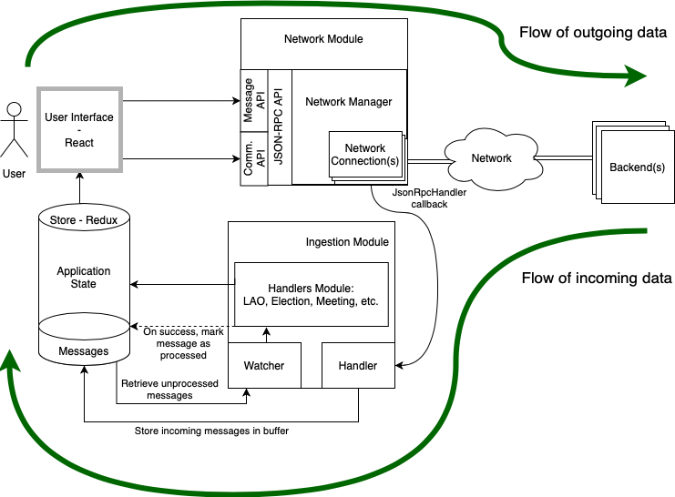

# PoP Web Frontend

This repository contains the client side implementation of the PoP project.

## Getting Started

We assume that you're familiar with the PoP project. Please read the
[Architecture Specifications](https://docs.google.com/document/d/19r3rP6o8TO-xeZBM0GQzkHYQFSJtWy7UhjLhzzZVry4)
to get an idea about all the actors and components in the system.

### Resources

If this is your first time working with TypeScript, React and/or Redux,
please follow the following tutorials:

* [TypeScript Handbook](https://www.typescriptlang.org/docs/handbook/intro.html)
* [Introduction to React](https://reactjs.org/tutorial/tutorial.html)
* [Redux Essentials](https://redux.js.org/tutorials/essentials/part-1-overview-concepts)

### IDE/Editors

TypeScript is supported well across multiple text editors and IDE.
The team at DEDIS has members using
[WebStorm (IntelliJ)](https://www.jetbrains.com/webstorm/),
[VSCode](https://code.visualstudio.com/)
and neovim/vim.

VSCode/Neovim/vim require some custom configuration for adding TypeScript and React support.
We'd suggest using WebStorm if you do not have a strict preference/experience
with the other text editors since it works out of the box and EPFL/ETHZ students may avail a
[free education license](https://www.jetbrains.com/community/education/#students)
for their use.

## Project Structure

At a high level, the project is roughly split in a `core` and `features`.
The `core` provides the technical foundations to the app's architecture, its initialization and ensures its portability.
The `features` module provides the application's functionality, built on top of the `core`.
Here's the annotated directory tree:


```
.
├── App.tsx                  # the entry point
│
├── core                     # core elements of the system
│
│   ├── components               # library of simple, reusable UI component
│   │
│   ├── contexts                 # feature context type definition
│   │
│   ├── functions                # module containing functions that are useful in the whole application
│   │
│   ├── hooks                    # contains utility react hooks
│   │
│   ├── keypair                  # module dealing with the storage of a global, unique keypair
│   │
│   ├── navigation               # module dealing with the top-level React navigation
│   │
│   ├── network                  # module to network with the backend
│   │   ├── ingestion              # implementation and configuration of the processing of incoming messages
│   │   ├── jsonrpc                # network & protocol objects
│   │   ├── strategies             # sending strategies when there are multiple server
│   │   └── validation             # protocol validation utilities
│   │
│   ├── objects                  # module containing the core business objects
│   │
│   ├── platform                 # platform-specific implementation of system functionality
│   │
│   ├── redux                    # module dealing with the global configuration of the application state (Redux-based)
│   │
│   ├── styles                   # stylesheets
│   │
│   └── types                    # some generic types
│
├── features                 # independent features in the system
│
│   ├── digital cash             # feature dealing with digital cash
│   │
│   ├── events                   # feature dealing with events happening in a LAO
│   │
│   ├── evoting                  # feature dealing with E-Voting and Elections
│   │
│   ├── home                     # feature dealing with the app's home screen
│   │
│   ├── lao                      # feature dealing with the notion of a LAO, showing the typical feature structure
│   │   ├── components             # feature components
│   │   ├── errors                 # feature errors definition
│   │   ├── functions              # feature functions
│   │   ├── hooks                  # feature hooks
│   │   ├── interface              # defines the dependencies of the feature and the interface it exposes
│   │   ├── navigation             # navigation within the feature screens
│   │   ├── network                # network APIs, objects and message parsing for the feature
│   │   ├── objects                # business objects for the feature
│   │   ├── reducer                # redux-based state management for the feature
│   │   ├── screens                # UI screens of the feature
│   │   └── store                  # static access to the feature's reducer store (DEPRECATED)
│   │
│   ├── meeting                  # feature dealing with meetings, a type of event
│   │
│   ├── rollCall                 # feature dealing with roll calls, a type of event
│   │
│   ├── social                   # feature dealing with social media functionality
│   │
│   ├── wallet                   # feature providing a HD-Wallet for safekeeping of secrets
│   │
│   └── witness                  # feature dealing with witness operations
│
├── __mocks__                # test mocks for external libraries
│
├── __tests__                # test utilities
│
└── resources                # application resources (icon, etc.)
```

## Architecture

The PoP TypeScript frontend provides an interface to allow the users to
interact as part of a Local Autonomous Organization (LAO),
within which they will acquire Proof-of-Personhood tokens to identify themselves.

Under the hood, the frontend establishes one or more long-lived websocket
connections with the servers (organizers, witnesses), through which messages
are sent back and forth using a publish/subscribe pattern.

On a higher level of abstraction, the frontend may publish messages or subscribe
for messages on a *channel*. You may think of a channel as a topic which
stores events that occur over time. For instance, every LAO is denoted by a unique
channel (also called the LAO channel) and contains messages about all events
that occur within it, for example, the creation of an election, a roll call.
A channel may have sub channels associated with it. For instance, a
LAO may have a sub-channel for the elections where all messages associated
with that election are published. Please refer to
[Data pipeline architecture](https://docs.google.com/document/d/19r3rP6o8TO-xeZBM0GQzkHYQFSJtWy7UhjLhzzZVry4/edit#heading=h.1h71fzpdznrh)
for more information.

All the messages are encoded using JSON and are validated using
[JSON Schemas](https://json-schema.org) as defined in the
[protocol folder](https://github.com/dedis/popstellar/tree/master/protocol).

[Protocol Specifications](https://docs.google.com/document/d/1fyNWSPzLhM6W9V0VTFf2waMLiJGcscy7wa4bQlLkySM)
also gives an introduction to the different message formats. However, note that
the [schemas](https://github.com/dedis/popstellar/tree/master/protocol) in this
repository are **always** the source of truth and are more up to date than the Google Doc.

### Managing the application state

In order for the application to perform as a user would expect, it needs to manage
its own internal state robustly. Its internal state is made up of local data,
such as a user's cryptographic material and preferences, but also of the local
representation of the application's view of the whole PoP system and its state.

The latter needs to be eventually consistent, i.e., sooner or later all frontend
users obtain the same "view" of the system. This translates to a basic expectation
that, one would expect all devices connected to a LAO to "see" the same thing.
Drawing a parallel, one would expect all social media users to be able to access
the same posts, see (roughly) the same number of associated likes, etc.

In order to achieve this, and as a general rule, each feature's UI displays
information from its local `reducer` (the application state container),
but it *doesn't* modify the LAO-wide information contained within it.
The view of the LAO, contained in the application state,
*only* gets updated in response to messages from the backends.

As such, let's take the example of a user who wants to publish or modify LAO-wide information.
In our example, the user wants to cast a vote in an election and does the necessary UI operations.
In turn, the application will send a message to the backend (which the backend should acknowledge),
which will then validate it and propagate it in the system.
Eventually, the vote is sent back to the application (through the publish/subscribe channel),
and upon receiving it the application would update its state.
By doing so, the store would contain new information that would automatically be reflected in the UI.

<div align="center">
  
</div>

Occasionally, the user interface could directly modify the application state,
but this would only be valid for local operations affecting local data
(e.g., changing a local setting, clearing the data stored in the browser, etc.).

For more information on managing the application state, please refer to the various features reducers
and make sure you have a solid understanding of [Redux](https://redux.js.org/) and its concepts,
as well as [React Redux](https://react-redux.js.org/) and [Redux Toolkit](https://redux-toolkit.js.org/).

#### Managing & storing secrets

A particular sub-problem of storing the application data is the management of secret data.
While any secret could be encrypted, this just shifts the problem to securely storing
cryptographic material and making sure that it is not leaked by the device running the application.

As the Web front-end is built on React and designed to also support a React Native deployment on
iOS and Android mobile phones, secret management must be conceived in a multi-platform way,
taking into account and abstracting the differences between these platforms.
Both mobile devices and the browsers offer APIs to manage cryptographic material securely,
but their support is limited to specific cryptographic primitives,
which unfortunately do not include those used in the PoP protocol specification.
Notably, most APIs do not support the Ed25519 keys.

As such, the general approach is to use platform-specific secure key management solutions,
such as the [Android KeyStore](https://developer.android.com/training/articles/keystore),
to safely store keys that will then be used to encrypt and decrypt the application secrets,
including the Ed25519 cryptographic material.
This ensures that all application secrets are encrypted-at-rest,
that the encryption and decryption keys are stored securely,
and that the application is free to use any convenient cryptographic primitive.

On the browser, which offers an intrinsically challenging security environment,
this translates to the use of the
[Web Crypto API](https://developer.mozilla.org/en-US/docs/Web/API/Web_Crypto_API)
to generate non-extractable key material, and the
[IndexedDB](https://developer.mozilla.org/en-US/docs/Web/API/IndexedDB_API)
to store it reasonably securely.
This is abstracted away in the
[WalletStore](https://github.com/dedis/popstellar/tree/master/fe1-web/src/features/wallet/store/WalletStore.ts),
while the platform implementation is in
[platform/crypto](https://github.com/dedis/popstellar/tree/master/fe1-web/src/core/platform/crypto).

Support for mobile devices is planned and the architecture allows it,
but secret management is not yet implemented.

### Sending messages over the wire

The communication stack within the PoP project is made of
[multiple layers](https://docs.google.com/document/d/1AeV7JX_SJ30mu9PIwmz24UkIi3jCo6NSYA0sPxdbscU)
and you need to be familiar with them to understand how communication happens.

The [core/network module](https://github.com/dedis/popstellar/tree/master/fe1-web/src/core/network)
contains most of the logic to encapsulate application-level messages and pass them down the stack,
and it is organized as follows, going from the lowest abstraction to the highest:
* `NetworkManager` and `NetworkConnection` classes abstract away the intricacies of
  dealing with WebSocket-based connections and errors that may appear at that level of abstraction.
* `JsonRpcAPI` exposes the [JSON-RPC](https://www.jsonrpc.org/specification) -based API
  that provides the publish/subscribe communication abstraction. In it, you will find
  functions to publish a message, subscribe and unsubscribe to a channel, and so on.
  **Importantly**, the publishing of messages also takes care of the `Message` layer,
  effectively encapsulating the application-level message as needed.
* `CommunicationApi` contains utility functions to deal with common operations,
  such as subscribing to a channel and retrieving past messages.
* It should be noted that the code specific to the publishing of an application-level message
  belonging to a feature, is implemented as part of the feature's module.

For more information on sending messages on the network, please refer to the
[network module](https://github.com/dedis/popstellar/tree/master/fe1-web/src/core/network)
and make sure you have a solid understanding
of [JSON-RPC](https://www.jsonrpc.org/specification),
the [Protocol Specifications](https://docs.google.com/document/d/1fyNWSPzLhM6W9V0VTFf2waMLiJGcscy7wa4bQlLkySM)
and their actual implementation in the [protocol schemas](https://github.com/dedis/popstellar/tree/master/protocol)

### Getting messages over the wire

Once it is clear how to send messages over the wire,
it is important to turn one's attention to receiving them.

Because receiving messages over the network and processing them to update the application state
are very different steps involving completely unrelated logic,
the two operations are split in separate and independent modules.

On the networking side, the `NetworkManager` and `NetworkConnection` classes
have facilities to define and attach a `JsonRpcHandler` callback (see `core/network/RpcHandler.ts`)
to a websocket connection.
This callback is called whenever the backend sends a JSON-RPC request or notification.

On the "message processing" side,
the [core/network/ingestion](https://github.com/dedis/popstellar/tree/master/fe1-web/src/core/network/ingestion) module
is the module responsible for receiving the messages and processing them,
effectively "ingesting and digesting" them (hence the name).
It is solely responsible for forwarding incoming messages in the `MessageReducer`,
making sure they get processed by their handlers as needed,
and finally marking them as processed within the `store` itself.

The `core/network/ingestion` module relies on the
[MessageRegistry](https://github.com/dedis/popstellar/tree/master/fe1-web/src/core/network/jsonrpc/messages/MessageRegistry.ts)
to process the messages, thereby enabling any feature to inject its own message handler.

The feature message handlers are found in the `features/{myFeature}/network/` folder.

For more information on processing messages received from the network, please refer to the
[core/network/ingestion](https://github.com/dedis/popstellar/tree/master/fe1-web/src/core/network/ingestion) module
and make sure you have a solid understanding of [Redux](https://redux.js.org/)
and the PoP communication protocol.

### Message definitions

All low- and mid-level objects referred to in the protocol specification (and the logic for parsing them)
are defined in `core/network/jsonrpc` package, closely mirroring the JSON-Schema folder structure.

Please note that the JSON-RPC definitions in the root of the repository are to be considered
a source of truth since the validation library checks the messages against it.

When you need to create a new object, please refer to existing message types and in particular
their `fromJSON` method to get an idea about how to implement a new type.

High-level objects are stored as part of features, in the `features/{myFeature}/network/messages` folder.

### User Interface

The development of an application providing a good user interface, enabling a good user experience,
requires the user interaction patterns to be predictable, coherent and homogenous across the app.
To achieve this, applications typically resort to the definition and implementation of a library of
reusable components - building bricks - that are reused throughout the application and assembled
to create the different "views" (or "screens") of the application.

As you design a given screen, you will break it down into sub-components, sub-sub-components, etc.
You can refer to the [React documentation](https://reactjs.org/docs/thinking-in-react.html#step-1-break-the-ui-into-a-component-hierarchy)
to have guidance on the thinking process going into this component break-down.

In general, the top-level components (the "views" or "screens") will be full of
application-specific logic, as they'll encompass the full behavior of that screen.
As you go down into sub- and sub-sub-components, you'll come across more generic logic,
which is only dealing with the UI itself.

As part of the PoP Web front-end, you'll find the low-level reusable UI components in the
`core/components` package, while most of the feature-specific UI will be found in the feature-folder.
Within a feature folder, main views/screens are found in `features/{myFeature}/screens`,
whereas display components can be found in `features/{myFeature}/components`.

In concrete terms, the `core/components` package provides elements such as a
[Date Picker](https://github.com/dedis/popstellar/tree/master/fe1-web/src/core/components/DatePicker.tsx),
a [QR Code displayer](https://github.com/dedis/popstellar/tree/master/fe1-web/src/core/components/QRCode.tsx),
or a component managing
[a list of Text Inputs](https://github.com/dedis/popstellar/tree/master/fe1-web/src/core/components/TextInputList.tsx).

A `features/{myFeature}/screens` package, on the other hand, contains screens such as the
[Wallet setup](https://github.com/dedis/popstellar/blob/master/fe1-web/src/features/wallet/screens/WalletSetSeed.tsx)
and the
[Wallet home](https://github.com/dedis/popstellar/blob/master/fe1-web/src/features/wallet/screens/WalletHome.tsx).

This is the current organization, but as this project evolves you should feel free to reorganize the
code layout (in agreement with your project teammates and the TAs) in any way that is convenient.

For more information on developing the user interface, please make sure you have a solid
understanding of [React](https://reactjs.org/).

#### Linking User Interface and Application State

For more information on linking up together the user interface with the application state,
please make sure you have a solid understanding of [React Redux](https://react-redux.js.org/)
and look at existing components.

#### Navigation

The root navigation in the application is handled in `core/navigation`.
All other navigation is setup as part of the `features`.

In order to get proper typing on the navigation, the whole layout stack, including the screens of the different features, is defined in `core/navigation/typing` even though this contradicts the general design with the separation into the different features. The reason for this is technical:

Assume a feature `X` provides a screen `SX`. If some other feature `Y` wants to tell the navigator to navigate to `SX`, we have to decide whether we want to statically check the navigation calls. Assuming we do want these checks, the whole navigation stack needs to be defined statically in typescript. We can use imports as long as they are not between features (see the related Section below) but not function calls such as `configure()` that return the API of a feature: Typescript types are a construct that does not have a representation in javascript at runtime. Hence we cannot use dependency injection to inject typing information into features, this has to be fixed statically. Hence the use of a global definition of the navigation stack.

Currently there is an app navigator that differentiates between three general application states: 1) Setup, 2) Not connected to a LAO and 3) Connected to a LAO. In each case a different screen is shown that possibly uses a subnavigator, i.e. in case 2) a stack navigator allowing the user to create LAOs or join existing ones or in case 3) a bottom tab navigation bar to navigate between the different LAO screens.

Inside the LAO subnavigator, each tab contains another stack-based subnavigator that allows navigation between events or different wallet items.

For more information on managing the navigation in the user interface,
please make sure you have a solid understanding of [React Navigation](https://reactnavigation.org/).

### Validation

All the incoming messages are validated using the `core/network/validation` package,
which ensures that all constraints defined within the JSON Schema are respected.

Furthermore, each object has specific constraints defined within its constructor. For an example, see
[CreateRollCall.ts](https://github.com/dedis/popstellar/blob/master/fe1-web/src/features/rollCall/network/messages/CreateRollCall.ts)

## Dependencies between features

### Idea

One may think of the features as being independent packages that are loaded by
the application. This leads to the question how inter-feature dependencies can
be handled. For instance there is the lao feature in `src/features/lao` that
manages the storage of LAO related data such as what the active LAO is. (At the
time of writing, the application can at a specific point in time only be
connected to one LAO). If another feature, for example the `evoting` feature,
needs to know the ID of the active LAO in order to send a message in the correct
channel, then it is **not** supposed to just import the corresponding function
directly from the `lao` feature.

Instead we want to use [dependency
injection](https://en.wikipedia.org/wiki/Dependency_injection) that allows the
`evoting` feature to make use of said function without directly importing it.

The way this works is by explicitly passing the function to the `evoting`
feature. More concretely, a feature can expose a `configure` function in
`src/features/<featureName>/index.ts` that accepts a set of dependencies such as
a function to retrieve the current lao id.

A simple implementation of this may look like

```typescript
export const configure = (getCurrentLaoId: () => ID) => {
  initFeature(getCurrentLaoId);
}
```

and more generally

```typescript
interface MyFeatureConfiguration {
  getCurrentLaoId: () => ID;
}

export const configure = (configuration: MyFeatureConfiguration) => {
  initFeature(configuration);
}
```

This leaves the question where we get the function `getCurrentLaoId` from and
where this `configure` function is called. Here the idea is that each feature
not only defines its dependencies but also the interface it exposes. For
instance, the `lao` feature must expose the function `getCurrentLaoId` so that
the `evoting` feature can make use of it. In order to achieve this, the same
`configure` function can be used. Instead of returning nothing, each feature can
return the interface it exposes. More concretely

```typescript
interface MyFeatureConfiguration {
  getCurrentLaoId: () => ID;
}

interface MyFeatureInterface {
  add: (a: number, b: number) => number;
}

export const configure = (configuration: MyFeatureConfiguration): MyFeatureInterface => {
  initFeature(configuration);

  return {
    add: (a: number, b: number) => a+b
  };
}
```

With this setup we can now answer the second question: how to put all of this
together. The answer is the file `src/feature/index.ts`. This file imports the
`index.ts` of each feature and calls `configure` on them. For instance for the
described scenario with the `lao` and `evoting` feature from before, we would
have

```typescript
import * as laoFeature from "./lao/index.ts";
import * as evotingFeature from "./evoting/index.ts";

export const configureFeatures = () => {
  const laoInterface = laoFeature.configure();
  const evotingInterface = laoFeature.configure({
    getCurrentLaoId: laoInterface.getCurrentLaoId
  });
};
```

As long as there are no circular dependencies, this pattern allows the injection
of dependencies into features without directly importing any function from a
different feature. One of the advantages is that testing becomes much easier as
it is possible to directly pass mock implementations without a complex mock
setup.

This pattern does not suffice in cases of circular dependencies but fortunately
there is a very natural way to extend it. For instance if the evoting feature
exports a navigation component called `EvotingScreen` which should be displayed
inside the `LaoNavigation`, the previously shown code will no longer work. On
which feature do we call `.configure()` first? Neither works!

What one can to do instead is to define a second function analogous to
`configure`, `configure2`! This then allows us to write

```typescript
import * as laoFeature from "./lao/index.ts";
import * as evotingFeature from "./evoting/index.ts";

export const configureFeatures = () => {
  const laoInterface = laoFeature.configure();
  const evotingInterface = laoFeature.configure({
    getCurrentLaoId: laoInterface.getCurrentLaoId
  });
  const laoInterface2 = laoFeature.configure2({
    screens: [evotingInterface.EvotingScreen]
  });
};
```

Now `configure2` is not a very good name which is the reason this `configure2`
in the codebase is at the time of writing called `compose`. This name is not
much better but at least harder to confuse with `configure`. At the time of
writing, two functions suffice to solve all of these cases but in the future it
might be necessary to have a third configuration function. Unless the features
become very entangled, a small number should suffice. Otherwise it is probably a
good idea to come up with an alternative pattern.

---

The way this pattern is explained leaves away one detail: How can react
components access these configuration values. For simple components it is
possible to have a setup that looks like

```tsx
const makeMyComponent = (configuration: MyFeatureConfiguration) =>
  (props: IProps) => {
    const myText = getMyText(props, configuration);

    return <Text>{myText}</Text>;
  };

export const configure = (configuration: MyFeatureConfiguration): MyFeatureInterface => {
  initFeature(configuration);

  return {
    MyComponent: makeMyComponent(configuration)
  };
}
```

but this quickly gets messy if the `evoting` feature has a second component that wants to render MyComponent as a child:

```tsx
const makeMyComponent = (configuration: MyFeatureConfiguration) =>
  (props: IProps) => {
    const myText = getMyText(props, configuration);

    return <Text>{myText}</Text>;
  };

const makeMyBetterComponent = (configuration: MyFeatureConfiguration) =>
  (props: IProps) => {
    const MyComponent = makeMyComponent(configuration);

    return <View><MyComponent isConfusing={true} /></View>;
  };

export const configure = (configuration: MyFeatureConfiguration): MyFeatureInterface => {
  initFeature(configuration);

  return {
    MyComponent: makeMyBetterComponent(configuration)
  };
}
```

Thus a different option was chosen that makes use of [react
contexts](https://reactjs.org/docs/context.html) which are a way of passing
props down to children far down in the component tree without doing so
explicitly. This is also how redux enables all components wrapped in `<Provider
store={myStore}/>` to access `myStore` using the
[hook](https://reactjs.org/docs/hooks-intro.html) `useStore()`;

Concretely `App.tsx` wraps all components using `<FeatureProvider
value={context} />` where `context` is of the type

```typescript
{
  [identifier: string]: unknown
}
```

If a given feature exports a context containing some values, these values can
then later be accessed using the `useContext` hook. The `context`
property returned from `configureFeatures` in `src/features/index.ts` is passed
to `App.tsx` and is used as the value of the feature context. Each feature is
supposed to define and export a unique identifier so that the feature context
value the looks like

```typescript
{
  [laoFeature.identifier]: laoFeature.context,
  [evoting.identifier]: evoting.context,
  [myFeature.identifier]: myFeature.context
}
```

Hence each feature can then define a `useMyFeatureContext` hook as follows:

```typescript
export const useMyFeatureContext = (): MyFeatureReactContext => {
  const featureContext = useContext(FeatureContext);
  // assert that the feature context exists
  if (!(MY_FEATURE_IDENTIFIER in featureContext)) {
    throw new Error('My feature context could not be found!');
  }
  return featureContext[MY_FEATURE_IDENTIFIER] as MyFeatureReactContext;
};

```

that then allows the its values to be accessed in any component like

```typescript
const MyComponent =>
  (props: IProps) => {
    const myFeatureContext = useMyFeatureContext();
    const myText = getMyText(props, myFeatureContext);

    return <Text>{myText}</Text>;
  };

```

which is easier to read than the alternative we had before.

### Convention

To make it easier to find mistakes using this pattern, we define it as a
convention to explicitly define the types of the dependencies and the interface
each feature exposes. The same goes for the react context where an explicit type
is required when casting it from unkown in `useMyFeatureContext()`.

## Testing

Software testing is a vast topic, requiring lots of application-specific adaptations.
We will not detail here aspects of software strategy, lest you would be reading a book
instead of a README, but you will find below some resources that you could find useful
in ensuring the code you write conforms to the specifications and your expectations:

- [Testing React applications with Jest](https://jestjs.io/docs/tutorial-react)
- [Understanding Mocking in Jest](https://medium.com/@rickhanlonii/understanding-jest-mocks-f0046c68e53c)
- [Testing application state management with Redux](https://redux.js.org/usage/writing-tests)

These resources mostly relate to unit and integration testing, but End-to-End (E2E) testing
has its own dedicated set of tools.

The PoP project E2E testing effort, based on Karate, can be found in this repository's `/tests` folder.

If you write E2E tests, please be mindful of making them maintainable through the use of the
[Page Object Model](https://martinfowler.com/bliki/PageObject.html).

## Debugging Tips

* Make abundant use of the Chrome Development Tools, they offer full visibility in
  the network activity (HTTP requests, WebSocket messages, etc.), they enable you
  to put breakpoints anywhere in your code and allow you to inspect the browser storage.
* Take it a step further with the "React Developer Tools" and "Redux DevTools" plugins,
  which give you full visibility into the structure of your GUI, and the events
  that changed the application state, respectively.
* Be generous with the use of log statements while developing a new feature.
  It's useful to get feedback about which steps executed and how far the message
  reached in the processing pipeline rather than getting an opaque error.
* Ensure your error messages are descriptive.
* Don't neglect `eslint`, `dependency-cruiser` and the unit tests.
  They may prevent bugs before you even see them in the UI.

## Deployments

Please reach out to the DEDIS Engineering team members to deploy a build to an
internet accessible host.

The web application can be packaged for deploynent by executing `npm run build-web`.
This will generate a timestamped zip package in the `./dist` folder.


## Coding Style

TypeScript leaves a lot of freedom to the developer, so it takes extra effort to maintain
a consistent coding style. The codebase was developed based on the TypeScript variant of
the [AirBnB style guide](https://github.com/airbnb/javascript).
As a rule of thumb, please run `npm run eslint` before submitting any Pull Request
and ensure there are no errors. This will run ESLint, a JavaScript/TypeScript linter
that will check your code for common errors and adherence to the style guide.

The CI also executes static analysis using SonarCloud which is good for giving
early feedback against common problems. Please ensure all the bugs, code smells
and warnings raised by SonarCloud are resolved before requesting reviews.

### Common pitfalls

It can be very tempting to make ESLint errors "go away" by simply disabling a check
on a troublesome line of code. This is also generally the wrong solution.
In the majority of cases, ESLint is pointing to a genuine problem,
sometimes of a stylistic nature, sometimes running deeper and affecting software stability.

Please try to address the underlying issue before disabling an ESLint check,
and if you still feel that disabling a check is the right approach,
do discuss your choice with your teammates and/or the TAs before proceeding.

## Hacks

Unfortunately hacks cannot always be completely avoided, for instance if there is an issue in a dependency that has not been fixed yet and cannot be circumvented by using the proper API.

At the moment this is the case for `@react-navigation/drawer` where the drawer cannot be closed by tapping on the black overlay. It might also be more of an issue of `react-native-reanimated` rather than the former given that it works in the officially [linked snacks](https://snack.expo.io/?platform=web&name=Drawer%20navigation%20%7C%20React%20Navigation&dependencies=%40expo%2Fvector-icons%40*%2C%40react-native-community%2Fmasked-view%40*%2Creact-native-gesture-handler%40*%2Creact-native-pager-view%40*%2Creact-native-paper%40%5E4.7.2%2Creact-native-reanimated%40*%2Creact-native-safe-area-context%40*%2Creact-native-screens%40*%2Creact-native-tab-view%40%5E3.0.0%2C%40react-navigation%2Fbottom-tabs%406.3.1%2C%40react-navigation%2Fdrawer%406.4.1%2C%40react-navigation%2Felements%401.3.3%2C%40react-navigation%2Fmaterial-bottom-tabs%406.2.1%2C%40react-navigation%2Fmaterial-top-tabs%406.2.1%2C%40react-navigation%2Fnative-stack%406.6.1%2C%40react-navigation%2Fnative%406.0.10%2C%40react-navigation%2Fstack%406.2.1&hideQueryParams=true&sourceUrl=https%3A%2F%2Freactnavigation.org%2Fexamples%2F6.x%2Fdrawer-based-navigation.js) using `useLegacyImplementation` (e.g. it might be related to https://github.com/software-mansion/react-native-reanimated/issues/1808). So far it was not possible to pinpoint the exact issue and thus [`patch-package`](https://www.npmjs.com/package/patch-package) is employed to change `@react-navigation/drawer`'s code after installing the npm packages. More specifically it changes [Overlay.tsx](https://github.com/react-navigation/react-navigation/blob/388b02f2f7cad3e7d25d439a115ea9f506bb7fc0/packages/drawer/src/views/modern/Overlay.tsx#L32) to always have `pointer-events` set to `auto`.

`pack-package` works by applying diffs to the installed dependencies within `node_modules`. The entry `"postinstall": "patch-package --error-on-fail"` in `package.json` makes sure this actually happens. The diffs are stored in `fe1-web/patches/`.
