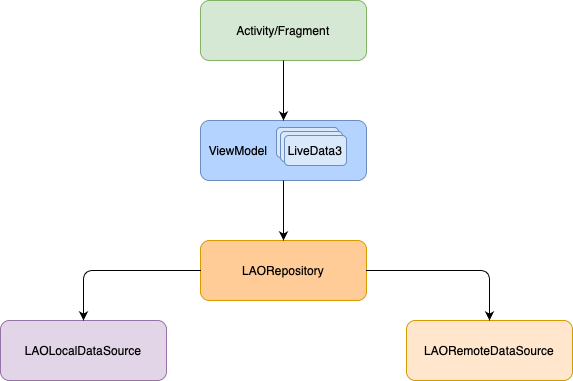

# PoP Android Frontend

This repository contains the UI side implementation of the PoP project.

## Table of contents

* [Getting Started](#getting-started)
* [Project Structure](#project-structure)
* [Architecture](#architecture)
    * [Application design](#application-design)
    * [Managing the application state](#managing-the-application-state)
    * [Sending messages over the wire](#sending-messages-over-the-wire)
    * [Getting messages over the wire](#getting-messages-over-the-wire)
    * [Message definitions](#message-definitions)
    * [User Interface](#user-interface)
* [Testing](#testing)
* [Debugging Tips](#debugging-tips)
* [Coding Standards](#coding-standards)

## Getting Started

We assume that you're familiar with the PoP project. Please read
the [Architecture Specifications](https://docs.google.com/document/d/19r3rP6o8TO-xeZBM0GQzkHYQFSJtWy7UhjLhzzZVry4)
to get an idea about all the actors and components in the system.

The preferred IDE for this project is [Android Studio](https://developer.android.com/studio). Make
sure you have the latest stable version.

Follow the steps described in [Coding Standards](#coding-standards) to make sure every you have the
same coding standards as every other contributor.

## Project Structure

The project is organized into different modules as follows

```
app/src
├── main 
│    ├── AndroidManifest.xml    # file describing essential information about the app (for example the activities)
│    │                           
│    ├── res                    # resources (layouts, strings, dimensions, etc.)
│    │    
│    └── java/P                 
│         ├── model             # module containing the data model & objects
│         │    ├── network      # ... of the objects sent over the network
│         │    └── objects      # ... of the application's entities
│         │    
│         ├── repository        # module to handle data operations and storage
│         │    ├── local        # local data source (database)
│         │    └── remote       # remote data source (connection to backend)
│         │    
│         ├── ui                # module containing the application's screens
│         │    
│         └── utility           # module containg the utility classes
│
├── prod                        # module containing the injection file of the prod build variant
│
├── mock                        # module containing the injection file of the mock build variant
│
├── androidTest                 # tests needing an emulator/android phone
│
└── test                        # unit tests
```

The letter `P` represents the project package: `com/github/dedis/popstellar`.

## Architecture

The PoP Java frontend provides an interface to allow the users to interact as part of a Local
Autonomous Organization (LAO), within which they will acquire Proof-of-Personhood tokens to identify
themselves.

Under the hood, the frontend establishes one or more long-lived websocket connections with the
servers (organizers, witnesses), through which messages are sent back and forth using a
publish/subscribe pattern.

On a higher level of abstraction, the frontend may publish messages or subscribe for messages on a *
channel*. You may think of a channel as a topic which stores events that occur over time. For
instance, every LAO is denoted by a unique channel (also called the LAO channel) and contains
messages about all events that occur within it, for example, the creation of an election, a roll
call. A channel may have sub channels associated with it. For instance, a LAO may have a sub-channel
for the elections where all messages associated with that election are published. Please refer
to [Data pipeline architecture](https://docs.google.com/document/d/19r3rP6o8TO-xeZBM0GQzkHYQFSJtWy7UhjLhzzZVry4/edit#heading=h.1h71fzpdznrh)
for more information.

All the messages are encoded using JSON and are validated
using [JSON Schemas](https://json-schema.org) as defined in
the [protocol folder](https://github.com/dedis/student_21_pop/tree/master/protocol).

[Protocol Specifications](https://docs.google.com/document/d/1fyNWSPzLhM6W9V0VTFf2waMLiJGcscy7wa4bQlLkySM)
also gives an introduction to the different message formats. However, note that
the [schemas](https://github.com/dedis/student_21_pop/tree/master/protocol) in this repository
are **always** the source of truth and are more up to date than the Google Doc.

### Application design

The application follows the Model-View-ViewModel (MVVM) pattern and uses
this [guide to app architecture](https://developer.android.com/jetpack/guide).

- The **View** consists of all the activities and fragments of the application. In this project
  there are only two activities respectively representing the detail and home view, this might
  change because one activity should represent one functionality of the application. The fragments
  represent a part of the UI within one of those activities.
- The **ViewModel** implements the UI logic and prepares and manages the data used by the activities
  and fragments. In this project each activity has its own view model.
- The **Model** consists of the local and remote data source, the model classes and the repository.
  The repository eases the data retrieval for the rest of the application. It is a mediator between
  the view model and the different data sources. In this application there are two data sources, the
  database and the PoP backend.
  The [Room](https://developer.android.com/reference/androidx/room/package-summary) persistence
  library is used to define the application's database, the entities and Data Access Object.

Below is the diagram from
the [guide to app architecture](https://developer.android.com/jetpack/guide)
written to fit this project.

<div align="center">
  
</div>

### Managing the application state

In order for the application to perform as a user would expect, it needs to manage its own internal
state robustly. Its internal state is made up of local data, such as a user's cryptographic material
and preferences, but also of the local representation of the application's view of the whole PoP
system and its state.

The latter needs to be eventually consistent, i.e., sooner or later all frontend users obtain the
same "view" of the system. This translates to a basic expectation that, one would expect all devices
connected to a LAO to "see" the same thing. Drawing a parallel, one would expect all social media
users to be able to access the same posts, see (roughly) the same number of associated likes, etc.

In order to achieve this, and as a general rule, the UI displays information from
the [`LAORepository`](https://github.com/dedis/student_21_pop/tree/master/fe2-android/app/src/main/java/com/github/dedis/popstellar/repository/LAORepository.java)
class (the application state container for now), but it **doesn't** modify the LAO-wide information
contained in it. The list of LAOs contained in the `LAORepository` only gets updated in response to
messages from the backends.

As such, let's take the example of a user who wants to publish or modify LAO-wide information. In
our example, the user wants to cast a vote in an election and does the necessary UI operations. In
turn, the application will send a message to the backend (which the backend should acknowledge),
which will then validate it and propagate it in the system. Eventually, the vote is sent back to the
application (through the publish/subscribe channel), and upon receiving it the application would
update its state. By doing so, the list of LAOs in `LAORepository` would contain new information
that would automatically be reflected in the UI.

Occasionally, the user interface could directly modify the application state, but this would only be
valid for local operations affecting local data (e.g., changing a local setting, clearing the data
stored in the browser, etc.).

As a side note, the `ViewModel` classes pass the information to be displayed from
the `LAORepository` to the UI, this intermediary step follows
the [Model-View-ViewModel](https://developer.android.com/jetpack/guide) pattern.

To better understand how the information is automatically reflected in the UI, check
the [RxJava](https://github.com/ReactiveX/RxJava) extension and the usage
of [`LiveData`](https://developer.android.com/topic/libraries/architecture/livedata) in
a `ViewModel`.

#### Managing & storing secrets

A particular sub-problem of storing the application data is the management of secret data. While any
secret could be encrypted, this just shifts the problem to securely storing cryptographic material
and making sure that it is not leaked by the device running the application.

For this, [Android KeyStore](https://developer.android.com/training/articles/keystore) is used for
the Android front-end to safely store keys that will then be used to encrypt and decrypt the
application secrets, including the Ed25519 cryptographic material. This ensures that all application
secrets are encrypted-at-rest, that the encryption and decryption keys are stored securely, and that
the application is free to use any convenient cryptographic primitive.

The `Injection` file in the `prod` package manages the secure storage, and the Keys file in
the `utility/security` package retrieves the public key of the user.

### Sending messages over the wire

The communication stack within the PoP project is made
of [multiple layers](https://docs.google.com/document/d/1AeV7JX_SJ30mu9PIwmz24UkIi3jCo6NSYA0sPxdbscU)
and you need to be familiar with them to understand how communication happens.

The [repository module](https://github.com/dedis/student_21_pop/tree/master/fe2-android/app/src/main/java/com/github/dedis/popstellar/repository)
contains some of the network communication logic, it is organized as follows:

* The `remote` module deals with the WebSocket-based connections, using
  the [Scarlet](https://github.com/Tinder/Scarlet) library.
* The `LAORepository` exposes the [JSON-RPC](https://www.jsonrpc.org/specification) -based API that
  provides the publish/subscribe communication abstraction. In it, you will find functions to
  publish a message, subscribe and unsubscribe to a channel, and so on.

The application-level message generation logic is implemented in the `ViewModel` classes, for
example the request for a LAO creation is in `HomeViewModel`. In the future an API could be created
to simplify the logic in the application code and reduce repetition.

For more information on sending messages on the network, please refer to
the [repository module](https://github.com/dedis/student_21_pop/tree/master/fe2-android/app/src/main/java/com/github/dedis/popstellar/repository)
and the `ViewModel` classes. Also, make sure you have a solid understanding
of [JSON-RPC](https://www.jsonrpc.org/specification),
the [Protocol Specifications](https://docs.google.com/document/d/1fyNWSPzLhM6W9V0VTFf2waMLiJGcscy7wa4bQlLkySM)
and their actual implementation in
the [protocol schemas](https://github.com/dedis/student_21_pop/tree/master/protocol)

### Getting messages over the wire

Once it is clear how to send messages over the wire, it is important to turn one's attention to
receiving them.

Because receiving messages over the network and processing them to update the application state are
very different steps involving completely unrelated logic.

On the networking side, the `repository/remote` module observes the upcoming messages and notifies
the `LAORepository`.

On the "message processing" side, the `LAORepository` only forwards the incoming messages in
the `handler`. The `handler` submodule is responsible for processing different kind of messages,
based on their types, and update the application state as needed.

For more information on processing messages received from the network, please refer to
the [handler](https://github.com/dedis/student_21_pop/tree/master/fe2-android/app/src/main/java/com/github/dedis/popstellar/utility/handler)
and the PoP communication protocol.

### Message definitions

All objects referred to in the protocol specification are defined in `model/network` package,
closely mirroring the [JSON-Schema](https://github.com/dedis/student_21_pop/tree/master/protocol)
folder structure.

The logic for parsing them is defined in `model/network/json` package.

When you need to create a new object please refer to existing message types. If the attribute's name
of the object differ from the JSON-Schema then use the `@SerializedName` annotation to specify the
field name. The file `CreateRollCall.java` is a good example.

### User Interface

The development of an application providing a good user interface, enabling a good user experience,
requires the user interaction patterns to be predictable, coherent and homogenous across the app. To
achieve this, applications typically resort to the definition and implementation of a library of
reusable components - building bricks - that are reused throughout the application and assembled to
create the different "views" (or "screens") of the application.

In general, the top-level components (the "views" or "screens") will be full of application-specific
logic, as they'll encompass the full behavior of that screen. As you go down into sub- and
sub-sub-components, you'll come across more generic logic, which is only dealing with the UI itself.

As part of the PoP Android front-end, you'll find the low-level reusable UI components and the main
views of the application in `/ui`.

The `/ui` package contains views such as
the [Home](https://github.com/dedis/student_21_pop/tree/master/fe2-android/app/src/main/java/com/github/dedis/popstellar/ui/home/HomeFragment.java)
and
the [Launch](https://github.com/dedis/student_21_pop/tree/master/fe2-android/app/src/main/java/com/github/dedis/popstellar/ui/home/LaunchFragment.java)
view. And it also provides elements such as
a [Date Picker](https://github.com/dedis/student_21_pop/tree/master/fe2-android/app/src/main/java/com/github/dedis/popstellar/ui/detail/event/pickers/DatePickerFragment.java)
.

This is the current organization, but as this project evolves you should feel free to reorganize the
code layout (in agreement with your project teammates and the TAs) in any way that is convenient.

#### Linking User Interface and Application State

For more information on linking up together the user interface with the application state, please
make sure you have a solid understanding of the [MVVM pattern](#application-design) and look at
the `ViewModel` classes and the `LAORepository`.

## Testing

For testing go to `Build Variants` and choose *mockDebug* as the `Active Build Variant`.

The [Mockito](https://site.mockito.org) library is used to mock the classes depending on the
backend.

## Debugging Tips

* If some libraries are not found in one of the build variants try `File`
  -> `Invalidate Caches/Restart` and running `gradle clear`
* The application tends to restart when a problem occurs because of missing error handling
  implementation, when this happens running in debug mode (`Run` -> `Debug`) and setting break
  points might help.
* Be generous with the use of log statements while developing a new feature. It's useful to get
  feedback about which steps executed and how far the message reached in the processing pipeline
  rather than getting an opaque error.
* Ensure your error messages are descriptive.

## Coding Standards

This project follows
the [Google Java Style Guide](https://google.github.io/styleguide/javaguide.html).
The [google-java-format](https://github.com/google/google-java-format) plugin allows very easy
formatting.

Please ensure that you configure Android Studio to use `google-java-format`. As of now, v1.9 of the
plugin requires JDK11 which is not shipped with Android Studio 4.0. Please install
the `Choose Runtime` plugin from the Marketplace and install a JDK11 runtime by double pressing
shift and searching for `Choose Runtime` in the popup.

`google-java-format` does not handle import orders unfortunately. Please import
the [google-style scheme](https://raw.githubusercontent.com/google/styleguide/gh-pages/intellij-java-google-style.xml)
in Android Studio by going to `Preferences` -> `Editor` -> `Code Style` -> `Import Scheme...` on the
Gear Icon for Scheme. After the plugin is installed, it needs to be enabled. Go
to `File -> Settings... -> Other Settings -> google-java-format Settings` and make
sure `Enable google-java-format` is checked and the Code style is set to `Default Google Java style`

Additionally, make sure `EditorConfig` is enabled. Go to `File -> Settings... -> Code Style` and
check `Enable EditorConfig support`.

Finally, you may want to install `Save Actions` plugin and configure it to `Optimise Imports`
and `Reformat File` on save.

### Resource Values

The values used for the UI are stored in the corresponding xml files (colors, dimens, strings or
styles) in the res/values folder.

The [R class in Android](https://stackoverflow.com/questions/4953077/what-is-the-class-r-in-android)
is an auto-generated class containing the IDs of all the resources, the values can be accessed using
```R.id``` or ```getResources()```.

The strings and dimensions are divided by usage, for example all strings or dimensions used for the
home view are grouped together.

### Github Actions

This project uses Github Actions as a CI, for more information go to
the [workflows](https://github.com/dedis/student_21_pop/blob/master/.github/workflows/ci.yaml) of
this project.

This CI builds and runs the Unit Tests. For the Android Tests,
the [reactivecircus](https://github.com/ReactiveCircus/android-emulator-runner) Android Emulator is
used, which is limited. There are issues finding the resource values and
checking [Toast messages](https://developer.android.com/reference/android/widget/Toast) appearance.
