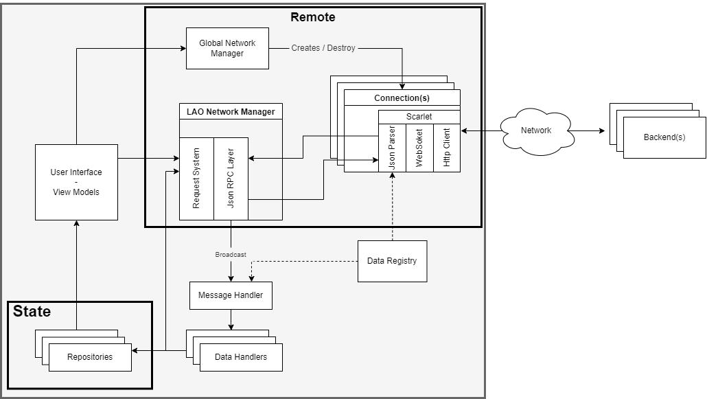

# PoP Android Frontend

This repository contains the UI side implementation of the PoP project.

## Table of contents

- [Getting Started](#getting-started)
- [Project Structure](#project-structure)
- [Architecture](#architecture)
  - [Application design](#application-design)
  - [Managing the application state](#managing-the-application-state)
  - [Sending messages over the wire](#sending-messages-over-the-wire)
  - [Getting messages over the wire](#getting-messages-over-the-wire)
  - [Message definitions](#message-definitions)
  - [User Interface](#user-interface)
  - [Dependency Injection](#dependency-injection)
- [Persistence](#persistence)
- [Witnessing](#witnessing)
- [Testing](#testing)
- [Debugging Tips](#debugging-tips)
- [Coding Standards](#coding-standards)

## Getting Started

We assume that you're familiar with the PoP project. Please read
the [Architecture Specifications](https://docs.google.com/document/d/19r3rP6o8TO-xeZBM0GQzkHYQFSJtWy7UhjLhzzZVry4)
to get an idea about all the actors and components in the system.

The preferred IDE for this project is [Android Studio](https://developer.android.com/studio). Make
sure you have the latest stable version.

Follow the steps described in [Coding Standards](#coding-standards) to make sure every you have the
same coding standards as every other contributor.

## Project Structure

The project is organized into different modules as follows

```
app/src
├── main
│    ├── AndroidManifest.xml    # file describing essential information about the app (for example the activities)
│    │
│    ├── res                    # resources (layouts, strings, dimensions, etc.)
│    │
│    └── java/P
│         ├── di                # module containing the hilt modules used for dependecy injection
│         │
│         ├── model             # module containing the data model & objects
│         │    ├── network      # ... of the objects sent over the network
│         │    └── objects      # ... of the application's entities
│         │
│         ├── repository        # module to handle data operations and storage
│         │    ├── database     # database interface and entities
│         │    └── remote       # remote data source (connection to backend)
│         │
│         ├── ui                # module containing the application's screens
│         │
│         └── utility           # module containg the utility classes
│
└── test                        # unit tests, this contains everything related to testing
    │
    ├── framework               # the utility code that are used by the tests
    │     ├── common            # framework code used in common by both test types
    │     ├── emulator          # framework code of the emulated tests
    │     └── robolectric       # framework code of the robolectric tests
    │
    ├── ui/                     # UI tests
    │     ├── emulator/         # tests executed on the emulator, those will not be ran on the CI
    │     └── robolectric/      # tests executed in the robolectric framework
    │
    └── unit/                   # usual unit tests
```

The letter `P` represents the project package: `com/github/dedis/popstellar`.

## Architecture

The PoP Java frontend provides an interface to allow the users to interact as part of a Local
Autonomous Organization (LAO), within which they will acquire Proof-of-Personhood tokens to identify
themselves.

Under the hood, the frontend establishes one or more long-lived websocket connections with the servers (organizers, witnesses), through which messages are sent back and forth using a publish/subscribe pattern.

On a higher level of abstraction, the frontend may publish messages or subscribe for messages on a _channel_. You may think of a channel as a topic which stores events that occur over time. For instance, every LAO is denoted by a unique channel (also called the LAO channel) and contains messages about all events that occur within it, for example, the creation of an election, a roll call. A channel may have sub channels associated with it. For instance, a LAO may have a sub-channel for the elections where all messages associated with that election are published. Please refer to [Data pipeline architecture](https://docs.google.com/document/d/19r3rP6o8TO-xeZBM0GQzkHYQFSJtWy7UhjLhzzZVry4/edit#heading=h.1h71fzpdznrh) for more information.

All the messages are encoded using JSON and are validated using [JSON Schemas](https://json-schema.org) as defined in the [protocol folder](https://github.com/dedis/popstellar/tree/master/protocol).

[Protocol Specifications](https://docs.google.com/document/d/1fyNWSPzLhM6W9V0VTFf2waMLiJGcscy7wa4bQlLkySM) also gives an introduction to the different message formats. However, note that the [schemas](https://github.com/dedis/popstellar/tree/master/protocol) in this repository are **always** the source of truth and are more up to date than the Google Doc.

### Application design

The application follows the Model-View-ViewModel (MVVM) pattern and uses this [guide to app architecture](https://developer.android.com/jetpack/guide).

- The **View** consists of all the activities and fragments of the application. They are responsible for the displaying part.
- The **ViewModel** implements the UI logic. It prepares and manages the data used by the activity
  and the fragments. Here, there's roughly a view model per feature. A fragment may use more than 1 view model.
- The **Model** consists of the model classes stored in the repositories. The repositories store the current application state persistently in the disk, for more info see the [persistence section](#persistence).

Below is the diagram of the application architecture :

<div align="center">
  
</div>

### Managing the application state

In order for the application to perform as a user would expect, it needs to manage its own internal
state robustly. Its internal state is made up of local data, such as a user's cryptographic material
and preferences, but also of the local representation of the application's view of the whole PoP
system and its state.

The latter needs to be eventually consistent, i.e., sooner or later all frontend users obtain the same "view" of the system. This translates to a basic expectation that, one would expect all devices connected to a LAO to "see" the same thing. Drawing a parallel, one would expect all social media users to be able to access the same posts, see (roughly) the same number of associated likes, etc.

In order to achieve this, and as a general rule, the UI displays information from
the [repositories](https://github.com/dedis/popstellar/tree/master/fe2-android/app/src/main/java/com/github/dedis/popstellar/repository) classes, but it **doesn't** modify the information contained in it. The repositories are separated roughly along feature lines, e.g. there is a `RollCallRepository` for roll call data. Repositories may only be updated in response to an incoming message from the backends.

As such, let's take the example of a user who wants to cast a vote in an election and does the necessary UI operations. In turn, the application will send a message to the backend (which the backend should acknowledge), which will then validate it and propagate it in the system.
Eventually, the vote is sent back to the application (through the publish/subscribe channel), and upon receiving it, the application will update its state. Consequently, the `ElectionRepository` will be updated and UI elements listening to it will be updated as well.

Occasionally, the user interface could directly modify the application state, but this would only be
valid for local operations affecting local data (e.g., changing a local setting, clearing the data
stored in the browser, etc.).

As a side note, the `ViewModel` classes may act as an intermediary between the views and the repositories.
Moreover, view models are primarily used to perform actions on behalf of the views and to store views data. To exemplify the difference between the state stored in the repositories and the state stored in view models, we will take the witness addition process. To add a witness, the main key of an LAO member will be scanned and a message will be sent to the backend(s). The `WitnessingViewModel` will update the list of scanned witness and the number of scanned people will be displayed on the screen. On the other hand the list of witnesses (accepted and broadcast by a backend) will only be updated once the backend messages are received and processed.

To better understand how the information is automatically reflected in the UI, check
the [RxJava](https://github.com/ReactiveX/RxJava) extension and the usage of [`LiveData`](https://developer.android.com/topic/libraries/architecture/livedata) in a `ViewModel`.

#### Managing & storing secrets

A particular sub-problem of storing the application data is the management of secret data. While any
secret could be encrypted, this just shifts the problem to securely storing cryptographic material
and making sure that it is not leaked by the device running the application.

For this, [Android KeyStore](https://developer.android.com/training/articles/keystore) is used for
the Android front-end to safely store keys that will then be used to encrypt and decrypt the
application secrets, including the Ed25519 cryptographic material. This ensures that all application
secrets are encrypted-at-rest, that the encryption and decryption keys are stored securely, and that
the application is free to use any convenient cryptographic primitive.

The AndroidKeysetManager instance is provided via injection through Hilt. It is instantiated in
the `KeysetModule`.

### Sending messages over the wire

The communication stack within the PoP project is made
of [multiple layers](https://docs.google.com/document/d/1AeV7JX_SJ30mu9PIwmz24UkIi3jCo6NSYA0sPxdbscU)
and you need to be familiar with them to understand how communication happens.

The [remote module](https://github.com/dedis/popstellar/tree/master/fe2-android/app/src/main/java/com/github/dedis/popstellar/repository/remote) contains most of the network communication logic, it is organized as follows:
- The `GlobalNetworkManager` is responsible for holding, creating and destroying WebSocket connections.
- It creates a `MultiConnection` object, which `extends` the `Connection` class, by using a [Composite pattern](https://www.baeldung.com/java-composite-pattern). It essentially contains a collection of `Connection` objects for the secondary servers and uses `super` as the connection with the main server.
- The `Connection` objects are created through the `ConnectionFactory` by using the [Scarlet](https://github.com/Tinder/Scarlet) library.
- The `MultiConnection` is passed to a `LAONetworkManager` that is responsible for handling the JsonRPC layer of the protocol. It exposes the protocol API with the `MessageSender` interface that can be retrieved by `ViewModel` through the `GlobalNetworkManager`.
- Upon reception of a `GreetLao`, the `MultiConnection` object is extended with new `Connection` objects by  establishing connections to the peers contained in the message.

For more information on sending messages on the network, please refer to the [remote module](https://github.com/dedis/popstellar/tree/master/fe2-android/app/src/main/java/com/github/dedis/popstellar/repository/remote) and the `ViewModel` classes. Also, make sure you have a solid understanding of [JSON-RPC](https://www.jsonrpc.org/specification), the [Protocol Specifications](https://docs.google.com/document/d/1fyNWSPzLhM6W9V0VTFf2waMLiJGcscy7wa4bQlLkySM) and their actual implementation in the [protocol schemas](https://github.com/dedis/popstellar/tree/master/protocol).

### Getting messages over the wire

Once it is clear how to send messages over the wire, it is important to turn one's attention to receiving them.

Receiving messages over the network and processing them to update the application state are very different steps. As such, they involve completely unrelated logic.

When the network dispatches a WebSocket message to the application, the embedded Scarlet service handles it and transforms it into a Java Object using Gson as the Json Parser.

The `LAONetworkManager` then hands the message over to the `MessageHandler`, which will in turn use the application's `DataRegistry` to pass the Data message to the right handler. The `handler` submodule is responsible for processing different kind of messages, based on their types, and update the application state as needed.

For more information on processing messages received from the network, please refer to
the [handler module](https://github.com/dedis/popstellar/tree/master/fe2-android/app/src/main/java/com/github/dedis/popstellar/utility/handler) and the PoP communication protocol.

### Message definitions

All objects referred to in the protocol specification are defined in `model/network` package, closely mirroring the [JSON-Schema](https://github.com/dedis/popstellar/tree/master/protocol) folder structure.

The logic for parsing them is defined in `model/network/json` package.

When you need to create a new object please refer to existing message types. If the attribute's name
of the object differ from the JSON-Schema then use the `@SerializedName` annotation to specify the
field name. The file `CreateRollCall.java` is a good example.

### User Interface

The development of an application providing a good user interface, enabling a good user experience,
requires the user interaction patterns to be predictable, coherent and homogenous across the app. To
achieve this, applications typically resort to the definition and implementation of a library of
reusable components - building bricks - that are reused throughout the application and assembled to
create the different "views" (or "screens") of the application.

Right now there are three Activities, `HomeActivity`, `LaoActivity` and `ConnectingActivity`. For the first one its purpose is to let a user initialize or retrieve the wallet seed; create, join, and display LAOs, with Fragments responsible for providing those features. The `LaoActivity` follows the single-activity principle. It supports many Fragments which provide all features centered around an LAO. Additional features provided in the context of an LAO should be added as fragments hosted by the `LaoActivity`. Finally, the `ConnectingActivity` is used upon creating or joining a LAO to set up the connection.

In general, the top-level components (the "views" or "screens") will be full of application-specific
logic, as they'll encompass the full behavior of that screen. As you go down into sub- and
sub-sub-components, you'll come across more generic logic, which is only dealing with the UI itself.

As part of the PoP Android front-end, you'll find the low-level reusable UI components and the main
views of the application in `/ui`.

The `/ui` package contains views such as the [Home](https://github.com/dedis/popstellar/tree/master/fe2-android/app/src/main/java/com/github/dedis/popstellar/ui/home/HomeFragment.java) and the [Launch](https://github.com/dedis/popstellar/tree/master/fe2-android/app/src/main/java/com/github/dedis/popstellar/ui/home/LaunchFragment.java) view. And it also provides elements such as a [Date Picker](https://github.com/dedis/popstellar/tree/master/fe2-android/app/src/main/java/com/github/dedis/popstellar/ui/detail/event/pickers/DatePickerFragment.java).

This is the current organization, but as this project evolves you should feel free to reorganize the
code layout (in agreement with your project teammates and the TAs) in any way that is convenient.

#### Linking User Interface and Application State

For more information on linking up together the user interface with the application state, please
make sure you have a solid understanding of the [MVVM pattern](#application-design) and look at
the `ViewModel` classes and the repositories. The `ElectionRepository` and the `RollCallRepository` should be good examples of what to do.

### Dependency Injection

The project uses Dependency Injection (DI) to provide an object with the objects it depends on. If
you are not familiar with dependency injection, Android provides a [simple guide](https://developer.android.com/training/dependency-injection).

Hilt is used to do the injection. It is an annotation-based framework. It is especially useful when
writing tests because it allows the user to choose specifically what is injected and thus which
modules are mocked and how.

For detailed information, take a look at the following resources:

- [Manual dependency injection](https://developer.android.com/training/dependency-injection/manual)
  To take a look at what hilt does by himself.
- [Dependency injection using Hilt](https://developer.android.com/training/dependency-injection/hilt-android) For an overview of the framework.
- [Testing using Hilt](https://developer.android.com/training/dependency-injection/hilt-testing) To
  learn how to use hilt in tests.
- [Annotation Cheatsheet](https://developer.android.com/training/dependency-injection/hilt-cheatsheet)
  If you ever forget what annotation to use where.

#### Hilt quick start

To provide an instance, you need to define it in a Module. A Module is a collection of rules on how
to provide a dependency. The modules of the project are defined inthe [di package](https://github.com/dedis/popstellar/tree/master/fe2-android/app/src/main/java/com/github/dedis/popstellar/di).

You can either directly provide an instance with arguments or a binding to link a type to another.

Providing an instance is done with a static function annotated with `@Provides`. The arguments of
the static function are also injected by Hilt.\
Binding the types A -> B is done through an abstract method annotated with `@Binds` that returns A
and takes B as argument.

Example :\
In a project where we have the interface Database and its implementation DatabaseImpl we could find
the module :

Here, the `NetworkService` argument is provided by Hilt in another by another rule.

```java
@Module
public abstract class DatabaseModule {

    @Binds
    public abstract Database bindDatabase(DatabaseImpl impl);

    @Provides
    public static DatabaseImpl provideDatabaseImpl(NetworkService networkService) {
        return new DatabaseImpl(networkService);
    }
}
```

If a module needs a `Database` instance, Hilt will find the Binds rule that specifies it should look
for a `DatabaseImpl`.\ Then it finds the Provides rule and needs a `NetworkService` instance.\
After finding the `NetworkService`, it can provide the actual instance of the Database object.

A final way to provide a type is to annotate the constructor Hilt should use with `@Inject`. As an
example, we could remove the methode `provideDatabaseImpl()` in the module if DatabaseImpl's constructor looked like this :

```java
@Inject
public DatabaseImpl(NetworkService networkService){
        [...]
        }
```

This solution is equivalent to `provideDatabaseImpl()` and it is widely used in the project.

If the class is an Activity or a Fragment, you need to annotate it with `@AndroidEntryPoint` and you
can create package-private fields annotated with @Inject that will be provided by Hilt when they are
constructed. You can see this usage in [SettingsActivity](https://github.com/dedis/popstellar/blob/master/fe2-android/app/src/main/java/com/github/dedis/popstellar/ui/settings/SettingsActivity.java)

## Persistence

Currently all the repositories store their state in a persistent way. The storage system used leverages the [Room library](https://developer.android.com/training/data-storage/room), which is essentialy a SQL-Lite efficient implementation. In the folder [database](https://github.com/dedis/popstellar/tree/master/fe2-android/app/src/main/java/com/github/dedis/popstellar/repository/database) you can find for each repository its [Entities](https://developer.android.com/training/data-storage/room/defining-data) and its [DAOs](https://developer.android.com/training/data-storage/room/accessing-data). 

One of the most important things to keep in mind is to perform the database operations in an asynchronous fashion and preferably using an I/O thread. This is easily possible thanks to the support for `RxJava2` by the `Room` library, such that the methods in the DAOs could return a `Completable` or a `Single`. However, having asynchronous queries is not always possible, in fact very few queries are performed on the main thread but this approach should be as limited as possible.

There's no a default behaviour of storing and retrieving the persistent state of a repository, so here's more details:
- The wallet seed is stored into the disk every time that the `HomeActivity` is stopped and retrieved every time it's resumed.
- The subscriptions and server address are saved by LAO id, thus when the user creates a `LaoActivity` they're restored for that LAO only, and stored when such activity pauses (that should be done when the activity stops but due to a bug the subscriptions are empty at `onStop()`, so for now it's done at `onPause()`). 
- The `MessageRepository`, being the biggest repository in terms of number of items stored, uses a `LRU` cache, which is loaded at the start of the application. This cache works as virtualization of the underlying disk database to speed up the operations. The great majority of the messages don't need their content to be stored persistently, they just need their identifier to be stored, as to avoid reprocessing of the same message. This optimization can help reduce the total memory occupied and scale more efficiently.
- The `LAORepository` loads all the disk state into the memory at the start of the application. This is because the list of LAOs shown in the home fragment must be complete. Also, retrieving only their name would be useless as the LAO is a quite light object (especially when it'll be decoupled from the remaining consensus feature), so it's worth to retrieve all of it in a lookup.
- All the other repositories (`RollCallRepository`, `ElectionRepository`, `MeetingRepository`, ...), which have LAO-dependent states (for each LAO they have a different state) work in the following way: when the user clicks on a LAO and opens a given tabs within the LAO which needs to display the data in a repository, that repository state is retrieved from the disk into the main memory and will be left there for the whole application lifecycle. 

## Witnessing

The `WitnessingRepository` is responsible for managing witnesses and witness messages within the context of a LAO. It provides methods to add witnesses, add witness messages, and process pending objects. The repository is designed to handle the witnessing policy, which determines the number of signatures required for a message to be considered valid.

A pending object represents an object that is subject to the witnessing policy and needs to be witnessed by a certain number of witnesses before being accepted. When a message is received that requires witnessing, the underlying object of that message is considered a pending object. The pending object consists of the object itself and the message identifier from which it originates. This allows the repository to associate a witness signature with a pending object based on the message ID.

A thing to notice is that pending objects are persisted in a `Room` database. They're retrieved at the LAO loading time as for other repositories. Every time a witness signatures is added, the method `hasRequiredSignatures()` checks if the message has achieved the required number of signatures based on the witnessing policy. If so, then the pending object related to that message (found through the mapping with the message identifier) is actually processed and added to its repository, while being in parallel deleted from the memory and the database.

## Testing

The [Mockito](https://site.mockito.org) library is used to mock the classes depending on the
backend.

To inject custom modules using Hilt, this [guide](https://developer.android.com/training/dependency-injection/hilt-testing) might help you.

### Project Setup

To execute test on the CI, we use a framework called [Robolectric](http://robolectric.org/),
it execute the tests very fast compared to the emulator, but it has no visual interface and
debugging a failing robolectric test can be very tricky.

To address that, the project is setup in a way that UI tests can be executed on both the emulator
and robolectric.

It is decided by the directory in which the test is placed. All tests in `src/test/ui/emulator`
will be executed on the emulator and will give a visual feedback. And all tests in `src/test/ui/robolectric` will be executed using the framework.

Beware, only the robolectric tests are executed on the CI. You need to place your tests in the
robolectric directory once you finished writing it.

### Getting Started

A template UI test has been written in the emulator directory. It is advised to take a look at it
and use it as a basis when writing tests.

Also, a lot of test utility code has been written for the project, it can be found under `src/test/framework`.

## Debugging Tips

- If some libraries are not found in one of the build variants try `File`-> `Invalidate Caches/Restart` and running `gradle clear`.
- The application tends to restart when a problem occurs because of missing error handling.
  implementation, when this happens running in debug mode (`Run` -> `Debug`) and setting break
  points might help.
- Be generous with the use of log statements while developing a new feature. It's useful to get
  feedback about which steps executed and how far the message reached in the processing pipeline
  rather than getting an opaque error.
- Ensure your error messages are descriptive.

## Coding Standards

This project follows the [Google Java Style Guide](https://google.github.io/styleguide/javaguide.html).
The [google-java-format](https://github.com/google/google-java-format) plugin allows very easy
formatting.

Please ensure that you configure Android Studio to use `google-java-format`. As of now, v1.9 of the
plugin requires JDK11 which is not shipped with Android Studio 4.0. Please install the `Choose Runtime` plugin from the Marketplace and install a JDK11 runtime by double pressing shift and searching for `Choose Runtime` in the popup.

`google-java-format` does not handle import orders unfortunately. Please import the [google-style scheme](https://raw.githubusercontent.com/google/styleguide/gh-pages/intellij-java-google-style.xml)
in Android Studio by going to `Preferences` -> `Editor` -> `Code Style` -> `Import Scheme...` on the
Gear Icon for Scheme. After the plugin is installed, it needs to be enabled. Go to `File -> Settings... -> Other Settings -> google-java-format Settings` and make sure `Enable google-java-format` is checked and the Code style is set to `Default Google Java style`

Additionally, make sure `EditorConfig` is enabled. Go to `File -> Settings... -> Code Style` and
check `Enable EditorConfig support`.

Finally, you may want to install `Save Actions` plugin and configure it to `Optimise Imports` and `Reformat File` on save.

### Resource Values

The values used for the UI are stored in the corresponding xml files (colors, dimens, strings or
styles) in the res/values folder.

The [R class in Android](https://stackoverflow.com/questions/4953077/what-is-the-class-r-in-android)
is an auto-generated class containing the IDs of all the resources, the values can be accessed using
`R.id` or `getResources()`.

The strings and dimensions are divided by usage, for example all strings or dimensions used for the
home view are grouped together.

### Github Actions

This project uses Github Actions as a CI, for more information go to the [workflows](https://github.com/dedis/popstellar/blob/master/.github/workflows/ci.yaml) of
this project.

This CI builds and runs the Unit Tests. For the Android Tests, the [reactivecircus](https://github.com/ReactiveCircus/android-emulator-runner) Android Emulator is used, which is limited. There are issues finding the resource values and checking [Toast messages](https://developer.android.com/reference/android/widget/Toast) appearance.
