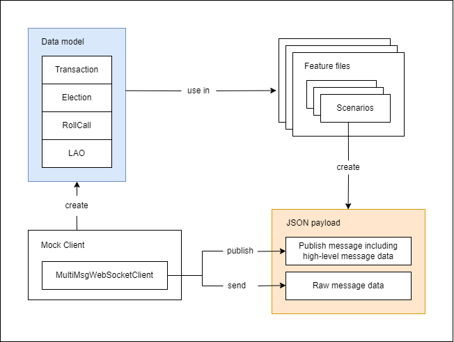
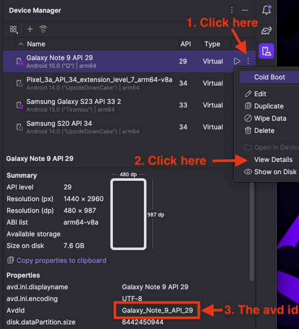

# Karate Tests

This folder implements tests for the back-end and front-end.
The front-end tests are out of date and currently not expected to pass!

## Functionality
The key idea is to have a single component being tested at a time, such as a Scala server or an Android front-end.
Mock components that act as either back-ends or front-ends can be created in the framework.
They are essentially WebSocket clients that can send and receive messages.
To create test cases, we handcraft messages with either valid or invalid message data.
The mock components then send these messages to the component being tested.
We then check that the responses the mock components receive are as expected.

## Features and Scenarios
Karate test cases are called scenarios and they are grouped within different feature files.
Each feature file tests a different message type (i.e. electionOpen, createRollCall etc.).

Scenarios are written in the Gerkhin syntax using the following keywords:

- **Given**: Prepare the JSON payload to be sent to the component being tested.
- **When**: Defines the action that is to be performed with the payload.
For instance, `publish` creates a message of type publish that contains some high-level message data, or `send` to send raw JSON data.
- **Then**: Asserts that the action taken in the 'When' step has the expected outcome.
- **And**: Connector that can be used after any of the other keywords.

## Background section
Code defined in the background section of a feature file runs before each scenario. This is especially useful for:

- **Sharing scopes with other features**: The call to `read(classpath: "path/to/feature")` is used to make the current feature share the same scope as the feature that is called.
This means they share definitions (def variables) and configurations.
JavaScript functions defined in the called feature are also available for use in the current feature's context.
For instance, reading `mockClient.feature` exposes functions like `createMockFrontend` and `createMockBackend` that can be used to create mock components.

- **Setting up previous steps necessary for a test**: For instance, before roll call messages can be tested, a LAO needs to be created first.
`simpleScenarios.feature` contains many such useful setup steps.

## Backend tests architecture
### Data model
To generate valid message data for JSON payloads dynamically, a simplified version of the model is implemented in Java code.
Mock components can create valid objects (for instance LAO, RollCall, Elections etc.), that can be used to handcraft messages.
These objects also provide functions to override their own data to some invalid values, to craft invalid messages.

Some care needs to be taken if more of these functions to override valid data are implemented in the future.
For example, when setting an invalid LAO name to test if the server rejects this, the LAO id also needs to be recomputed.
The LAO id depends on the LAO name, and if the id is not recomputed the test might fail due to invalid LAO id, and not because the name was invalid.
As of February 2024, there is no way to distinguish this as only the error code is asserted and not the error message.
This is a possible improvement that could be done in the future.

<div align="center">
  
</div>

### Launch a single server
The feature `tests/karate/src/test/java/be/features/utils/server.feature` is a utility that can be used to test a single server for the current `env` (i.e go or scala). When the feature is called, it starts the server. Then, when the scenario is done it automatically stops the server and cleans up the database.

### Launch multiple servers
If you need to launch multiple servers, you can use the classes `GoServer` and `ScalaServer`.
The classes offer a few methods:
- `start`: Launches the server. If the database path specified in the constructor is `null`, it will automatically create a temporary database.
- `stop`: Stops the server
- `pairWith`: Pairs two servers. Must be called before starting the server.
- `unpairWith`: Unpairs two servers. Must be called before starting the server.
- `deleteDatabaseDir`: Removes the database directory.

### Example: Create a valid roll call scenario
- The first `read` of the background section uses the full path description of the `constants.feature`.
Subsequent paths used are defined as constants within this feature to make it easier to change them in the future.
- `createMockFrontend` is defined in `mockClient.feature` and returns an instanciation of the Java class `MockClient`.
This class provides the functions to create model data for LAOs, roll calls, elections etc.
- Curly brackets after a `read` allow passing arguments to the called scenario.
For instance, here the created organizer and LAO are passed to the `createLaoScenario`.
- The name tag `@createRollCall1` is used to call individual scenarios on the command line, see [Running the Tests](#running-the-tests)

```gherkin
Feature: Create a Roll Call

  Background:

    * call read('classpath:be/features/utils/constants.feature')
    * call read(serverFeature)
    * call read(mockClientFeature)
    * def organizer = call createMockFrontend
    * def lao = organizer.generateValidLao()
    * def validRollCall = organizer.generateValidRollCall(lao)
    * call read(createLaoScenario) { organizer: '#(organizer)', lao: '#(lao)' }

  @createRollCall1
  Scenario: Valid Roll Call
    Given def validCreateRollCall =
      """
        {
          "object": "roll_call",
          "action": "create",
          "id": '#(validRollCall.id)',
          "name": '#(validRollCall.name)',
          "creation": '#(validRollCall.creation)',
          "proposed_start": '#(validRollCall.start)',
          "proposed_end": '#(validRollCall.end)',
          "location": '#(validRollCall.location)',
          "description": '#(validRollCall.description)',
        }
      """
    When organizer.publish(validCreateRollCall, lao.channel)
    And json answer = organizer.getBackendResponse(validCreateRollCall)
    Then match answer contains VALID_MESSAGE
    And match organizer.receiveNoMoreResponses() == true
```

## Frontend tests architecture
### Files
* `utils`
  * `constants.feature`: Contains all the necessary constants. Usually called at the beginning of any feature.
  * `android.feature` and `web.feature`: Contain platform specific scenarios that will be used by the actual tests. Both files should implement the same scenarios.
  * `platform.feature`: A simple wrapper around `android.feature` and `web.feature` that allows you to call the right scenario depending on the current env you are testing for. (i.e. if you set `karate.env=web`, it will call scenarios from `web.feature`)
  * `mock_client.feature`: Allows you to create a mock client via `createMockClient`. Automatically stops all clients after each scenario.
* `features`: The actual tests

### Example: Lao join
```gherkin
Feature: LAO
  Background:
    # Get the needed utils
    * call read('classpath:fe/utils/constants.feature')
    * call read(MOCK_CLIENT_FEATURE)

  @name=lao_join
  Scenario: Manually connect to an existing LAO
    # Use a mock client to create a random lao
    Given def organizer = createMockClient()
    And def lao = organizer.createLao()
    # Call platform specific code with some parameters
    # i.e. if karate.env=web, equals to call('classpath:fe/utils/web.feature@name=lao_join') { params: { lao: "#(lao)" } }
    When call read(PLATFORM_FEATURE) { name: "#(JOIN_LAO)", params: { lao: "#(lao)" } }
    # Actual test: The user should not have access to the button
    Then assert !exists(event_create_button)
    And screenshot()
```


## First Setup

### All
Make sure that you have [maven](https://maven.apache.org/download.cgi) installed.
The Karate plugin for IntelliJ is also recommended.

### Backend

To test a backend, you don't need more setup that what is needed to build that backend.
Use the resources provided by those projects.

### Frontend

#### Appium
Appium provides the API that will allow us to test both frontends on multiple platforms. You can install the CLI version with the command `npm install -g appium` or install the [Desktop App](https://github.com/appium/appium-desktop/releases/) instead.

#### Android
You need to add the Android driver to Appium with the following command.
```shell
appium driver install uiautomator2
```

Then, you need to create an Android emulator in Android studio if you don't have one yet. The easiest way to achieve it is to install it through [Android Studio](https://developer.android.com/studio): Go to `Tools -> Device Manager` and create a virtual device.

Finally, you need to set the environment variable `ANDROID_HOME` (The previous name was`ANDROID_SDK_ROOT` and it still works) to your Android SDK installation.
Find it by opening Android Studio and going to `Tools -> SDK Manager`.
It stands next to `Android SDK Location`.

If your Computer runs on Windows: we strongly advise that you do not use a VM or WSL. You will encounter problems you would not have otherwise, some of which might even be technically impossible to solve.

### Google Chrome & Microsoft Edge
Make sure you have Google Chrome and/or Microsoft Edge installed.

Then, install the Appium driver.
```
appium driver install chromium
```
### Firefox
Make sure you have Firefox installed. Then download the latest release of [geckodriver](https://github.com/mozilla/geckodriver/releases) and add it to your path.

Then, install the Appium driver.
```
appium driver install gecko
```

### Safari
Install the Appium driver.
```
appium driver install safari
```

Then, allow remote automation of Safari.
```
safaridriver --enable
```

## Running the Tests

### Backend

Build the backend you want to test.
Follow the steps described in the corresponding subproject.
Keep the executables in their default build location, Karate will find them there.

Simply run all the tests with:

```
mvn test -DargLine="-Dkarate.env=go"
mvn test -DargLine="-Dkarate.env=scala"
```

Individual scenarios can be run with:

```
mvn test -Dkarate.options="--tags @scenarioTagName"
```

With the Karate plugin for IntelliJ, the full tests can also be run directly from inside IDE in the `BackEndTest` class.

### Web Front-end
Build the app with `npm run build-web` in the corresponding directory.

Launch the Appium server (with `appium`).

Finally run the tests:
* All tests: `mvn test -Dkarate.env=web -Dtest=FrontEndTest#fullTest`
* One feature: `mvn test -Dkarate.env=web -Dtest=FrontEndTest#fullTest -Dkarate.options="classpath:fe/features/<file_name>.feature"`
* One scenario: `mvn test -Dkarate.env=web -Dtest=FrontEndTest#fullTest -Dkarate.options="classpath:fe/features/<file_name>.feature --tags=@name=<scenario_name>"`

The following options are available (option names must be prefixed by `-D`).
| Name         | Description                                    | Default                                   |
|--------------|------------------------------------------------|-------------------------------------------|
| browser      | One of 'chrome', 'safari', 'edge' or 'firefox' | 'chrome'                                  |
| url          | URL of the web app                             | 'file:../../fe1-web/web-build/index.html' |
| screenWidth  | Width of the browser                           | 1920                                      |
| screenHeight | Height of the browser                          | 1080                                      |
| serverURL    | Client URL of the backend server from the test host perspective               | 'ws://localhost:9000/client' |
| platformServerURL    | Client URL of the backend server from the tested platform perspective              | 'ws://localhost:9000/client' |

### Android Front-end
Build the application by running `./gradlew assembleDebug` in the corresponding directory.

Launch the Appium server (with `appium`).

Finally run the tests:
* All tests: `mvn test -Dkarate.env=android -Dtest=FrontEndTest#fullTest`
* One feature: `mvn test -Dkarate.env=android -Dtest=FrontEndTest#fullTest -Dkarate.options="classpath:fe/features/<file_name>.feature"`
* One scenario: `mvn test -Dkarate.env=android -Dtest=FrontEndTest#fullTest -Dkarate.options="classpath:fe/features/<file_name>.feature --tags=@name=<scenario_name>"`

In case you have multiple emulators running, you may specify one by avd id. To find the avd id of some emulator, go to the Device Manager (`Tools -> Device Manager`) and follow the steps in the image below.



Once you have the avd id of your emulator, you can use the command below to run the tests on this specific emulator.
```shell
mvn test -Dkarate.env=android -Davd=<avd_id> -Dtest=FrontEndTest#fullTest
#e.g. mvn test -Dkarate.env=android -Davd=Galaxy_Note_9_API_29 -Dtest=FrontEndTest#fullTest
```

The following options are available (option names must be prefixed by `-D`).
| Name         | Description                                    | Default                                   |
|--------------|------------------------------------------------|-------------------------------------------|
| avd          | Name of the android emulator                   | Choosen automatically by appium           |
| serverURL    | Client URL of the backend server from the test host perspective               | 'ws://localhost:9000/client' |
| platformServerURL    | Client URL of the backend server from the tested platform perspective              | 'ws://10.0.2.2:9000/client' |
