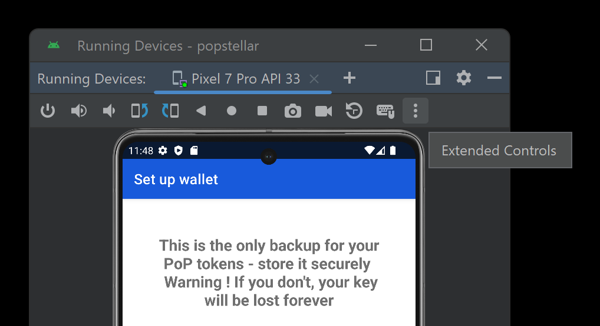

# Karate Tests

This folder implements tests for the back-end and front-end.
The front-end tests are out of date and currently not expected to pass!

## Functionality
The key idea is to have a single component being tested at a time, such as a Scala server or an Android front-end.
Mock components that act as either back-ends or front-ends can be created in the framework.
They are essentially WebSocket clients that can send and receive messages.
To create test cases, we handcraft messages with either valid or invalid message data.
The mock components then send these messages to the component being tested.
We then check that the responses the mock components receive are as expected.

## Architecture
### Features and Scenarios
Karate test cases are called scenarios and they are grouped within different feature files.
Each feature file tests a different message type (i.e. electionOpen, createRollCall etc.). 

Scenarios are written in the Gerkhin syntax using the following keywords:

- **Given**: Prepare the JSON payload to be sent to the component being tested. 
- **When**: Defines the action that is to be performed with the payload.
For instance, `publish` creates a message of type publish that contains some high-level message data, or `send` to send raw JSON data. 
- **Then**: Asserts that the action taken in the 'When' step has the expected outcome.
- **And**: Connector that can be used after any of the other keywords.

### Background section
Code defined in the background section of a feature file runs before each scenario. This is especially useful for: 

- **Sharing scopes with other features**: The call to `read(classpath: "path/to/feature")` is used to make the current feature share the same scope as the feature that is called.
This means they share definitions (def variables) and configurations.
JavaScript functions defined in the called feature are also available for use in the current feature's context.
For instance, reading `mockClient.feature` exposes functions like `createMockFrontend` and `createMockBackend` that can be used to create mock components.

- **Setting up previous steps necessary for a test**: For instance, before roll call messages can be tested, a LAO needs to be created first.
`simpleScenarios.feature` contains many such useful setup steps.

### Data model
To generate valid message data for JSON payloads dynamically, a simplified version of the model is implemented in Java code. 
Mock components can create valid objects (for instance LAO, RollCall, Elections etc.), that can be used to handcraft messages.
These objects also provide functions to override their own data to some invalid values, to craft invalid messages. 

Some care needs to be taken if more of these functions to override valid data are implemented in the future.
For example, when setting an invalid LAO name to test if the server rejects this, the LAO id also needs to be recomputed.
The LAO id depends on the LAO name, and if the id is not recomputed the test might fail due to invalid LAO id, and not because the name was invalid.
As of February 2024, there is no way to distinguish this as only the error code is asserted and not the error message.
This is a possible improvement that could be done in the future. 

<div align="center">
  
</div>

### Example: Create a valid roll call scenario
- The first `read` of the background section uses the full path description of the `constants.feature`.
Subsequent paths used are defined as constants within this feature to make it easier to change them in the future.
- `createMockFrontend` is defined in `mockClient.feature` and returns an instanciation of the Java class `MockClient`.
This class provides the functions to create model data for LAOs, roll calls, elections etc.
- Curly brackets after a `read` allow passing arguments to the called scenario.
For instance, here the created organizer and LAO are passed to the `createLaoScenario`.
- The name tag `@createRollCall1` is used to call individual scenarios on the command line, see [Running the Tests](#running-the-tests)

```
Feature: Create a Roll Call

  Background:

    * call read('classpath:be/features/utils/constants.feature')
    * call read(serverFeature)
    * call read(mockClientFeature)
    * def organizer = call createMockFrontend
    * def lao = organizer.createValidLao()
    * def validRollCall = organizer.createValidRollCall(lao)
    * call read(createLaoScenario) { organizer: '#(organizer)', lao: '#(lao)' }

  @createRollCall1
  Scenario: Valid Roll Call
    Given def validCreateRollCall =
      """
        {
          "object": "roll_call",
          "action": "create",
          "id": '#(validRollCall.id)',
          "name": '#(validRollCall.name)',
          "creation": '#(validRollCall.creation)',
          "proposed_start": '#(validRollCall.start)',
          "proposed_end": '#(validRollCall.end)',
          "location": '#(validRollCall.location)',
          "description": '#(validRollCall.description)',
        }
      """
    When organizer.publish(validCreateRollCall, lao.channel)
    And json answer = organizer.getBackendResponse(validCreateRollCall)
    Then match answer contains VALID_MESSAGE
    And match organizer.receiveNoMoreResponses() == true
```

## First Setup

### All
Make sure that you have [maven](https://maven.apache.org/download.cgi) installed.
The Karate plugin for IntelliJ is also recommended.

### Backend

To test a backend, you don't need more setup that what is needed to build that backend.
Use the resources provided by those projects.

### Android Front-end

To test the Android Frontend, you need to have an Android emulator installed.
The easiest way to achieve it is to install it through [Android Studio](https://developer.android.com/studio) :
Go to `Tools -> AVD Manager` and create an emulator.

Then you need to install Appium.
You can install either the command line app with `npm install -g appium`, or the [Desktop App](https://github.com/appium/appium-desktop/releases/).

Finally, you need to set the environment variable `ANDROID_HOME` (The previous name was`ANDROID_SDK_ROOT` and it still works) to your Android SDK installation.
Find it by opening Android Studio and going to `Tools -> SDK Manager`.
It stands next to `Android SDK Location`.

If your Computer runs on Windows : we strongly advise that you do not use a VM or WSL.
You will encounter problems you would not have otherwise, some of which might even be technically impossible to solve.

### Web Front-end

Make sure you have [Google Chrome](https://www.google.com/intl/en/chrome/) and [npm](https://nodejs.org/en/download/) installed.

## Running the Tests

### Backend

Build the backend you want to test. 
Follow the steps described in the corresponding subproject.
Keep the executables in their default build location, Karate will find them there.

Simply run all the tests with:

```
mvn test -DargLine="-Dkarate.env=go"
mvn test -DargLine="-Dkarate.env=scala"
```

Individual scenarios can be run with:

```
mvn test -Dkarate.options="--tags @scenarioTagName"
```

With the Karate plugin for IntelliJ, the full tests can also be run directly from inside IDE in the `BackEndTest` class.


### Android Front-end

Build the application by running `./gradlew assembleDebug` in the corresponding directory.

Start the Android Emulator.
Start Appium : if you use the GUI, delete the text in Host and Port and click on the start server button.
If you use the terminal, run `appium`.

With Android Hedgehog the emulator can either run in a tool window or a standalone window.
(To have it in a standalone window, go to `File -> Settings -> Tools -> Emulator` and unselect `Launch in a tool window`).
- Standalone window : \
The emulator window name should match : `Android Emulator - avd:id` \
Ex: `Android Emulator - Pixel_4_API_30:5554`
- Tool window : open the `Extended Controls` (the 3 points above the emulator)
  - The Extended Controls window name is the `avd` but with ' ' instead of '_' \
    Ex: `Pixel 4 API 30` for an `avd` of `Pixel_4_API_30`
  - Go to `Help`, under `Emulator ADB serial number` it should match `emulator-id`\
    Ex: `emulator-5554`


<em>Emulator standalone window with Extended Controls.</em><br><br>


Make sure the [karate-config](src/test/java/karate-config.js) is correct.
More precisely :

- `deviceName` is set to `emulator-<id>`, here it would be `emulator-5554`.
- `avd` is set to the avd name indicated on the emulator window, here it would be `Pixel_4_API_30`.

Run the test with :
`mvn test -DargLine="-Dkarate.env=android"`

### Web Front-end

Build the app with `npm run build-web` in the corresponding directory.

If your Chrome installation is not one of these :

- mac: `/Applications/Google Chrome.app/Contents/MacOS/Google Chrome`
- win: `C:/Program Files (x86)/Google/Chrome/Application/chrome.exe` \
  (You should check, it is also common for Chrome to installed in `/Programm Files/` rather than `/Program Files (x86)/`)

You need to set the executable manually in the driver definition in the [Web page object](src/test/java/fe/utils/web.feature) (line 6).

Change the line from `* configure driver = { type: 'chrome' }`to `* configure driver = { type: 'chrome', executable: 'PATH' }`\
where PATH is the path to your Chrome installation.\

Run the test with :
`mvn test -DargLine="-Dkarate.env=web"`
